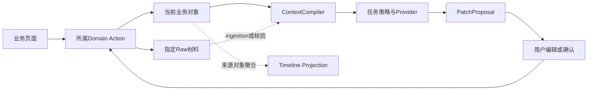

# 架构与工程合同

按[authority](00-authority.md)读取本文件。**Current Architecture描述审计已证实的实现；Stable Contracts描述持续遵守的工程边界；Target Direction描述本周期尚待实施的Opportunity增量目标。** 对象语义以四份[Opportunity目标](target/opportunity/opportunity-domain-model.md)及其同目录产品、UI、Context规范为准，不因旧代码形态改写目标。

## Current Architecture

### 技术与数据

以下先记录 2026-09-18 Production Cutover 后的现役实现；2026-09-17 的旧 v1 事实仍可在 [AS-IS](audit/AS-IS-system-map.md)追溯，但不再代表当前 runtime。

- Python/FastAPI + Uvicorn单进程本地服务；前端为**Vanilla TypeScript/JavaScript + Vite**，模板字符串/DOM和hash路由，没有React。
- 主入口`frontend/index.html → src/main.ts → workspace.ts`；独立纸面编辑器`editor.html → editor/legacy-entry.ts → legacy-app.js`。复用结构化分区、格式、撤销及html2canvas/jsPDF单页图片式PDF；不能承诺可选文字或ATS解析质量。
- Python sqlite3直接访问一个SQLite数据库；`meta/current/revisions/records/applications`存JSON与少量索引/约束。没有独立ORM、Repository层、向量库或图数据库。大多数业务引用由服务验证，不都有FK。
- `current`保存可变当前对象；通用保存追加`revisions`。`records`包括版本、原件、run等，但通用_record是upsert，不能将整表视为数据库级不可变。
- 正式 runtime 为 `0.7.0-batch-f`，SQLite schema v6。已有库必须精确为 v6，旧 v1–v5 在任何业务写入前拒绝；版本升级使用独立、显式、hash-bound 的 v1→v6 migration chain，不在启动时隐式迁移。
- 默认数据正本`~/Library/Application Support/Career Data/workspace.sqlite3`及`artifacts/`；默认备份为同级`Career Data-backups`，不在静态根目录或Git中。`CAREER_DATA_DIR`可覆盖代码外路径。运行入口见[服务README](../src/workbench/README.md)，前端命令见[frontend README](../frontend/README.md)。

### 实际模块

| 模块 | 当前职责与限制 |
| --- | --- |
| app / core | HTTP及静态服务、共享Store、事务/CAS/epoch、兼容编排、分析/投递/反馈；尚非严格Controller–Service–Repository分层 |
| opportunity / domain | canonical Opportunity/Company、phase/result、CAS/幂等与旧 ID resolver；旧 Job/JourneyPlan 保留兼容读取，不能继续写求职状态正本 |
| journey / engagement | 任职工作卡及 legacy note/typed 活动兼容读取；求职 Communication/Interview/Offer 新写由 scoped Domain Action 接管 |
| editor / profile / resume_documents | 一个 Resume Workspace UI 管理 Opportunity-owned ResumeDocument；autosave current、显式普通版本、冻结投递版本/PDF及引用保护；profile只有显式选材才进入当前稿 |
| knowledge | 来源登记、人工候选确认、Wiki修订/撤回、scope/来源校验；登记locator不读取外部内容 |
| context / providers | Compiler按明确任务读取允许的当前资料与冻结 Submission snapshot；ModelGateway只接收受控packet，OpenAI-compatible adapter与SecretStore封装远端调用。没有默认模型时基础业务继续可用 |
| employment / work | Employment与episode兼容身份；Stage、Project、Person、Participant、WorkEvent、Achievement、Evidence等受控接口；不等于Stage→Project→Wiki全链自动连接 |
| artifacts / backup / demo | 文件hash/原子写、路径保护、隔离恢复与虚构案例管理；Production Cutover 已真实验证备份、恢复、引用和附件 hash，同盘副本仍不能抵御整盘故障 |

新写入以 canonical Opportunity 为唯一求职状态正本，Company→Opportunity 为 1:N；phase 固定为写简历/已投递/面试/Offer，`result != active` 进入已结束 View。旧 Job/JourneyPlan、legacy typed activity 与旧 Submission 保持只读/待核对，不根据历史名称、状态或日期自动推导。每个 Opportunity 可拥有独立 ResumeDocument，唯一 Submission 冻结当时 Greeting、ResumeVersion、PDF 与机会快照；Communication、Real/Simulation Interview、Preparation/Raw/Final Review、real-only Research Patch、唯一 current Offer 与谈薪均由各自 Domain Action 管理，Timeline 仅为读取投影。

当前AnalysisRun保存packet/payload/result，无独立Session/Conversation/turn系统，也没有多Agent执行循环。新Provider请求不继承远端会话；分析同步调用，状态为running/succeeded/failed/stale，启动时把中断running标failed，而非已有后台队列自动续跑。Context 的允许来源、冻结快照与 Unknown 规则见[Context合同](02-context-contract.md)。

当前正式进程已核对为 `0.7.0-batch-f` / schema v6，加载 `/Users/frog/Projects/Career` 的已验收源码与 dist，数据目录仍为 `/Users/frog/Library/Application Support/Career Data`。部署、完整性、浏览器 smoke 与 rollback point 见 [STATUS](execution/STATUS.md) 和 [Batch F §23](execution/OPPORTUNITY-BATCH-F.md#23-opportunity-mvp-production-cutover2026-09-18)。

## Stable Contracts

### 数据、接口与依赖

Local-first、代码与用户数据分离、单进程模块化单体仍为稳定方向。模块通过小Interface封装完整行为，Interface包含输入、前提、错误、并发和副作用；不机械按表建Controller/Service/Repository，不为命名漂亮重写编辑器或更换框架。

前端调用HTTP/领域动作，领域模块拥有业务验证，Store提供短事务；ContextCompiler提供受控任务输入，Provider只处理payload，不能反向取得Store/SQL或任意文件能力。这是当前调用边界，不是独立进程安全沙箱。canonical Opportunity 已是新写入的唯一业务正本；仍未人工核对的旧 Job/JourneyPlan 只通过 legacy adapter 读取，不冒充 canonical 状态。

可变当前值使用revision/CAS；幂等动作回放原结果；提案接受与正式对象更新在同一事务。来源变更使旧分析/提案stale，冲突保留输入，不最后写入静默覆盖。应用内AI只提出修改，事实写入由用户确认后的受控Domain Action完成，详见Context合同。

投递快照、投递版本、Greeting Snapshot和PDF保留当时内容，后续当前编辑不能改写。新求职Raw覆盖更正及Offer原件例外遵守模块目标；不将“所有历史永远追加”当成跨对象通用规则，也不据此清理已有历史。个人事实、表达、研究、来源和分析分别有自己的拥有者。

### 本地可靠性

- 文件使用临时写、hash和原子落盘，引用登记失败不能显示完整成功；数据库与附件不是天然同一原子事务，极端崩溃和引用删除须验收。
- 备份要求SQLite一致快照、附件清单及hash；恢复到隔离目录验证。已安装定时任务不等于成功备份，同盘副本不能防整盘损坏。
- 升级先核对代码/运行版本、取得一致备份并控制旧写入，再执行显式版本迁移。旧代码拒绝新schema；开放新写入后的回滚不能丢掉新增资料。
- 回环监听、同源请求与安全文件路径；密钥仅服务端配置。模型调用在事务外，不无声重试收费请求。睡眠/关机不承诺后台继续运行。
- 开发/测试使用虚构隔离资料。源码、目标文档、测试通过及实际运行分别标证据，不以UI按钮、demo或mock证明真实模型质量。

## Target Direction — Opportunity Vertical

仅在现有能力上增量收敛，目标尚未落地。完整字段和关系在[Domain Model](target/opportunity/opportunity-domain-model.md)，动作在[UI Flow](target/opportunity/opportunity-ui-flow.md)；本节维护工程分工，不另造第二套字段规格。

| 现有承载 | 本周期方向 |
| --- | --- |
| opportunity / domain / core | Opportunity拥有一次尝试的JD/公司引用与推进状态；Job旧ID保留兼容，停止两套当前值双写。SearchCycle/TargetRole/OrgUnit保留可选旧引用，不作为必填依赖，不新增独立JobPosting |
| journey plan / application status | 领域动作统一改变Opportunity阶段/结果；计划为辅助信息，不能与状态正本竞争；旧状态保留解释与迁移映射 |
| editor / profile / artifacts | 参数化文档身份与归属，保留纸面编辑器；每机会独立可选稿，显式普通版本与自动投递版本分开；保留旧稿/版本/用途/PDF，不猜owner；共享附件时补全引用保护 |
| applications | 可保留表名，领域行为收紧为一次尝试最多一次Submission，支持无简历和Greeting冻结；版本/快照/阶段联动原子提交，不靠前端拼凑 |
| engagement / notes | 沿用typed身份；Raw只负责材料，note只读兼容；逐步补齐当前Research、真实/模拟轮次、当前Offer、谈薪沟通及结果动作 |
| knowledge / ingestion / proposals | 复用来源、scope、CAS与确认底座；统一业务入口资料生命周期，Patch通过目标模块写入；不让Wiki拥有所有业务对象 |
| context / providers | 增加任务声明与当前对象reader；去掉目录描述隐式背景。Career Context接口隔离Employment/Project内部结构；Provider边界保持 |
| 前端workspace | 管线→单机会Workspace；稳定顶部、阶段工作区、岗位情报、投递材料、Timeline。完成替代入口和旧记录可达后再退役对应旧tabs |
| Timeline查询 | 从Opportunity、Submission、Communication、Interview、Offer和result投影；聚合、摘要、排序、跳转，不存第二套事件事实 |

这是目标流，不表示新的IngestionService、领域Skill或Timeline已经接通。Simulation MVP使用Context Pack复制到用户新开的ChatGPT语音对话，用户自行记录/转写后上传文本；内置语音引擎、通用Session、多Agent或自动招聘平台均非当前实现或本期前置需求。

迁移顺序与保护建议见[Gap Analysis §7–9](audit/OPPORTUNITY-GAP-ANALYSIS.md)，当前周期顺序见[Roadmap](07-roadmap.md)。保留旧Job、Opportunity、applications、editor-main、版本/PDF、ResumeUse、来源与revisions；多次Submission、公司冲突、历史轮次含义不能自动删合或补造。先准备可恢复基线，再实施各纵向闭环。

## 非本期模块边界 — 保留

以下沿用原有Employment/Project/People模块说明，不属于本次新增设计或验收。字段列包含原有目标概念，不能把它当作全部现役字段；实际落库与缺边以Current Architecture和AS-IS为准，本期不据此扩表或补链。

| 对象 | 原有字段 / 身份 | 原有关系与规则 | 原有交付说明（须结合AS-IS边界） |
| --- | --- | --- | --- |
| Employment | id、公司/组织、角色、开始/结束、origin_offer_id? | 一次真实任职；可手建，Offer来源可空；接受意向不等于实际入职 | `employment:<episode_id>` 公开身份；原journey_episode作为兼容来源保留 |
| EmploymentStage / WorkEvent / Problem / Reflection | employment_id、时间/目标/原件/当前解释 | Employment 1:N Stage；阶段不是另一份Employment；事实与复盘分开 | Stage 已独立建模并做日期边界、CAS、幂等校验；原件/更正视图和候选回流保留 |
| Project | id、kind=employment/personal/open_source/learning/other、employment_id? | 独立职业资产；允许无公司；同一项目多个证据形式 | Project 与 ProjectSource 已显式建模，保留兼容来源 |
| ProjectSource / EvidenceLink | project_id/fact_id、source_id、定位、用途、覆盖范围 | RawSource/Evidence N:M CareerFact；版本化引用，不能把README当全部事实 | Evidence 与 EvidenceLink 已建模；页/行级定位待扩展 |
| Person / ProjectParticipant | person_id、project_id、role、职责、参与起止 | Person独立身份，任职期内私密协作；Project N:M Person，关系单独保存 | Person 与 Participant 多对多关系已建模 |

Employment仍可独立手工管理，接受Offer不自动创建Employment。任职原话、更正历史、项目来源、参与关系、成果与证据保留；Stage与Project不存在已验证的直接父子链，成果到Wiki不视为已经自动接通。Opportunity只经Career Context接口取得允许复用的职业事实，不读取任职私聊或复制这些对象成为第二正本。

### 未来 Repository Ingestion

LocalFolder、Git remote、文档都是ProjectSource，不自动扫描全磁盘、不自动上传GitHub。授权导入时明确根目录、路径允许列表、符号链接边界、文件大小和排除密钥；冻结文件hash/git commit/脏工作树摘要。先产候选概览、模块图、关键流程和引用，确认后成为Project Wiki。源变更使依赖摘要失效；读取目录只读清单后按指定文件回源。公司代码无读取/带出授权时用允许保存的描述与证据，来源覆盖不足显示未知，绝不由代码存在推断个人贡献。

本节Repository Ingestion属于后续方向，不是Opportunity Vertical的依赖或当前已实现能力。
