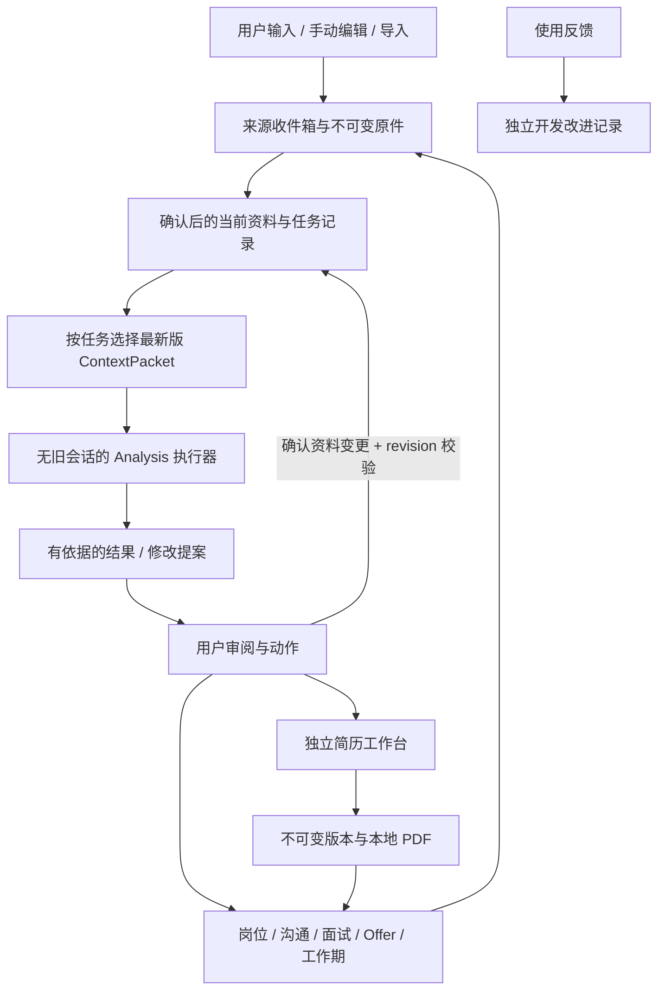

# 当前架构与扩展方式

这是当前实现的架构基线；产品不变量以 [上下文契约](02-context-contract.md) 为准，实际交付范围以 [当前状态](execution/STATUS.md) 为准。

## 技术路线

当前采用 Python/FastAPI 单体本地后端、React/TypeScript/Vite 前端、单个 SQLite 数据库和本地附件目录。语音或本地模型未来可作为独立受控进程；暂无微服务、图数据库或向量库。

`workspace.sqlite3` 保存当前资料、来源、事件、任务、分析审计和提案；不同用途由表、模块接口和事务边界隔离。分析执行器只接收 ContextPacket，提案应用与 `appliedProposalId` 在同一数据库事务内完成，避免跨库对账和重复更新。

关键数据关系结构化；可变分析内容使用带schemaVersion的JSON。不为每个UI页造表，也不把所有约束藏进万能JSON。

## 数据对象

| 对象 | 职责 |
| --- | --- |
| ContextEntry / Revision / SourceArtifact | 当前资料、修订、不可变原件与来源 |
| CareerEpisode / WorkItem | 独立工作期、目标、事项与行动 |
| Opportunity | 求职推进对象，引用 JobPosting；旧job兼容当前JD，不是已投递 |
| ResumeDocument | 可编辑、自动保存工作稿；不是事实正本 |
| ResumeVersion | 显式保存的不可变快照；可无岗位或关联一个岗位；parentVersionId可空 |
| Application | 显式记录的实际投递；关联岗位、已有版本、时间和状态；同岗位/版本可多次使用 |
| EvidenceRef | 经历到来源的引用；旧简历只能作定位线索，不能自证 |
| WorkbenchRecoveryPoint | 草稿/导入/恢复备份；不混入正式版本历史 |
| Communication / InterviewSession / Offer | 对应实际沟通、面试、条款事件 |
| Review / Practice / LearningAction | 派生复盘、练习与后续行动 |
| CollaborationRecord / StageDocument | 工作范围内的协作观察和阶段记录 |
| AnalysisRun / Proposal | 输入清单、策略/模型版本、结果状态、待确认差异 |

稳定经历ID仅承诺同工作稿lineage派生中保留；重新导入不同文件不自动判断同一经历。没有claim graph或全局识别要求。

## 深模块

Module是通过小Interface提供丰富行为的封装；Interface包含调用、前提、错误、并发及副作用，不只是函数签名。Seam放在真实可变处；Adapter实现供应方差异。以下Interface是设计示例，非必须逐字实现。

| Module | Interface | 隐藏的复杂性 |
| --- | --- | --- |
| Context | readCurrent / applyChange / getTaskSources | revision、来源、冲突、范围、摘要失效 |
| Artifacts | ingest / read / export / backup | 格式解析、文件哈希、原件、附件一致性 |
| Journey | getCurrentTask / executeAction | 允许跳步和回退的流程、引用、事务、幂等 |
| Analysis | run / cancel / propose | 选材、模型、校验、过期判定 |
| Resume | openDraft / applyProposal / saveVersion / export | 编辑、稳定ID、PDF、版本与恢复 |
| Conversation | start / submitTurn / finish | 文本/语音、轮次、追问、转写、复盘 |
| Integrations | searchJobs / researchCompany / importSource | 平台差异、错误、限流、采集时间 |

工作记录先作为Journey/Context中的场景；有独立复杂性后再拆。删除某模块后若复杂性会回到多个调用者，说明它有价值；若只是转发包装可合并。不要机械按表建立Controller/Service/Repository三层。

## 当前目录

```text
frontend/                    任务页面、资料编辑、简历、对话
src/workbench/               深模块实现
tests/                       Interface测试、HTTP/SQLite与浏览器验收
docs/                        本包规范，模块文档及execution状态
.agents/skills/              按任务读取的开发技能
用户选择的数据目录/          workspace.sqlite3、artifacts、backups
```

代码与用户数据分离；数据不在静态根目录、不进Git。手动资料编辑经页面落库；若支持外部Markdown，使用导入差异协议，避免两个正本。

## 本地运行与可靠性

- 启动器检测服务/端口并打开HTTP地址；已有服务则复用。浏览器file地址不是应用入口。
- 自动保存草稿，后台任务持久化为queued/running/succeeded/failed/cancelled/stale；进程重启可恢复。模型调用不持有长事务。
- 请求有幂等键；远端模型重试可能再次计费，不承诺外部exactly-once。
- 文件先临时写、哈希、原子改名，再登记引用；失败不显示“已完整保存”。无引用残留可延迟回收。
- 数据库一致性备份+不可变附件清单，实际恢复验证；单盘备份不能抵御整盘损坏。
- 锁定依赖、字体本地化、版本化migration，升级前备份；回滚匹配代码和数据版本。
- 本地监听回环地址，限制Origin/会话和可读文件范围；密钥只在服务端配置。远端发送范围遵循上下文契约。
- 开发Agent使用隔离数据；有终端权限的Agent不能仅靠提示词与真实文件隔离，需要环境权限保证。

## 扩展

新能力沿“任务输入→选材策略→提案→用户动作→持久化结果”加入。模型/语音/外部数据接入是合理Seam；没有第二种实际需求的普通功能不预造Adapter平台。未来同步不影响现在的稳定ID设计，但当前不写同步实现。

## 简历模块接入约束（2026-09-14 修正）

产品基线见 [产品目标](01-product.md#简历工作台基线2026-09-14-用户明确)。既有工作台的结构化文档接口已实际读到 `schemaVersion`、`profile`、`sections`、`formatting`、`meta`；分区、经历与条目有 ID。后续接入需保留结构与格式，不得降为一个 `content` 字符串往返。

Resume 模块自行封装纸面编辑、草稿、版本和渲染。Journey 传递岗位/任务关联、选定工作稿和已确认的修改提案，接收版本与 PDF 引用；不得直接改编辑器 DOM，也不得把旧简历内容自动提升为 Context 事实正本。文档读写接口可作为适配接缝，但现有全量替换接口尚未证明支持 revision 冲突保护，不能直接当成最终集成契约。

已取得既有应用发布分支源码，并核对实际入口为 `client/index.html → legacy-entry.ts → legacy-app.js`。纸面编辑与 CSS 可直接复用，妙搭数据库及文件存储调用集中在加载、草稿同步、版本和 PDF 接缝；本地化替换这些接缝。原 PDF 为 html2canvas/jsPDF 图片式导出，不能声称可选中文本。源码版本、当前复用批次和验收见 [工作台接入](execution/RESUME-WORKBENCH.md)。

## 当前技术基线

Python 3.9+ / FastAPI，React/TypeScript + Vite，单进程模块化单体。SQLite 单文件以 current/revisions/records/applications 等用途隔离，Context 入口仅读获准的当前白名单；选择单库使提案应用和幂等状态同事务，避免双库对账。schema 使用 PRAGMA user_version=1，后续迁移需先备份、显式版本迁移，拒绝打开更高版本。基础身份、Wiki 当前事实、不可变原件和任务记录已分责；旧自由文本资料仅保留兼容整理入口，不作为新数据模型。

2026-09-15 增量重构后，公开业务身份以 `Opportunity` 与 `Employment` 为主；旧 `job` 与 `journey_episode` 仅作为兼容 adapter，稳定映射分别为 `opportunity:<job_id>` 与 `employment:<episode_id>`。结构化 editor document/version 是唯一可写简历链，旧文字 resume/version 仅可历史读取。Project、Person、WorkEvent、Achievement、Evidence 及关系由 work 模块维护；Submission 冻结 Opportunity、JobPosting、业务关系、ResumeVersion 和 Export artifact。Context Compiler 输出 schema v2，并把关系对象作为 `task_context` 来源纳入 revision/hash 与全局失效检查。当前仍沿用 schema v1 通用物理表；是否拆分物理表只通过后续显式 migration 进行，不能另建平行数据库。

生产默认 `~/Library/Application Support/Career Data`，可用 CAREER_DATA_DIR 指定代码外位置。服务入口 `scripts/run.py`；接口与运行命令见 `src/workbench/README.md` 与 `frontend/README.md`。远端接口为无会话 Chat Completions Provider，实际 JSON payload 本地审计；测试模式必须显式配置。运行时密钥仅环境变量。

## 全链路架构及扩展约束



这是目标数据流；已接通范围、外部 Gate 与验证证据见 [当前状态](execution/STATUS.md)。

### 依赖方向与深模块契约

前端 → HTTP入口 → Journey编排 → Context/Resume/Artifacts/Analysis；Provider仅接收packet生成的请求体，不能反向取得Store。Context不知道页面和模型供应商，Resume不负责招聘平台，Integrations不能直接写个人事实，反馈服务不能读职业正文。

| 模块 | 小接口及外部可见结果 | 必须藏在内部的规则与失败语义 |
| --- | --- | --- |
| Context | selectCurrent(task, selection)、applyChange(command) | 来源/范围、版本快照、重复写入、冲突与失效；409保留输入；不提供“搜索一切历史”给模型 |
| Journey | setNextAction、recordEvent、openEpisode、addWorkNote | 状态可跳转、任务隔离、事件和计划区别；重复事件幂等；找不到关联对象404 |
| Analysis | preview、run、propose | 资料选择、供应方请求、引用校验、过期判定、超时/取消/失败；不能直接更新事实或对外发送 |
| Resume | readDocument、saveDraft、applyPatch、saveVersion、restore、export | 原版编辑格式、稳定ID、CAS、冻结渲染、版本/PDF一致性；冲突不覆盖；恢复产生新稿 |
| Artifacts | importSource、readArtifact、export、backup、restore | 文件类型、大小、原件hash、安全路径、原子写入、备份清单与一致性 |
| Conversation | submitTurn、correctTranscript、finishReview | 逐轮文本、语音分段、说话人/时间戳、回答与建议分离；转写失败留音频 |
| Integrations | searchJobs、researchCompany、transcribe | 授权、去重、分页、限流、来源刷新、外部不可用；同一业务不暴露供应商原始响应 |

仅在真正实施第二种 Provider 或复杂业务规则时再拆文件；“模块深度”来自封装完整的业务不变量，不来自目录数量。当前 `context.py`、`opportunity.py`、`employment.py`、`work.py`、`engagement.py`、`knowledge.py`、`profile.py`、`journey.py` 与 `editor.py` 已形成受控边界，`core.py` 保留兼容编排；后续拆分必须保持 Interface 测试和旧数据读取。

### 数据一致性与可维护演进

当前单库中的current、revisions、records用途隔离，事务内更新当前值和revision。作为首试工程选择，单库足够；两个数据库并不能阻止一个拥有全部路径权限的进程读旧内容。若未来需要更强隔离，再把Analysis放到只接收packet的独立进程；不为了名字上的“彻底分离”先增加分布式事务。

稳定ID、schemaVersion、expected_revision和幂等key是跨模块接口基础。资料编辑导致依赖结果stale；不可变事件引用其当时版本和文件hash。普通计划阶段不产生Application。独立编辑器版本回传时应由用户选择version_id/artifact_id并创建带岗位引用的使用事件；当前纸面稿单份，Wiki 批次已完成版本用途引用，不让前端自行拼成已投递事实。

将来新增渠道只实现候选岗位规范化Adapter；新增面试类型只增加任务输入策略和评估结构；新增任职场景复用工作期/事件/提案，避免每一类问题建立一套聊天存储。资料索引是派生缓存，命中ID之后重新读当前值。大附件按需取，任务列表逐步分页；没有性能证据时不引入图谱/向量服务。

### 本地运行、更新和导出

脱离妙搭后，HTML/CSS/JS、字体、SQLite和附件都能留在本地。本项目已实际接入独立编辑器并生成本地PDF，无需妙搭云数据库或文件服务。已生成的PDF可复制、下载、备份，离线仍能读取。当前沿用原版图片式PDF，不能承诺可选择文字或ATS解析质量；文本式PDF需独立渲染任务与版面验收。

开发依赖首次安装/版本更新通常需要网络；安装完成后的查看、编辑、记录和PDF不依赖云端。网络公司研究/搜岗和远端AI需要网络；完全离线AI需要预先下载可运行模型及语音组件，并在本机实际测试。没有凭据不阻断手动路径，也不自动改用收费服务。睡眠或关机不执行后台任务，重启显示中断状态，避免静默重复收费。

维护流程：停止写入或取得一致快照 → 数据库与附件清单备份 → 锁定依赖安装/构建 → 显式迁移并检查版本 → 隔离测试/浏览器验收 → 启动本地服务。失败回滚到匹配的代码与数据库备份，不用旧代码打开新schema。数据位于代码外；重装前端或更新代码不能清空档案。本机磁盘不等于永不丢失，备份应可另存外置磁盘，恢复需实际演练。

### AI Agent 持续开发的读取路线

入口AGENTS保持短：权威顺序、命令、数据边界、文件所有权、技能入口。Agent先读STATUS了解当前状态，再按authority读取相关产品/Context/架构/用户路径，最后只读本模块README和Interface测试；不加载完整历史聊天或把归档材料当产品要求。所有新增产品决策更新所属文档而非写第二套方案。

一个批次应包含：一个用户结果、输入/输出/错误/并发/副作用、允许文件、验收场景、命令与证据、未实现能力。独立审查分产品符合度和工程规范两轴；主控实际跑关键路径。保留失败证据与测试模式标签，不以执行者自报替代验收。提示词/选材策略同代码版本化；实际请求体审计留在用户数据目录，仓库仅用虚构回归样例。

增加能力之前用一条隔离场景证明价值；只有失败、变化或未解决问题才扩大测试。UI验收关注首次入口、任务连续性、错误后输入和历史引用，而非页面截图美观。后续自动开发必须读取用户选定反馈并给出可审阅改动，应用内不运行具有整个文件系统权限的自主Agent。

## 最新领域模型：Wiki 核心与两条业务主干（2026-09-14）

本节修订早期 Opportunity=JD、整份资料作为唯一上下文的简化。产品对象是业务身份与引用，不是页面目录；父级展示不代表数据库所有权。当前落地清单见 execution/WIKI-DOMAIN.md，以下完整目标结构中未实现的对象不提前造空表。

| 对象 | 核心字段 / 身份 | 关系与写入规则 | 本轮实现 |
| --- | --- | --- | --- |
| CareerOwner | 单本机所有者 | 持有资料与业务空间，不做登录/租户系统 | 隐式单用户 |
| RawSource | id、type、content/hash、locator、scope、采集时间 | 原貌不可覆盖；修正另建来源；路径不是读取授权 | text/摘录保留；目录/Git/URL仅登记 |
| ExtractedCandidate | id、source_ids、类型、内容、scope、revision、状态 | RawSource N:M 候选；修正、拒绝、确认；确认事务创建Wiki | 人工整理闭环；AI提取未接入 |
| WikiEntry / CareerFact | id、type、内容、scope、revision、status、来源列表、verification | 当前认知可改；历史只读；确认≠独立核验 | 项目、目标、约束、经历、能力、成果、人物、成长、策略 |
| CoreProfile | name/email/phone/wechat/github/links、mode、revision | 同一profile正本；自由文本需显式归档并拆候选，结构化后不允许自由文本写回 | 基础字段/CAS、旧资料整理事务 |
| SearchCycle | id、名称、目标、时间、状态 | 1:N Opportunity；计划背景不强制填写 | 名称/说明与机会关联 |
| TargetRole | id、方向、典型要求来源 | 1:N 通用简历用途；不是具体招聘广告 | 可编辑对象、版本用途引用 |
| Company | id、名称、主体证据 | 1:N OrgUnit、JobPosting；不能靠同名自动合并 | 可编辑公司身份 |
| OrgUnit | id、company_id、parent_id?、名称、类型、有效时间 | 同公司树，允许省略层；不允许环；组织变化用新revision/新节点 | 同公司树、循环检查、可编辑 |
| JobPosting | id、公司/组织引用、来源、原始JD快照、采集时间 | 一份招聘信息，可被不同周期的机会引用；原JD与当前解读不同 | 旧job JD当前记录与revision兼容保留，尚未独立拆实体 |
| Opportunity | id、owner、cycle_id?、posting_id、当前策略/下一步 | 求职推进单位；可排除恢复、多次申请、跳步 | 旧job ID保持；增加公司/团队/方向/周期显式关联 |
| ResearchSnapshot | id、target_kind/id、source_refs、as_of、结论/未知 | 分公司/业务/组织/团队/岗位；每次采集不可变、当前解释可修订 | 现有研究原话 + 机会Wiki；细粒度研究快照执行器待建 |
| ResumeDocument | id、scope=role/opportunity、target_id、content JSON、formatting、revision | 独立模块拥有；可从通用稿派生定制稿；引用事实ID但不是事实正本 | 原版单工作稿＋source_refs版本来源；主动Wiki选材，多文档仍待接入 |
| ResumeVersion / ExportSnapshot | document_id、冻结内容、版本、模板版本、文件hash | 目标 Version 1:N ExportSnapshot；当前每版固定一个 PDF，输出内容与排版冻结 | 已有不可变版本/PDF；本轮新增用途记录，非多稿管理 |
| ResumeUse | scope=role/job、scope_id、version_id、artifact_id/hash、引用时间 | 同版本可多处复用；不是Submission，引用不修改PDF | 实际事务内验证并保存 |
| Submission | opportunity_id、发生时间、渠道、version_id、export_id | Opportunity 1:N；版本和JD快照固定；只有实际发送才登记 | 共用 applications；接受新 editor_version / 旧 version，固定内容/JD/PDF快照与渠道 |
| ResearchSnapshot / Communication / Interview / Offer | opportunity_id必需、submission_id可空、原件、发生时间 | 研究可被多个机会复用；允许先聊天、内推、先面试后投递；不能强迫归属于Submission | 独立 typed object 引用不可变 journey_note 原文；旧 note 只读投影兼容 |
| Employment | id、公司/组织、角色、开始/结束、origin_offer_id? | 一次真实任职；可手建，Offer来源可空；接受意向不等于实际入职 | `employment:<episode_id>` 公开身份；原journey_episode作为兼容来源保留 |
| EmploymentStage / WorkEvent / Problem / Reflection | employment_id、时间/目标/原件/当前解释 | Employment 1:N Stage；阶段不是另一份Employment；事实与复盘分开 | Stage 已独立建模并做日期边界、CAS、幂等校验；原件/更正视图和候选回流保留 |
| Project | id、kind=employment/personal/open_source/learning/other、employment_id? | 独立职业资产；允许无公司；同一项目多个证据形式 | Project 与 ProjectSource 已显式建模，保留兼容来源 |
| ProjectSource / EvidenceLink | project_id/fact_id、source_id、定位、用途、覆盖范围 | RawSource/Evidence N:M CareerFact；版本化引用，不能把README当全部事实 | Evidence 与 EvidenceLink 已建模；页/行级定位待扩展 |
| Person / ProjectParticipant | person_id、project_id、role、职责、参与起止 | Person独立身份，任职期内私密协作；Project N:M Person，关系单独保存 | Person 与 Participant 多对多关系已建模 |
| ContextSnapshot / AnalysisRun | task、scope、选材ID/revision/hash、policy、epoch、请求体 | 每次Run恰好一个不可变输入快照；一次Session可多轮Run | 当前packet/run；Wiki材料显式选择与最新读取 |
| PatchProposal | target_id、before/after、expected_revision、依据、状态 | 分析仅提出，人工确认/CAS后写回；与事实区分 | 早期文本简历提案；结构化patch待接入 |
| FeedbackEntry / ProductIssue | 原话/截图、页面/实体、独立分析与关联 | 多条反馈可支持一个问题，反馈仍原样保留；永不进职业Context | 独立反馈已实现；问题归并未自动化 |

### 必须修正的对象关系

1. Wiki是当前资料的组织与读取视图，不另复制Employment、Project或Profile成为第二正本。episode继续拥有任职卡字段；profile仅拥有基础身份，旧混合文本经显式整理归档，其余候选确认进Wiki。新Wiki条目通过scope关联，不同时维护同字段的两个正本。
2. Opportunity拥有推进记录，JobPosting拥有招聘来源。旧job混合这两者是兼容适配，不允许新模块据此假定一次JD只对应一次投递。
3. ResumeDocument属于Resume模块，Opportunity/TargetRole持有用途引用。树图中的两处展示不会创建两个版本对象。同一个版本可用于多个机会；修改工作稿不会修改引用。
4. Employment是任职，Stage是任职内阶段；历史任职无需先伪造Offer。接受Offer后先建立入职计划，到实际入职再登记Employment；本轮不自动建卡。
5. Session允许多轮，每轮Run重编译最新材料且各持一个Snapshot；不是整个会话永久绑定同一份旧上下文。
6. 公司研究优先展开已知团队和岗位问题；组织未知保持空值。Company/OrgUnit身份说明本身不是研究证据，不自动进入模型。当前上下文关联与Wiki事实分工明确。

### 当前可执行模块边界

`knowledge.py`：原件登记、候选确认、Wiki CAS与历史、同scope来源验证、选材白名单；`domain.py`：公司/组织树、方向/周期、机会关联、冻结简历用途。两者都使用Store短事务，不把整个库交给AI。`core._packet`在同一读事务中读取基础资料、当前JD和获准Wiki最新版；personal为current_fact，job为task_context。远端Provider只得到该包。

`profile.py` 在同一事务归档旧profile、生成候选及切换结构化基础身份；`journey.py` 保留不可变note，新增 `journey_note_revision` 更正和 `journey_request` 幂等结果；`editor.py` 在CAS事务读取当前获准Wiki/profile、追加表达及服务端来源refs。原件scope保留，允许复用的选段另建来源，不复制整份私聊。

复用 schema v1 的 current/revisions/records 是非破坏增量；新 kind 必须由相应模块验证，不开放任意对象 CRUD。参与关系及 Evidence/EvidenceLink 已由 work 模块受控实现；更细的页/行定位、多个 ResumeDocument 和独立 JobPosting 留待后续显式迁移，不为凑齐图形建立无约束万能表。

### 未来 Repository Ingestion

LocalFolder、Git remote、文档都是ProjectSource，不自动扫描全磁盘、不自动上传GitHub。授权导入时明确根目录、路径允许列表、符号链接边界、文件大小和排除密钥；冻结文件hash/git commit/脏工作树摘要。先产候选概览、模块图、关键流程和引用，确认后成为Project Wiki。源变更使依赖摘要失效；读取目录只读清单后按指定文件回源。公司代码无读取/带出授权时用允许保存的描述与证据，来源覆盖不足显示未知，绝不由代码存在推断个人贡献。
