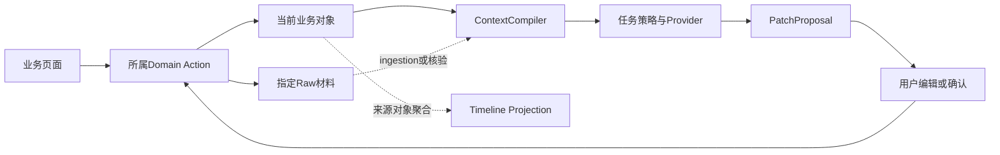

# 架构与工程合同

按[authority](00-authority.md)读取本文件。**Current Architecture描述审计已证实的实现；Stable Contracts描述持续遵守的工程边界；Target Direction描述尚待实施的目标。** 跨模块长期语义以[长期 Career 模型](target/long-term-career-model.md)为唯一正本；Opportunity细节以四份[Opportunity目标](target/opportunity/opportunity-domain-model.md)及同目录产品、UI、Context规范为准。不因旧代码形态改写目标。

## Current Architecture

本节的系统结构与代码职责是实现观察，不代替产品目标。2026-09-18 Production Cutover 记录的进程身份属于历史快照；当前运行 PID、源码清单、数据身份和模式只以 [STATUS](execution/STATUS.md) 顶部最近一次核验为准。

### 技术与数据

以下先记录 2026-09-18 Production Cutover 后的现役实现；2026-09-17 的旧 v1 事实仍可在 [AS-IS](audit/AS-IS-system-map.md)追溯，但不再代表当前 runtime。

- Python/FastAPI + Uvicorn单进程本地服务；前端为**Vanilla TypeScript/JavaScript + Vite**，模板字符串/DOM和hash路由，没有React。
- 唯一主入口为`frontend/index.html → src/main.ts → workspace.ts`。Resume Workspace 在`#resume?document_id=...`内挂载同一份`editor/legacy-app.js`纸面编辑模块，Workspace 只持有当前`ResumeDocument`选择与模块生命周期，编辑状态、revision/CAS、AI 建议、版本、PDF 和投递冻结均由该模块及既有后端合同维护。编辑器外围使用独立的`resume-canvas`命名空间，避免与应用壳层`.workspace`网格规则冲突；固定A4纸面不参与父容器收缩，宽桌面居中，窄桌面由画布与分组工具区独立滚动。`editor.html`仅保留到 Workspace 的薄兼容跳转，不承载第二套编辑器状态。正式 PDF 由服务端用 ReportLab 从结构化数据直接生成可提取文字的 A4 文档；网址使用原生 PDF URI 链接注释，不经过浏览器打印、不使用 PDF JavaScript。不能承诺任意 ATS 的解析质量。
- Python sqlite3直接访问一个SQLite数据库；`meta/current/revisions/records/applications`存JSON与少量索引/约束。没有独立ORM、Repository层、向量库或图数据库。大多数业务引用由服务验证，不都有FK。
- `current`保存可变当前对象；通用保存追加`revisions`。`records`包括版本、原件、run等，但通用_record是upsert，不能将整表视为数据库级不可变。
- 正式 runtime 为 `0.7.0-batch-f`，SQLite schema v6。已有库必须精确为 v6，旧 v1–v5 在任何业务写入前拒绝；版本升级使用独立、显式、hash-bound 的 v1→v6 migration chain，不在启动时隐式迁移。
- 默认数据正本`~/Library/Application Support/Career Data/workspace.sqlite3`及`artifacts/`；默认备份为同级`Career Data-backups`，不在静态根目录或Git中。`CAREER_DATA_DIR`可覆盖代码外路径。运行入口见[服务README](../src/workbench/README.md)，前端命令见[frontend README](../frontend/README.md)。

### 实际模块

| 模块 | 当前职责与限制 |
| --- | --- |
| app / core | HTTP及静态服务、共享Store、事务/CAS/epoch、兼容编排、分析/投递/反馈；尚非严格Controller–Service–Repository分层 |
| opportunity / domain | canonical Opportunity/Company、phase/result、CAS/幂等与旧 ID resolver；旧 Job/JourneyPlan 保留兼容读取，不能继续写求职状态正本 |
| journey / engagement | 任职工作卡及 legacy note/typed 活动兼容读取；求职 Communication/Interview/Offer 新写由 scoped Domain Action 接管 |
| editor / profile / resume_documents | 一个 Resume Workspace UI 管理 Opportunity-owned ResumeDocument；autosave current、基础资料同步当前稿、显式普通版本、冻结投递版本/PDF及引用保护；Wiki事实仍需显式选材 |
| knowledge / wiki | 旧来源登记、人工候选确认和 `wiki_entry` / T14 求职兼容继续独立存在；D1 新增 `raw_material` 原文记录与 `wiki_knowledge` 当前知识，按稳定 typed `source_refs` 引用现有原件，复用 `records/current/revisions`、CAS 与幂等，不新增表或升级 schema。新 Wiki 不进入 ContextCompiler，Compiler / Cognition 自动提炼未实现；Runtime 与验收以 [STATUS](execution/STATUS.md) 为准。 |
| context / providers | Compiler按明确任务读取允许的当前资料与冻结 Submission snapshot；ModelGateway只接收受控packet，OpenAI-compatible adapter与SecretStore封装远端调用。没有默认模型时基础业务继续可用 |
| employment / work | Employment仍兼容episode身份；Project 已有独立一级工作区，支持独立存在、自由Tags、四种状态和可选 Employment 关联；新建个人Project不依赖Participant。既有Stage、Participant、WorkEvent、Achievement、Evidence和T14接口仅保留兼容现状，不表示Person生命周期或Wiki Compiler已按新模型收口。 |
| artifacts / backup / demo | 文件hash/原子写、路径保护、隔离恢复与虚构案例管理；Production Cutover 已真实验证备份、恢复、引用和附件 hash，同盘副本仍不能抵御整盘故障 |

新写入以 canonical Opportunity 为唯一求职状态正本，Company→Opportunity 为 1:N；phase 固定为写简历/已投递/面试/Offer，`result != active` 进入已结束 View。旧 Job/JourneyPlan、legacy typed activity 与旧 Submission 保持只读/待核对，不根据历史名称、状态或日期自动推导。每个 Opportunity 可拥有独立 ResumeDocument，唯一 Submission 冻结当时 Greeting、ResumeVersion、PDF 与机会快照；Communication、Real/Simulation Interview、Preparation/Raw/Final Review、real-only Research Patch、唯一 current Offer 与谈薪均由各自 Domain Action 管理，Timeline 仅为读取投影。

当前AnalysisRun保存packet/payload/result，无独立Session/Conversation/turn系统，也没有多Agent执行循环。新Provider请求不继承远端会话；分析同步调用，状态为running/succeeded/failed/stale，启动时把中断running标failed，而非已有后台队列自动续跑。Context 的允许来源、冻结快照与 Unknown 规则见[Context合同](02-context-contract.md)。

运行进程、启动模式、HEAD 与其加载的工作区源码是否一致会随每次 runtime 更新和 Git 收口变化，不在本架构页复制易过期的 PID 或源码身份。最近一次受控 Runtime Rebaseline 及数据目录、健康检查、静态资源证据见 [STATUS](execution/STATUS.md)；2026-09-18 Production Cutover 的历史证据见 [Batch F §23](execution/OPPORTUNITY-BATCH-F.md#23-opportunity-mvp-production-cutover2026-09-18)。

## Stable Contracts

### 数据、接口与依赖

Local-first、代码与用户数据分离、单进程模块化单体仍为稳定方向。模块通过小Interface封装完整行为，Interface包含输入、前提、错误、并发和副作用；不机械按表建Controller/Service/Repository，不为命名漂亮重写编辑器或更换框架。

前端调用HTTP/领域动作，领域模块拥有业务验证，Store提供短事务；ContextCompiler提供受控任务输入，Provider只处理payload，不能反向取得Store/SQL或任意文件能力。这是当前调用边界，不是独立进程安全沙箱。canonical Opportunity 已是新写入的唯一业务正本；仍未人工核对的旧 Job/JourneyPlan 只通过 legacy adapter 读取，不冒充 canonical 状态。

可变当前值使用revision/CAS；幂等动作回放原结果；提案接受与正式对象更新在同一事务。来源变更使旧分析/提案stale，冲突保留输入，不最后写入静默覆盖。应用内AI只提出修改，事实写入由用户确认后的受控Domain Action完成，详见Context合同。

投递快照、投递版本、Greeting Snapshot和PDF保留当时内容，后续当前编辑不能改写。新求职Raw覆盖更正及Offer原件例外遵守模块目标；不将“所有历史永远追加”当成跨对象通用规则，也不据此清理已有历史。个人事实、表达、研究、来源和分析分别有自己的拥有者。

### 本地可靠性

- 个人本机版不区分从 macOS `Career.app` 还是命令行启动：两个入口都只监听 `127.0.0.1`，页面与业务 API 不使用配对码、Bearer、浏览器恢复凭据或登录流程。Host/Origin/Fetch Metadata/写请求校验继续生效；`/api/local/healthz` 和 `/api/local/stop` 只接受启动器持有的本机控制凭据，页面不提供停止服务入口。启动时只删除旧版本遗留的 `pairing.json`、`browser-session.json` 及浏览器存储中的旧凭据，不读取其内容；不碰 Career 业务数据。能访问这台电脑本机端口的本地程序仍可尝试访问 Career；本机免登录不防护同一台电脑上的其他本地账号或已控制当前用户账号的程序。未来域名/多人部署必须另做正式登录和用户数据隔离，不得复用旧配对方案。
- 文件使用临时写、hash和原子落盘，引用登记失败不能显示完整成功；数据库与附件不是天然同一原子事务，极端崩溃和引用删除须验收。
- 备份要求SQLite一致快照、附件清单及hash；恢复到隔离目录验证。已安装定时任务不等于成功备份，同盘副本不能防整盘损坏。
- 升级先核对代码/运行版本、取得一致备份并控制旧写入，再执行显式版本迁移。旧代码拒绝新schema；开放新写入后的回滚不能丢掉新增资料。
- 回环监听、同源请求与安全文件路径；密钥仅服务端配置。模型调用在事务外，不无声重试收费请求。睡眠/关机不承诺后台继续运行。
- 开发/测试使用虚构隔离资料。源码、目标文档、测试通过及实际运行分别标证据，不以UI按钮、demo或mock证明真实模型质量。

## Target Direction — 长期 Career 模型与 Opportunity

长期对象、Raw/Wiki、Person确认、Resume AI隐私与全局导航以[长期 Career 模型](target/long-term-career-model.md)为准，目标尚未全部落地。Opportunity完整字段和关系在[Domain Model](target/opportunity/opportunity-domain-model.md)，动作在[UI Flow](target/opportunity/opportunity-ui-flow.md)；本节维护工程分工，不另造第二套字段规格。

| 现有承载 | 本周期方向 |
| --- | --- |
| opportunity / domain / core | Opportunity拥有一次尝试的JD/公司引用与推进状态；Job旧ID保留兼容，停止两套当前值双写。SearchCycle/TargetRole/OrgUnit保留可选旧引用，不作为必填依赖，不新增独立JobPosting |
| journey plan / application status | 领域动作统一改变Opportunity阶段/结果；计划为辅助信息，不能与状态正本竞争；旧状态保留解释与迁移映射 |
| editor / profile / artifacts | 参数化文档身份与归属，保留纸面编辑器；编辑器从Opportunity进入并明确当前主体；每机会独立简历，⌘S创建命名版本，投递快照冻结；迁移先分类真实/测试旧稿，保护真实来源与PDF |
| applications | 可保留表名，领域行为收紧为一次尝试最多一次Submission，支持无简历和Greeting冻结；版本/快照/阶段联动原子提交，不靠前端拼凑 |
| engagement / notes | 沿用typed身份；Raw只负责材料，note只读兼容；逐步补齐当前Research、真实/模拟轮次、当前Offer、谈薪沟通及结果动作 |
| knowledge / ingestion / proposals | 复用来源、scope、CAS与确认底座；统一业务入口资料生命周期，Patch通过目标模块写入；不让Wiki拥有所有业务对象 |
| context / providers | 增加任务声明与当前对象reader；去掉目录描述隐式背景。Career Context接口隔离Employment/Project内部结构；Provider边界保持 |
| 前端workspace | 管线→单机会Workspace；稳定顶部、阶段工作区、岗位情报、投递材料、Timeline。完成替代入口和旧记录可达后再退役对应旧tabs |
| Timeline查询 | 从Opportunity、Submission、Communication、Interview、Offer和result投影；聚合、摘要、排序、跳转，不存第二套事件事实 |

```mermaid
flowchart LR
  UI[业务页面] --> ACTION[所属Domain Action]
  ACTION --> CURRENT[当前业务对象]
  ACTION --> RAW[指定Raw材料]
  CURRENT --> COMP[ContextCompiler]
  RAW -. ingestion或核验 .-> COMP
  COMP --> SKILL[任务策略与Provider]
  SKILL --> PATCH[PatchProposal]
  PATCH --> USER[用户编辑或确认]
  USER --> ACTION
  CURRENT -. 来源对象聚合 .-> TL[Timeline Projection]
```

这是目标流，不表示新的IngestionService、领域Skill或Timeline已经接通。Simulation MVP使用Context Pack复制到用户新开的ChatGPT语音对话，用户自行记录/转写后上传文本；内置语音引擎、通用Session、多Agent或自动招聘平台均非当前实现或本期前置需求。

迁移审计参考[历史 Gap Analysis](audit/OPPORTUNITY-GAP-ANALYSIS.md)，当前批次顺序见[Roadmap](07-roadmap.md)与[实施计划](execution/WIKI-PROJECT-RESUME-IMPLEMENTATION-PLAN.md)。先区分真实资料与测试资料；不为 T14、ResumeUse、Achievement、Evidence 建复杂兼容层，明确属于测试的旧业务对象可安全清理。真实或未知记录按证据处理。任何数据库 schema migration 仍须显式、安全、可测试，并先在备份副本 dry-run 和验证恢复。

## 当前旧对象形态 — 仅作现状盘点

下表只说明旧目标概念和当前实现线索，用于识别迁移来源；它们不再是长期Career目标或待维护的兼容契约。新的字段、关系和生命周期以[长期 Career 模型](target/long-term-career-model.md)为准；实际落库与缺边以本节Current Architecture和AS-IS为准。

| 对象 | 原有字段 / 身份 | 原有关系与规则 | 原有交付说明（须结合AS-IS边界） |
| --- | --- | --- | --- |
| Employment | id、公司/组织、角色、开始/结束、origin_offer_id? | 一次真实任职；可手建，Offer来源可空；接受意向不等于实际入职 | `employment:<episode_id>` 公开身份；原journey_episode作为兼容来源保留 |
| EmploymentStage / WorkEvent / Problem / Reflection | employment_id、时间/目标/原件/当前解释 | Employment 1:N Stage；阶段不是另一份Employment；事实与复盘分开 | Stage 已独立建模并做日期边界、CAS、幂等校验；原件/更正视图和候选回流保留 |
| Project | id、kind=employment/personal/open_source/learning/other、employment_id? | 独立职业资产；允许无公司；同一项目多个证据形式 | Project 与 ProjectSource 已显式建模，保留兼容来源 |
| ProjectSource / EvidenceLink | project_id/fact_id、source_id、定位、用途、覆盖范围 | RawSource/Evidence N:M CareerFact；版本化引用，不能把README当全部事实 | Evidence 与 EvidenceLink 已建模；页/行级定位待扩展 |
| Person / ProjectParticipant | person_id、project_id、role、职责、参与起止 | Person独立身份，任职期内私密协作；Project N:M Person，关系单独保存 | Person 与 Participant 多对多关系已建模 |

旧实现曾把 Employment Stage、Event、Achievement、Evidence、Participant 和 T14 Wiki 复用拆成多类记录；这些只是AS-IS线索，不构成目标对象要求。T14复用流程待退役，目标为 Raw 记录原始材料、Wiki保存有来源的当前知识，项目/任职/人物由各自Domain Object拥有。Opportunity仍通过受控Career Context读取任务获准资料，不读取任职私聊或复制对象成为第二正本。

### 未来 Repository Ingestion

LocalFolder、Git remote、文档都是ProjectSource，不自动扫描全磁盘、不自动上传GitHub。授权导入时明确根目录、路径允许列表、符号链接边界、文件大小和排除密钥；冻结文件hash/git commit/脏工作树摘要。先产候选概览、模块图、关键流程和引用，确认后成为Project Wiki。源变更使依赖摘要失效；读取目录只读清单后按指定文件回源。公司代码无读取/带出授权时用允许保存的描述与证据，来源覆盖不足显示未知，绝不由代码存在推断个人贡献。

本节Repository Ingestion属于后续方向，不是Opportunity Vertical的依赖或当前已实现能力。
