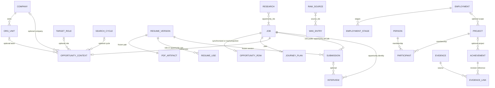
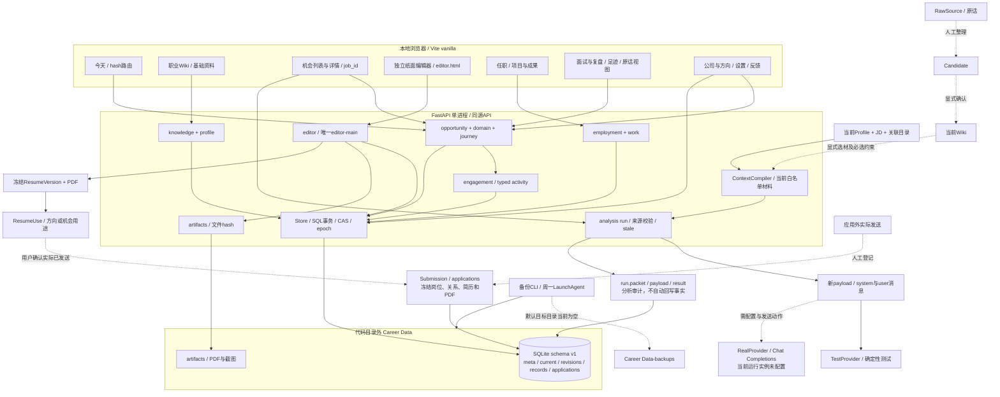

# Career MVP — AS-IS System Map

## 1. Current stack

审计日期：2026-09-17（Asia/Shanghai）。源码基线：`368af740fd2b17e5718ce31675bf526df4591347`。这是当前实现的只读快照，不是产品设计或整改方案。

**当前 Career 是一个单用户、本地运行的 FastAPI + 原生 TypeScript/JavaScript 工作台，以单个 SQLite 的 JSON 记录承载职业资料、求职和任职业务，另有共享的结构化简历编辑器、本地 PDF，以及受控资料包驱动的岗位 AI 评估。**

证据标记贯穿全文：

| 标记 | 含义 | 边界 |
| --- | --- | --- |
| C — Verified by code | 已检查现役源码与调用路径 | 不自动代表当前进程已加载该代码 |
| S — Verified by schema | 已用 SQLite `mode=ro`、`query_only=ON` 检查实际 schema；涉及行数另注明数据观察 | 字段/数据存在不代表业务闭环可用 |
| T — Verified by test | 本轮运行的现有隔离测试有对应通过断言 | 不代表真实模型、真实投递或浏览器写入验收 |
| L — Verified by live inspection | 本轮实际 GET、进程、文件或浏览器只读观察 | 仅覆盖所观察时间和路径 |
| D — Documented only | 文档声明或历史验收 | 不作为当前已实现证据 |
| I — Inferred | 从注明的事实推导的影响 | 不是已复现结果 |
| U — Unknown / Not verified | 未验证或现有证据不能确定 | 不补全为合理架构 |

本轮先读根 `AGENTS.md` 和 `docs/00-authority.md`，再按路由读取产品、上下文、架构、路线、STATUS 和模块 README。没有修改业务代码、schema、配置、产品文档或用户数据，没有启动/重启服务、创建 migration、运行生产备份/恢复、发送 AI 请求或外部消息。唯一仓库产物为本文。隔离测试使用临时虚构数据；浏览器只查看页面和未填写的表单。

| 部分 | 当前事实 | 证据 |
| --- | --- | --- |
| 后端 | Python/FastAPI，Uvicorn 单进程，同源 API 与静态资源 | C：`scripts/run.py`、`src/workbench/app.py` |
| 前端 | Vite + 原生 TypeScript；模板字符串/DOM 渲染；独立编辑器主体为 JavaScript；没有 React 依赖 | C：`frontend/package.json`、`src/main.ts`、`src/workspace.ts`、`src/editor/legacy-entry.ts` |
| 数据 | Python `sqlite3`；5 张业务/支撑表；JSON body；本地文件附件；无 ORM、独立 Repository 层、向量库 | C/S：`core.py`、实际 sqlite_master |
| AI | 同步 Chat Completions 兼容 HTTP；RealProvider/TestProvider；没有 agent 工具执行循环 | C：`providers.py`、`core.Store.analyze` |
| PDF | 结构化工作台：html2canvas + jsPDF 图片式单页 A4；旧文字版和 demo 使用 ReportLab | C：`legacy-app.js:createPdfArtifact`、`artifacts.py`、`demo.py` |
| 已安装运行库 | Python 3.9.6；SQLite 3.51.0；FastAPI 0.115.12；Uvicorn 0.34.2；httpx 0.28.1；Pydantic 2.13.5；ReportLab 4.4.0；pytest 8.3.5 | L：虚拟环境版本读取 |
| 已安装前端工具 | Node v22.23.2、npm 10.9.8；TypeScript 5.9.3、Vite 6.4.3、html2canvas 1.4.1、jsPDF 4.2.1 | L：命令与 node_modules/package.json |
| 依赖配置 | Python `requirements.txt`/`requirements.lock`；`pyproject.toml` 仅 pytest 设置。前端 package.json/package-lock.json；无 lint 脚本 | C |

源码引用均相对仓库根目录。核心证据入口：[core.py](../../src/workbench/core.py)、[app.py](../../src/workbench/app.py)、[workspace.ts](../../frontend/src/workspace.ts)、[main.ts](../../frontend/src/main.ts)。下文的函数名用于定位具体实现，不以 README 替代代码。

## 2. Runtime / data locations

| 位置/入口 | 当前用途与观察 | 证据 |
| --- | --- | --- |
| `/Users/frog/Projects/Career` | 源码、`.venv`、前端 node_modules/dist、测试、fixtures、macOS 启动器 | C/L |
| `scripts/run.py` | `.venv/bin/python scripts/run.py`；默认 `127.0.0.1:8765`，先 GET `/api/state`，有版本字段即复用；支持 `--port`、`--no-browser` | C |
| `macos/Career.app`、`scripts/macos_app.py` | App 用 Chrome 打开 `/#home`；后台服务 PID/日志放 `.career-runtime/`；生命周期管理与业务模块分开 | C；Chrome 启动行为由 mock 测试 T 支持 |
| `/Users/frog/Library/Application Support/Career Data/workspace.sqlite3` | 当前生产进程报告的数据正本，实际存在，516096 bytes；journal_mode=`delete`，user_version=`1` | S/L |
| 同目录 `artifacts/` | 当前 1 个已登记 PDF，22668 bytes，SHA-256 匹配；本次枚举未发现无引用文件 | S/L；该 PDF 带 demo 标记 |
| `/Users/frog/Library/Application Support/Career Data-backups` | 默认备份目录存在，但本轮检查为空 | L；不能推断其他路径/外置设备没有备份 |
| `~/Library/LaunchAgents/local.career.weekly-backup.plist` | 任务存在且 launchctl 已加载，周一 00:00 调用本项目 `scripts/weekly_backup.py` | L；未验证一次实际定时执行成功 |
| `CAREER_DATA_DIR` | 可覆盖默认数据目录；Store 拒绝使用项目目录及其子目录 | C；当前审计 shell 未设置此变量 |
| `/tmp` 或系统临时目录 | 测试 `tmp_path` 的隔离库、附件和备份；fixtures 在 `fixtures/scenarios.json` | C/T；不是生产资料 |

**源码、运行进程和构建产物必须区分。** L：当前 PID `12720` 于 2026-09-15 16:12:16 启动，监听 `127.0.0.1:8765`；`GET /api/state` 报 `app_version=0.1.0`，当前 `core.APP_VERSION` 和前端 package.json 为 `0.2.0`。实际 `/api/opportunities`、`/api/employments`、`/api/opportunity-activity`、`/api/work-domain` 均返回 200，故不能把该进程简单当成“所有新模块都没有”的旧版。准确已加载代码组合为 U；本轮没有重启验证。HTTP 两个 HTML 入口与当前 `frontend/dist` 字节相同，但没有重建验证 dist 对应当前源码的完整程度。

Git 初始状态为 ` D .codex/config.toml`（既有删除，未触碰）。没有 commit、checkout、reset、stash、安装依赖或构建操作。

实际 schema（S；`core.py:Store.__init__` 同样定义）：

| 表 | 核心列与约束 | 实际责任 |
| --- | --- | --- |
| `meta` | 单行 `id=1`，`epoch` | Context 全局失效号 |
| `current` | `id` PK，`kind`，`revision`，`body TEXT`；kind 索引 | 所有可变对象的当前 JSON |
| `revisions` | `(id,revision)` PK，body，created_at | 当前对象的历史快照，没有独立 kind 列 |
| `records` | id PK，kind，body；kind 索引；run 请求 key、artifact.version_id 部分唯一索引 | 原件、正式版本、分析、用途、反馈、命令回放等 |
| `applications` | id PK，job_id，version_id、artifact_id 引用 records.id；idempotency_key UNIQUE；body | 实际投递登记；额外快照及状态历史都在 JSON |

大多数业务关系没有数据库外键；applications.job_id 也没有 FK；version/artifact 的 FK 不限定 records.kind。对象类型、scope、引用匹配、CAS 主要由服务检查。`records` 并非整体不可变：`_record` 是 upsert，run/feedback/proposal 会更新；原件与版本的不可变性来自特定接口约束。没有发现独立 migration 文件；启动时执行 `CREATE IF NOT EXISTS`/`user_version=1`，拒绝版本大于 1 的数据库。初始化还会建立空 profile、修改文件权限、把 running run 标为 failed，所以本轮未对真实库实例化 Store。

本轮实际数据计数（S/L，仅类型/数量，不复制私人正文）：

| 存储 | kind: count |
| --- | --- |
| current（24 行） | profile:1，editor_draft:1，job:2，opportunity:1，opportunity_context:1，resume:1，journey_plan:2，journey_episode:2，employment:1；domain_company/org_unit/search_cycle/target_role 各1；knowledge_candidate:3，wiki_entry:1；work_project/person/achievement/employment_stage 各1 |
| records（27 行） | artifact/editor_version/run/research_snapshot/communication/interview/offer 各1；resume_use:2，journey_note:5，knowledge_source:3，feedback:2；work_project_source/project_participant/event/evidence/evidence_link 各1；demo_manifest/domain_command/knowledge_request 各1 |
| 其他 | applications:1；revisions:146 |

current 中18行、records 中22行、applications 中1行带 `demo_dataset_id`。唯一 run 是 demo TestProvider 的 succeeded 记录；唯一正式版本、投递和 PDF 同样是 demo。未带 demo 标记不等于真实经历或真实业务事件，本文不据此推断个人事实。`PRAGMA quick_check` 返回 `ok`，`foreign_key_check` 返回空；这些检查不验证 JSON 业务语义。

## 3. Frontend map

C：主入口 `frontend/index.html → src/main.ts → workspace.ts`；hash 路由，非 React Router。独立入口 `editor.html → editor/legacy-entry.ts → legacy-app.js`。主页面初始化并行 GET `/api/state`、`/api/journey`、`/api/knowledge`、`/api/domain`、`/api/work-domain`，随后 GET `/api/editor/versions`。因此“此页使用的数据”不等于浏览器只加载此页的数据；应用会先加载这些合集到内存。`/work-domain` 读取失败被 catch 为全空集合。

一级导航（C/L）：**今天、职业 Wiki、机会、简历工作台、任职、面试与复盘、足迹**。账户菜单另有个人资料、公司与方向、设置、反馈记录；顶部全局反馈。`#progress` 与 `#jobs` 复用同一机会视图，`#profile` 指向 Wiki 基础资料；不存在独立 Application 页面。

| 页面/路由 | 实际渲染数据 | 可触发动作（C；不代表本轮执行写入） |
| --- | --- | --- |
| 今天 `#home` | state.jobs + journey.plans；按 due_date 排序，最多4项非 closed 计划 | 继续机会、添加机会、进入编辑器、记录任职、整理 Wiki；没有后台任务调度器 |
| 职业 Wiki `#wiki`、`#profile` | knowledge.sources/candidates/entries，state.profile；业务目录作 scope 选择 | 登记原文/定位、人工整理候选、确认/拒绝、编辑/撤回当前条目、看历史、维护基础资料及旧文本整理 |
| 机会 `#jobs/<legacy_job_id>?tab=...` | state.jobs 为列表主数据；journey.plans；domain.opportunities 关联；state.runs/applications；domain.resume_uses；journey.notes | 添加/编辑 JD，排除/软删除/恢复，改阶段/下一步/日期，评估，打开编辑器，关联正式版本、登记投递、改投递状态，追加/更正/回流原话 |
| 简历工作台导航 `#resume` | editorVersions 元数据、resume_uses、目录对象 | “文档与版本”“方向与机会用途”；查看/下载 PDF，关联用途，进入纸面编辑器 |
| 纸面编辑器 `/editor.html?job_id=...` | `/api/editor` 的唯一 editor-main 草稿；`/materials`、`/sources`；正式版本列表/详情 | 富文本、分区/条目排序、格式、撤销/重做、自动/手动保存、Wiki选材、来源查看、保存/删除/恢复版本、MD/JSON/PDF 导出 |
| 任职 `#work/<episode_id>` | journey.episodes/notes；work-domain.employments/projects/events/achievements/evidence | 工作卡编辑/导出，事项/协作/收获原话；建项目、事件、成果、证据、参与者及成果证据关联；页面主要显示项目描述和计数 |
| 面试与复盘 `#practice` | journey.notes 中 kind=interview/reflection，不调用 typed interviews API | 跨机会/任职阅读记录，更正、看原文历史、选段转候选；没有模拟会话/语音交互 |
| 足迹 `#footprint` | 全部 journey.notes | 阅读/来源跳转/更正/候选；不是汇总 submissions、work_event、分析和状态变更的统一事件流 |
| 公司与方向 `#directory` | domain.objects：公司、组织、方向、周期；resume_uses | 创建/编辑目录、同公司组织层级、方向版本用途 |
| 设置 `#diagnostics` | diagnostics | 显示 Provider/路径/版本，说明环境配置方式；显式装载/删除 demo；不是可提交密钥的配置表单 |
| 反馈 `#feedback` | state.feedback，截图 artifact 引用 | 查看、追加、Markdown/JSON 导出；顶部录入文本及可选截图 |

L：本轮查看机会默认详情及截图、简历 tab、面试 tab、未填写的“记录面试”表单、独立纸面编辑器。机会实际是白灰固定视口、左导航＋中间列表＋右详情；列表有进行中/已归档；详情顶部公司/岗位、当前计划与主动作，下面为机会/评估/研究/简历/沟通/面试/Offer tabs。简历 tab 显示“这次机会使用的版本”和“历史投递”，不是现场编辑一份机会专属简历。面试表单只有标题、内容、可选投递关联，没有轮次、日期、参与者、结果字段。编辑器显示已保存稿和纸面工具；没有执行保存/导出/恢复。其他页面映射以 C 为据，未逐页做浏览器验收。

页面并非直接一页一表：机会跨至少7类数据，Wiki跨3类，足迹/练习只是同一笔记合集的不同过滤。真实业务数据/状态主要在后端；页面选择、tab、筛选、编辑缓冲、撤销栈和“下一主动作”推导在前端。不存在统一后端工作流状态机。

## 4. Backend modules

| 模块 | 实际入口/职责 | 边界与限制（C） |
| --- | --- | --- |
| `app.py` | create_app、state/jobs/context/analysis/applications/feedback；挂载 routers 和 dist | 传输、校验与部分业务处理混合；只允许回环 Host/同源 Origin，写入需 X-Career-Request，JSON请求上限8MB；无账户/租户 |
| `core.py` | Store、当前修订、epoch、旧简历、run/proposal、投递快照/状态、反馈 | 所有模块共享 Store；connect(write=True) 用 BEGIN IMMEDIATE；read 使用 BEGIN。不是独立数据库访问服务 |
| `opportunity.py` | `/api/opportunities`；canonical ID 和旧 job 兼容投影 | 创建/修改最终调用 Store 保存 job 并同步 opportunity |
| `domain.py` | `/api/domain`、objects、opportunities/{id}、resume-uses | 公司/组织/方向/周期、机会关联、正式版本用途；组织同公司/防环验证 |
| `journey.py` | `/api/journey`；plans、episodes、notes/correct/history/candidate/export | 计划/工作卡及不可变原话＋更正视图；新求职原话同步生成 typed activity |
| `engagement.py` | `/api/opportunity-activity[/kind]` | ResearchSnapshot/Communication/Interview/Offer 创建和读取；旧原话只读 projection；没有活动更新/删除或研究执行器 |
| `employment.py` | `/api/employments` | Employment 与旧 journey_episode 同事务同步/兼容读取 |
| `work.py` | `/api/work-domain`、`/api/work/*` | Stage、Project、Person、Participant、Source、Event、Achievement、Evidence、EvidenceLink；无 Achievement→候选的专用入口 |
| `knowledge.py` | `/api/knowledge/*` | 来源、候选、确认、Wiki修订/撤回与选材白名单；不抓取 locator 指向的内容 |
| `profile.py` | `/api/profile/basics`、organize | 唯一基础身份，旧混合文本归档＋候选；保存身份时同步当前 editor 草稿 |
| `editor.py` | `/api/editor`、materials/sources/select-facts/versions/restore | 单份结构化草稿、显式选材、冻结版本/PDF、删除引用保护、恢复点；没有 AI patch |
| `context.py` | ContextCompiler.compile | 同一事务读受控当前材料并编译 schema v2 packet；只有 job/resume 两种 task_type |
| `providers.py` | build_payload / complete / diagnostics | 只持有 payload 和 Provider 配置，不持有 Store/任意SQL/文件工具；远端无工具调用、无历史 session |
| `artifacts.py` | PDF/截图生成、原子文件写、路径校验 | 相对路径、SHA-256；附件下载检查完整性；通用文件解析未实现 |
| `backup.py`、`scripts/weekly_backup.py` | 本地一致性备份、hash manifest、恢复到新目录 | 命令行能力；本轮仅临时数据测试，没有生产恢复演练 |
| `demo.py` | `/api/demo/load`、remove | 直接建立带 dataset id 的虚构对象和 PDF，幂等装载与清理；不能代替实际用户走业务入口 |

各 router 经常直接调用 Store 私有 helper 或 SQL，未形成严格 Controller→Service→Repository 分层。模型输入隔离是调用边界约束，不是独立进程/数据库的安全沙箱。

## 5. Current domain objects

以下为 C；第2节说明实际落库是否存在。业务对象名称不等于独立数据库表。

| 概念 | 实际存储/形态 | 在现实业务中的责任；不是何种能力 |
| --- | --- | --- |
| Company | current.kind=`domain_company`；name、description、revision | 可复用公司身份目录。没有统一公司外部编号、同名去重、独立 research 聚合；机会里的 company 字符串仍另存 |
| OrgUnit | `domain_org_unit`；company_id、parent_id | 同公司组织树；机会最多引用一个节点，不是完整招聘团队知识模型 |
| TargetRole / SearchCycle | `domain_target_role` / `domain_search_cycle`；name、description | 目标方向/求职周期目录；周期尚无起止日期和独立状态流 |
| Job / JobPosting | current.kind=`job`；company/title/jd/url/status/source/created_at | 一条人工收录且可改的招聘信息，同时承担旧任务ID与可用性状态。没有独立 JobPosting 对象或可跨多个 Opportunity 共享的 posting_id；source 固定 manual；旧 JD 在 revisions，投递另冻结快照 |
| Opportunity | `opportunity:<job_id>`，kind=`opportunity`，复制 job 多个字段；另有 `opportunity_context`、`journey_plan` | 一次求职推进的公开身份，但不能脱离 job 单独存在/生命周期独立变化。旧数据可只通过读投影获得；不是 Submission |
| Application / Submission | 同一个 `applications` 表/对象；同时有 job_id、opportunity_id | 用户登记已经发生的一次投递，引用冻结简历/PDF/岗位/业务关系、渠道、发生时间；可以多次登记。不是外部自动投递任务或初始机会 |
| Resume | 当前可写为 `editor_draft`，固定 id=`editor-main`；旧 `resume` 是按 job 的文字稿 | 结构化工作稿是全局一份表达与排版容器。它不是个人事实正本，也不是多个 role/opportunity 独立文档 |
| Resume Version | records.kind=`editor_version`，完整 document、名称、时间、artifact_id | 显式冻结的一份简历与配套 PDF；没有 document_id/parentVersionId 分支模型。旧 kind=`version` 文字版本只保留兼容 |
| ResumeUse | records.kind=`resume_use`；scope_type/ID、version_id、artifact_id/hash、名称快照 | “该方向/机会使用此版本”的用途记录；同一版本可多处使用；用途本身没有投递时间/结果，不代表已发送 |
| Greeting | 未发现独立 kind、接口、生成器或主界面动作 | 可以人工写在 communication 正文，但没有独立招呼草稿/已发送招呼模型；不能由产品文档推定已实现 |
| Research | `research_snapshot`；opportunity_ids[]、raw_note_id、captured_at、source_locator、content | 用户登记的一次研究材料快照，API可关联多个机会；不是联网搜索、公司事实库或自动研究报告 |
| Communication | `communication`；opportunity_id、occurred_at、channel、participants、raw_note_id、outcome | 一次人工沟通记录；没有收发消息、会话回合或消息平台接入 |
| Interview | `interview`；opportunity_id、可空 submission_id、round、occurred_at、participants、raw_note_id、outcome | 一次人工面试/复盘记录。可建立多条表示多轮；round 自由字段，无轮次唯一性、排程、问题/答案/turn 模型；页面主要存原话 |
| Offer | `offer`；opportunity_id、raw_note_id、occurred_at、terms、status | 一份人工条款记录；默认 pending，status/terms 缺少强枚举/结构验证；无薪酬计算、比较、谈判或接受转入职闭环 |
| RawSource | `knowledge_source`；content/source_type/locator/scope、可选 origin | 用户提供的原文/摘录/指针；登记 URL/Git/目录不读取外部内容。普通来源创建不统一写 hash；部分回流来源带 hash/origin |
| ExtractedCandidate | `knowledge_candidate` | 人工整理的待确认解释；pending/confirmed/rejected；可修订，确认产生 Wiki；不是已完成 AI 抽取 |
| WikiEntry | `wiki_entry`；entry_type/content/scope/source_ids/revision/status/verification | 当前采用的可修订职业认知；active/withdrawn；确认和编辑设 user_asserted，不等于独立核验 |
| CoreProfile | `profile`，固定ID；basics/content/mode/revision | 当前基础身份。structured 后 content 由字段生成；旧 mixed content 在显式整理前仍会进入 Context |
| JourneyNote / NoteRevision | 原件 `journey_note`；更正 `journey_note_revision` + revisions | 原始业务叙述与当前更正视图；可选投递引用。更正不会覆盖原件或自动改 Wiki |
| Employment | `employment:<episode_id>` + `journey_episode` | 一次任职及旧工作卡兼容身份；公司仍是文本；未发现 company_id/org_unit_id/origin_offer_id |
| EmploymentStage | `work_employment_stage` | 任职内阶段；日期、focus、planned/active/completed/paused；存在API和数据，主页面未呈现阶段管理 |
| Project / Person | `work_project` / `work_person` | 项目有可空 scope（personal/episode/employment），人物独立；Participant 是项目内角色关系。Project 没有 stage_id |
| WorkEvent / Achievement | `work_event` / `work_achievement` | 事件指向 episode 或 project；成果可引用 project，能CAS修订；不自动成为 Wiki |
| ProjectSource / Evidence / EvidenceLink | work_project_source/work_evidence/work_evidence_link | 项目材料/证据及成果引用；与 knowledge_source 是不同 kind；EvidenceLink 实际指向 Achievement，没有 fact_id 或页/行字段 |
| AnalysisRun / ContextPacket / Proposal | run.body 内 packet/payload/result/status；旧 proposal 单独记录 | 一次请求及审计，不是职业事实。没有独立 ContextSnapshot 表、Session/Conversation 表；旧文字提案仅内部兼容方法存在 |

phase/status/result 的具体实现和“结束”判定见第10节，不能把这三个词当同义字段。

## 6. Current relationships

关系基数来自服务和JSON引用，不表示数据库均有 FK。`0..1` 表示可选；关系存在但没实测多条时，不宣称完整用户链路已验收。

| 两端 | 当前基数/实现 | 证据与限定 |
| --- | --- | --- |
| Job ↔ Opportunity | 公开视图 1:1；落库 Job→Opportunity 0..1 | C/S：sync_job、current_opportunities；实际2个job仅1个opportunity行 |
| Job → Plan / OpportunityContext | 各 0..1 | C：确定性 `journey:<job_id>` / `opportunity-context:<job_id>` |
| Company → OrgUnit | 1:N；OrgUnit→parent 0..1，同公司树 | C/T |
| Company/OrgUnit/TargetRole/SearchCycle → OpportunityContext | 各1:N；每个机会关联各0..1 | C：assign 检查引用；不是按 job.company 自动关联 |
| Opportunity → Submission | 1:N；每个投递属于一个机会/job | C/T；不是 Opportunity=Submission |
| 独立 JobPosting → 多个 Opportunity | **未实现** | C/S：只有 job 与 opportunity 的一对一同步形态 |
| 当前 editor-main → ResumeVersion | 逻辑1:N，所有版本来自唯一草稿 | C：无显式 document_id FK；历史版本不可当当前事实 |
| 新 ResumeVersion ↔ PDF Artifact | 1:1 | C/S/T：保存版本同时登记一个PDF；每版一个artifact，部分唯一索引 |
| ResumeVersion ↔ Opportunity/TargetRole | N:N，经 ResumeUse | C/T；允许同一版本多用途，多个请求可建重复用途行 |
| ResumeVersion/PDF → Submission | 1:N | C/T：一次投递固定一个版本和PDF |
| Opportunity → Communication / Interview / Offer | 各1:N | C/T：允许先记录而不先投递 |
| Submission → Interview | 1:N，Interview端0..1 | C：仅存在时验证同job；普通页面 note 引用也检查同job |
| ResearchSnapshot ↔ Opportunity | N:N（opportunity_ids[]） | C/T：研究API支持多机会；raw_note只归第一个job，前端按note scope看记录 |
| Typed activity → JourneyNote | 创建路径各1:1；无DB唯一约束 | C：raw_note_id；旧note兼容projection不是新落库对象 |
| JourneyNote → NoteRevision | 0..1 当前更正；1:N 更正历史 | C/T |
| RawSource ↔ Candidate / WikiEntry | N:N，source_ids[] | C/T：引用必须同scope；Candidate确认只创建0..1个WikiEntry |
| WikiEntry/Profile → editor items | 可多次选材的来源引用（source_refs） | C/T：每次固定revision/hash；不是简历正文对Wiki的实时镜像 |
| JourneyEpisode ↔ Employment | 公开视图1:1；实际行可缺Employment | C/S：实际2个episode、1个employment行 |
| Employment → Stage | 1:N | C；Stage→Project **没有关系字段**，不能画成现有1:N |
| Employment或Episode → Project | 1:N，通过scope；Project也可personal/无scope | C |
| Project ↔ Person | N:N，经 ProjectParticipant | C/T；同项目/人物拒绝重复；保存person_revision |
| Project → ProjectSource / WorkEvent / Achievement | 各1:N，部分对象目标/项目引用可空或另为episode | C/T |
| Achievement ↔ Evidence | N:N，经 EvidenceLink | C/T；固定achievement_revision，Evidence可为多种scope |
| Offer → Employment | **未实现** | C：没有origin_offer_id或转入职接口；不推定关联 |
| Run → ContextPacket / payload | 每run各1个嵌入快照 | C/T；没有Session父对象 |



该简图省略表中部分关系；不表示 JobPosting 已独立、不表示 Stage 拥有 Project，也不表示所有图边有 FK。图中 JOB 作为现有底层任务锚点，其公开 Opportunity 身份固定由 job ID 派生。

## 7. Current user flow

**可以走通的是人工资料与求职记录链，AI、招聘平台和真实面试执行链没有完整接通。** C/T/L 的具体边界如下：

1. 人工登记 RawSource → 整理候选 → 确认 Wiki → 修订/撤回。基础资料单独保存；旧混合文本可显式归档并拆候选。候选确认前不进入普通AI Context。
2. 手工添加公司名称、岗位名和 JD，URL 可空；可另建公司/组织/方向/周期并关联。没有已接入的自动搜岗、招聘API或文件批量解析入口。
3. 编辑计划阶段、下一步与日期。评估可以选Wiki、预览资料包、显式请求Provider；当前运行实例未配置真实模型，评估不是人工链的必备条件。
4. 从机会或独立入口打开同一纸面工作稿 → 显式选入个人/当前job Wiki → 人工编辑表达和排版 → 保存正式版本/PDF → 为机会建立 ResumeUse。
5. 在应用外实际发送；回到机会登记时间、渠道、版本、状态。应用没有发送邮件、招聘平台投递或批量提交能力；登记是用户陈述的事件，不能独立核验外部发送是否发生。
6. 可不经投递直接追加研究/沟通/面试/Offer原话，也可关联已有投递；更正保留原件。多轮面试可用多条笔记表示，后台另有round字段；没有逐轮模拟问答/录音/转写执行器。
7. 原话选段 → 同范围或显式提升personal的候选 → 人工确认Wiki → 下一次选材。旧投递、旧简历版本不会自动随事实变化。
8. Offer后可另建任职卡；没有接受Offer→实际入职的自动引用链。任职页可记录工作卡/项目/事件/成果/证据，普通journey note可回流候选；没有专用 work_achievement→Wiki 转换入口。

T：冻结、范围隔离、幂等、原话更正/候选回流等对应测试通过。L：页面入口和演示记录可读。U：本轮未在生产数据上重新执行整条写入路径、真实投递、实际模型或浏览器PDF导出；两项 profile/editor 测试失败见第11节。

## 8. AI / Context flow

核心证据：[context.py](../../src/workbench/context.py)、[knowledge.py](../../src/workbench/knowledge.py)、[providers.py](../../src/workbench/providers.py)、`core.py:analyze/_validate_result/_bump`、`main.ts:analyze`。

| 问题 | AS-IS 答案 |
| --- | --- |
| 1. 用户资料存在哪里？ | S/C：基础身份在current.profile，当前事实在current.wiki_entry；原文在records.knowledge_source及journey_note；候选在current.knowledge_candidate；工作对象、简历表达、分析审计分别有kind。不是磁盘上的Raw/Wiki/Analysis目录树。附件只有显式登记文件，普通URL/目录/Git source只保存用户输入和locator |
| 2. AI每次从哪里读？ | C/T：ContextCompiler在同一Store读事务内查询当前profile、active job、opportunity_context引用的当前目录对象、选中的active Wiki；取epoch，生成packet。Provider只接收payload |
| 3. 是否读取旧对话/旧revision？ | C/T：普通新分析不查询revisions、旧run、proposal、历史简历、旧投递、反馈或journey note；无隐式远端会话、开发Agent聊天读取。旧run可由幂等key回放返回，不等于发起新请求。用户若手工把旧说法粘入当前资料或本轮instruction，文本仍会进入包；系统不识别这种语义污染 |
| 4. AI输出自动回写正式数据吗？ | C：岗位结果写入run.result，状态为succeeded/stale/failed，不改profile/Wiki/机会。内部旧resume分析可创建proposal，须显式apply；现役HTTP已经拒绝resume分析和旧proposal应用。没有结构化简历AI写入入口，也没有自动候选提取/确认 |
| 5. Raw与正式事实分开吗？ | C/T：按kind和模块分开；候选确认事务才建active Wiki。普通Context不会展开Raw；source_ids只是追溯。与事实同库、进程同权限，不是不可绕过的物理隔离 |
| 6. Resume/Interview/Research各有AI吗？ | C：只有job和旧resume两类编译策略，共用Provider；HTTP只允许实际job分析。Research/Interview是手工记录模块，没有独立模型调用或任务策略；结构化编辑器不调用Provider |
| 7. 是否存在Compiler？ | C/T：存在明确的 `ContextCompiler` 类，schemaVersion=2、policy=context-v2。它是规则白名单＋用户选材的编译器，不是语义检索/智能摘要/冲突求解器 |
| 8. 一次请求可能读哪些数据？ | C：详见以下完整来源表；浏览器全量GET与真正发给Provider的数据不同 |

一次普通非demo job 请求的来源（C）：

| 来源 | 自动/显式 | purpose与限制 |
| --- | --- | --- |
| 当前 profile.content | 非空则自动包括 | current_fact；结构化时含姓名/联系方式/网页；仍未整理的旧混合文本会整段进入 |
| 当前 job 的 company/title/jd/url | 自动 | target_jd；招聘要求不是本人经历；有revision/hash |
| opportunity_context关联的 Company/OrgUnit/TargetRole/SearchCycle | 关联存在则自动 | task_context；每个含id/revision/name/description；不需要额外wiki勾选。这一点与文档契约冲突 |
| personal active goal/constraint Wiki | 自动强制包括 | current_fact；不由“未勾选”排除 |
| 其他personal active Wiki | 每轮wiki_ids显式选择 | current_fact；user_asserted不是独立核验 |
| 当前job active Wiki | 每轮wiki_ids显式选择 | task_context；其他job和任职episode范围拒绝 |
| 本轮instruction | 用户输入 | 独立字段，最多10000字符；不会从旧聊天补入 |
| 来源ID/revision/hash/purpose、scope及目录引用 | 随packet | 用于追溯；Wiki source_ids附带，但不递归读取原件正文 |

demo 特例（C）：带demo_dataset_id的job不包含profile，只保留同数据集Wiki；显式选择其他dataset Wiki会被拒绝。目录关联仍由通常编译逻辑读取，不能把这种特例推断成整个demo系统的通用权限隔离。

实际过程（C/T）：

```text
选取wiki_ids + 当前job + 本轮instruction
  → POST /api/context（只读预览，无独立ContextSnapshot持久化）
  → 用户确认发送
  → POST /api/analysis（同参数、expected_epoch、idempotency_key）
  → BEGIN IMMEDIATE：重编译当前packet，比较epoch，生成payload，存run=running
  → 事务外Provider.complete(payload)
  → 校验必需字段、claims类型和source_ids是否属于当前包
  → 新事务复查epoch：succeeded或stale；异常存failed
  → 前端展示结果、来源、packet和实际payload；不自动写业务事实
```

RealProvider用全新的system/user两条messages，JSON响应格式，POST `{base_url}/chat/completions`，30秒timeout，不跟随重定向、不自动重试。system提示区分current_fact、target_jd和task_context；无模型文件、SQL或网络工具。API key仅服务端环境。已验证外发只有测试桩，未调用真实远端。L：运行实例 `mode=real`、`configured=false`、model空，默认base URL为`https://api.openai.com/v1`。

Compiler的实际限制（C）：

- `unknowns` 仅列缺失的公司/组织/方向/周期关联；`conflicts=[]`、`omissions=[]` 是固定占位，不证明已检查无冲突/无遗漏。
- 30条、100000正文字符的硬限制只由 `selected_wiki_sources` 对Wiki选材执行，未覆盖附加profile/JD/目录对象；packet.budget_used列出同名限额，但不是全包统一预算。content_chars按Python字符串长度统计，非token数；Provider另设JSON编码2MB上限。
- sources同时保存`selected_content`与兼容`content`，Provider实际JSON会带两份内容；不是仅发送一次显示文本。
- 全局epoch对profile/JD/Wiki/目录关联等变更失效；计划、原话、简历用途不属于普通事实输入，不都bump epoch。全局变更会使无关run一并stale。
- 输出校验只确保结构及来源ID存在。并未证明每个Fact受所引文本支持，也未检测所有新增数字/职责/矛盾。部分job字段允许str/list/dict，比提示词要求宽松。
- 页面通过预览传expected_epoch，但HTTP服务允许省略expected_epoch；预览是当前UI流程，非API强制“必须先预览”的令牌协议。
- 存储、Compiler和分析运行在同进程；“Provider没有Store引用”已实现，“分析执行器进程无数据库权限”未实现。

## 9. Resume implementation

核心证据：[editor.py](../../src/workbench/editor.py)、[legacy-app.js](../../frontend/src/editor/legacy-app.js)、[profile.py](../../src/workbench/profile.py)、[test_editor.py](../../tests/test_editor.py)、[test_fact_resume.py](../../tests/test_fact_resume.py)。

**当前内容、工作稿修订、正式版本和实际投递快照是四种不同用途。**

| 层 | AS-IS 内容与变化规则（C） |
| --- | --- |
| 当前内容 | current.editor_draft，id恒为editor-main；document schemaVersion=1，profile/sections/formatting/meta；sections只允许experience/projects/education/skills各至多一个 |
| 自动/手动保存 | PUT `/api/editor`，expected_revision CAS；current表revision递增，revisions追加document快照；来源refs不能从普通PUT篡改。GET空草稿不落库 |
| 撤销/重做 | 浏览器内存栈，最多100个checkpoint；之后按正常保存形成新revision，不减少服务端revision，不提供持久化撤销会话 |
| Wiki选材 | `/select-facts`检查草稿/事实revision和scope，把选定标题/正文追加到简历条目；服务记录item_id/source_id/revision/hash；不是AI改写或自动岗位匹配 |
| 来源状态 | `/sources`比较当前来源revision及条目是否仍在，返回current/updated/withdrawn/removed。Wiki修改不自动重写正文 |
| 基础资料同步 | 保存profile/basics或organize，在同一事务主动更新当前草稿姓名和联系方式并加revision；历史版本不改。编辑器普通正文保存也能修改表达，因此同步发生在显式资料保存时，不是双向实时唯一字段 |
| 正式版本 | POST `/editor/versions`校验提交document等于已保存稿、revision一致；存完整document与固定PDF，名字和时间；请求指纹/幂等key防重复。不是每次autosave都建正式版本 |
| PDF | 客户端先锁定编辑、flushSave、等待字体、检查A4溢出，再canvas截图写一页JPEG PDF；超出A4拒绝保存；不是自动多页排版、可选文字或ATS可解析承诺 |
| 后端PDF验证 | Base64、大小≤5MB、PDF头尾标记与存储hash；没有验证PDF画面与document语义一致。冻结保证同一组提交字节，不证明PDF内容正确 |
| 版本恢复 | POST `/restore`以CAS把冻结document恢复成新的当前revision，并存editor_recovery.before；不把旧revision重新标为当前，不更新Wiki/profile |
| 版本删除 | 未引用版本可删除及移除PDF；已有resume_use或application则冲突拒绝；没有对外承诺永不可删除的所有版本档案 |
| 版本用途 | ResumeUse引用现有editor_version及PDF/hash；role或opportunity；同版可多处复用。target_name/version_name为用途时名称快照 |
| 实际投递 | application保存完整resume_snapshot/document/formatting/source_refs、artifact_snapshot及当时JD/关系；后续工作稿/Wiki/公司改动不更新它 |

`editor.html?job_id=...`只影响材料范围和返回机会链接；不会选择另一份草稿。不同机会的准备最终写入同一个editor-main。版本没有独立ResumeDocument身份、scope/target_id、parentVersionId或正式document lineage。当前scope位于用途记录，而非草稿所有权。

旧链仍在代码/数据里：current.resume按job保存文字，records.version保存旧正式文本，core仍有open_resume/save_resume/analyze(kind=resume)/apply_proposal/save_version等内部方法，部分测试直接调用。现役HTTP拒绝旧文本编辑、创建版本、resume分析和proposal应用；POST `/api/resumes`仅返回已有旧稿，旧PDF导出接口仍可为已有version产出PDF。当前主导航没有“早期记录”tab；legacyResumePage函数与旧事件绑定残留，但workspace.view不调用该渲染函数。因此不能把内部旧测试通过当作当前纸面编辑器AI已接通。

L：从案例机会进入编辑器看到全局当前稿而非案例正式版本，符合单工作稿实现。唯一落库正式版本/PDF为demo数据；本轮只查文件/hash，没有生成新的浏览器PDF。测试使用最小PDF字节替身验证部分编辑器持久化，ReportLab测试另生成真实PDF；二者不等于html2canvas浏览器排版验收。

## 10. Opportunity / Application implementation

核心证据：[opportunity.py](../../src/workbench/opportunity.py)、[domain.py](../../src/workbench/domain.py)、[engagement.py](../../src/workbench/engagement.py)、`core.py:save_job/save_opportunity/record_application/application_status`、`journey.py:save_plan/create_note`。

**Job与Opportunity仍混合承担岗位信息和求职推进；Opportunity与Submission在存储和动作上已分开。**

- C：新增job时创建job及`opportunity:<job_id>`两行；公司名、岗位名、JD、URL、status等同步复制，两份revision均可增长。Opportunity并没有独立posting_id指向可共享招聘信息实体；Context、计划、Wiki scope、笔记、主前端仍大量使用legacy job_id。
- S/L：当前实际2个job、1个opportunity行；GET `/api/opportunities`返回2项，另一项来自只读兼容投影。不能把API数量当实体落库数量。
- C：公司身份在domain_company；机会另存company字符串；任职卡也独立存公司字符串。关联公司不校对/同步job.company。L/S：本次一条已关联记录的job.company与domain_company.name不同，页面也同时显示两个不同案例公司名称。冻结历史再复制公司名是合理事件快照；当前记录之间无同步的重复公司信息则有歧义风险。
- C/T：applications每行代表一次显式登记。机会没有投递也可评估/记沟通/面试/Offer；计划改applied不会创建application；同机会同版本可以多次真实登记，用不同动作key区分。
- C/T：结构化投递必须先有该机会与所选version/artifact/hash匹配的ResumeUse；role用途不够。服务检查PDF文件/hash，事务内固定job_snapshot、opportunity_snapshot（含目录关系）、resume_snapshot、artifact_snapshot、channel、applied_at及初始status_history。
- C：没有必须active才可登记投递的检查；也没有必先评估/面试/Offer的后端流程顺序约束。不同可用性状态不自动阻止全部历史动作。

状态实现：

| 现实含义 | 字段/取值 | 谁改变；对其他状态影响 |
| --- | --- | --- |
| 机会是否在活动列表 | job.status / opportunity.status = active/excluded/deleted | 编辑机会；同步两个对象。deleted是软标记，仍有历史/恢复；不是业务输赢结果 |
| 计划阶段（最接近phase） | journey_plan.stage = screening/research/resume/outreach/applied/interview/offer/closed | 用户“编辑计划”，CAS保存；next_action必填、due_date可空；没有独立phase字段，不自动生成事实事件 |
| 一次投递进度 | applications.body.status = applied/interviewing/rejected/offer/closed | 登记初值或单独status接口；每次追加status_history；不改plan或job.status。没有CAS/expected_status，也不验证转移方向 |
| 沟通/面试结果 | communication.outcome / interview.outcome | 创建时自由值，默认空；主页面表单没有这些字段；不是统一result枚举 |
| Offer状态/条款 | offer.status默认pending；terms默认{} | typed创建接口接收，无后续状态变更接口；主页面原话入口默认值；不自动改投递/计划或建Employment |
| AI执行状态与结果 | run.status running/succeeded/stale/failed；run.result结构化建议 | 后端分析过程；不是求职业务阶段/录用结果 |

**“已结束”没有全局定义。** C：`application.status=closed`显示“已结束”，`journey_plan.stage=closed`显示“结束”，job的excluded/deleted控制归档。三者互不归约；rejected也不会自动关闭机会。首页正常计划列表排除stage=closed，但机会列表仍按job.status；当没有符合条件计划时，首页回退显示active jobs，closed计划对应的active job仍可能被展示。I：同一机会可能在不同位置呈现“已结束”“进行中”或继续按钮，不代表数据丢失，而是当前规则分别计算。

主动作由前端按“有JD→有succeeded评估→有ResumeUse→有Submission→计划下一步”推导；不是按stage/result的统一决策。succeeded不额外区分demo/test与真实模型；真实Provider未配置时仍可以从简历tab完成手工链，但主按钮可能持续建议评估。

Research/Communication/Interview/Offer的双视图（C）：

- 新 `POST /api/journey/notes` 对求职四种kind，同事务保存raw note和typed object；旧note通过activity_view的legacy_projections只读兼容。
- 前端读取 `/api/journey` 的更正note，未读取 `/api/opportunity-activity`。直接typed API写入的round、participants、terms、outcome等字段在目前页面不展示。面试可多条记录，但不等于多轮流程状态管理。
- ResearchSnapshot可N:N机会，其raw note scope仅第一个job；按当前前端过滤规则，第二个机会不会仅因opportunity_ids包含它就显示该研究原话。typed快照content也不会随note更正更新；当前解释应看note更正视图，不能把两种API返回当同一个当前正文。
- 通用note可携带同job submission_id；typed Interview显式保存并验证这个关系，Communication/Offer没有同样的顶层submission字段（普通note仍可保留）。不要把四种typed对象都描述成完整相同的Submission子对象。

## 11. Tests and verified capabilities

执行前先确认测试均使用tmp_path、显式TestProvider或mock HTTP；macOS启动测试mock Popen/健康检查，不启动或停止真实服务。选择运行已有测试覆盖用户要求的当前资料隔离、引用冻结、并发、持久化与人工业务记录；不新增测试、不修复失败、不重复运行。

```sh
PYTHONDONTWRITEBYTECODE=1 PYTEST_DISABLE_PLUGIN_AUTOLOAD=1 .venv/bin/python -B -m pytest tests -q -p no:cacheprovider
npm --prefix frontend run typecheck
```

结果：**71项，69 passed，2 failed，2.05s；typecheck退出码0。** 未运行build（会改dist）、未新增lint配置、未调用真实AI。测试临时文件在系统pytest临时目录，不写生产库；关闭pytest cache和Python bytecode写入。

| 已通过证据（T） | 能证明什么 | 不能据此证明什么 |
| --- | --- | --- |
| test_context / test_knowledge / test_wiki_integration | 当前revision、显式Wiki＋必选约束、scope拒绝、packet/payload、预览epoch过期与运行失效 | 语义选材质量、真实模型可靠性、完整冲突识别 |
| test_applications / test_opportunity_flow | 机会/版本/PDF/关系冻结、状态历史、用途匹配、损坏PDF拒绝、并发幂等、重开库保留 | 对外真实投递、当前长驻进程等价于测试源码 |
| test_editor / test_editor_http / test_fact_resume | 结构化草稿CAS、版本保存/恢复/删除保护、来源refs、Wiki选材scope、事实回流到payload | 当前浏览器PDF排版、所有profile→editor流程无回归 |
| test_journey / test_journey_http / test_record_candidates | 计划CAS、原话不覆盖、更正历史、候选确认、任务隔离、导出与临时备份恢复 | 自动面试、语音、完整活动领域字段UI |
| test_engagement / test_domain / test_work_domain | typed记录持久化、N:N研究/人物/证据、公司组织校验、用途不是投递、工作对象不自动写Wiki | Stage→Project→成果→Wiki完整自动链；多轮调度/Offer计算 |
| test_providers_artifacts | HTTP mock中精确payload/错误脱敏，ReportLab PDF、截图/路径保护 | 真实网络服务、模型质量、html2canvas导出 |
| test_backup / test_demo / test_macos_app / test_http | 临时库备份恢复、demo幂等及归属保护、启动Chrome参数、同源和Host保护 | 生产定时备份实际成功、真实资料端到端恢复 |
| 部分 test_core、旧resume相关测试 | 内部旧方法仍可运行、proposal CAS等底层兼容行为 | 已关闭HTTP入口可用，或新结构化编辑器已有AI适配 |

两项失败（保留事实，不改测试）：

1. `tests/test_profile_ownership.py:34` 的 `test_basic_profile_explicit_resume_selection_and_provenance`：保存basics后用expected_revision=0调用select-facts，实际409“工作稿已更新，请保存并重新选择材料”，断言预期200。
2. `tests/test_profile_ownership.py:46` 的 `test_extended_contacts_roundtrip_resume_refresh_and_old_client_preserves_fields`：同样保存basics后以expected_revision=0选材，返回JSON无document，测试报 `KeyError: 'document'`；后续扩展联系方式/旧客户端保留断言未执行到。

C：profile._save调用sync_profile_to_draft，后者会增加工作稿revision。I：两项测试的旧revision假设与当前同步行为不一致，解释了失败；这不单独证明实际页面同样失败，也不能因此宣称这两条业务验证已通过。没有为本轮审计改动实现或测试。

L/S：另外实际检查了服务GET（state/journey/knowledge/domain/work-domain/opportunities/employments/opportunity-activity/editor/versions）、机会页/面试表单/编辑器只读展示、SQLite quick_check/FK、附件hash、备份任务加载和目录。以上均非写入验收。

## 12. Inconsistencies between docs and implementation

以下只指出偏差，不修改权威文档；明确标注“目标”的设计内容不自动算错误。

| 文档/声明（D） | 代码/当前观察（C/S/L/T） | 结论 |
| --- | --- | --- |
| `docs/03-architecture.md`技术路线写React/TypeScript/Vite | package无React；main/workspace手动DOM、编辑器JS | 当前stack声明不准确 |
| `docs/02-context-contract.md`“业务目录中的公司/组织名称…不自动成为模型背景”；03后段也说不自动进入模型 | ContextCompiler自动读取所关联目录对象name/description作为task_context | 当前外发材料范围比该契约描述更宽；UI预览包仍包含实际内容，但不能按旧描述承诺范围 |
| 03架构“当前可执行模块边界”仍指core._packet读取profile/JD/Wiki | core._packet委派到独立context.ContextCompiler，新增目录关系来源 | 早期边界描述未完整更新；服务README对Compiler已更新 |
| 03对象/运行段涉及parentVersionId、InterviewSession、queued/cancelled、会话/任务恢复 | 新版ResumeVersion无parentVersionId；无Session/turn模块；分析同步执行，仅running/succeeded/failed/stale；启动把running改failed | 属于目标/示例或过宽当前描述，不作为已有能力 |
| STATUS称Employment→Stage→Project→…→Evidence→可确认Wiki候选 | Stage和Project是各自对象，Project无stage_id；work模块无Achievement/Evidence专用候选转换；只有journey note回流和通用人工Wiki整理 | 不能作为已连通的连续引用链 |
| frontend README描述“早期记录”分区仍可达 | 主材料tabs只有版本/用途，legacyResumePage未由workspace.view调用；旧HTTP写入已拒绝 | 存在旧代码和旧数据，不代表当前UI有文档宣称的入口 |
| frontend README前段称未保存输入保留当前页面会话；末段更正为资料切页不保留 | profile-ui及main导航重新读取保存资料，具体缓冲按页面不同 | README内部有不同阶段说明，应以现役代码为准；本轮未验证所有未保存切页情况 |
| 文档讲研究/面试/Offer“独立对象已接入” | 后端typed对象确实有，前端仍用journey note，字段、N:N研究和结果不完整展示 | 后端存在与完整产品交互是不同验收层 |
| README/authority描述已有生产备份链、每周任务 | 任务已加载，但默认backups目录为空 | 安装状态有证据，已有可恢复生产备份为U；不能由历史文档推出本日备份成功 |
| 源码/包版本0.2.0 | 运行diagnostics0.1.0；进程长期未重启 | 当前运行身份与源码不一致，源码测试结果不可直接替代运行实例认证 |
| 早期测试/证据宣称通过profile选材、扩展联系方式 | 本轮2项对应测试失败 | 本轮现状以失败结果为准，不用历史成功覆盖 |

文档已明确列为未来的文件解析、AI提取、结构化patch、多ResumeDocument、独立JobPosting、Repository Ingestion、语音/自动搜岗等，与源码缺失相符；这些是未实现范围，不记为“偷偷已有”。`PROVIDERS.md`的ReportLab说明仅适用于write_pdf路径，不能外推到当前纸面编辑器的canvas PDF。

## 13. Unknowns requiring further inspection

| Unknown / Not verified | 已知边界；进一步判断需要什么 |
| --- | --- |
| 当前长驻服务准确加载的源码组合、dist与工作树完全一致性 | 已观察版本不一致和新API可读；本轮不重启/重建，因此不认证运行实例与HEAD等价 |
| 真实Provider授权、模型语义质量/延迟/成本/稳定性 | 当前实例configured=false，唯一run为demo/test；需另行在授权配置和隔离材料下实际调用 |
| 生产资料完整业务写入链当前是否全部可用 | 本轮只读；源码隔离测试有2项失败；需要之后明确范围的写入验收，不能从可见按钮推断 |
| 当前浏览器PDF实际导出版式、单页边界表现、可恢复生产版本质量 | 本轮仅查看编辑器与既有demo文件/hash；没触发版本/PDF写入；服务器PDF验证也不证明画面匹配 |
| 非demo记录的真实业务语义、实际外部投递/沟通/Offer发生情况 | 没有用个人正文做事实判断；无平台回执接入；不把数据库登记当第三方核验 |
| 默认目录之外的有效生产备份、定时执行成功记录、真实恢复能力 | 默认目录空、任务已加载；未扫描其他磁盘/备份系统或做生产恢复 |
| 大数据量性能、跨窗口全部冲突体验、崩溃瞬间DB/附件一致性 | 有部分并发/恢复测试，未做负载和故障注入；单库全集读取/粗粒度epoch有结构证据，实际规模风险未测 |
| 其他未验证外部能力 | 没有真实语音、招聘平台、公司研究网络接入证据；当前受检源码也没有相应执行器，不能承诺可用 |

**具备进入 TO-BE Gap Analysis 的条件。** 已明确当前对象身份、引用、数据位置、页面与API差异、Context实际范围和测试边界；可以据此分析差距。这个结论不等于当前实现全部验收通过，也不等于已获准修复、迁移或重构。新设计若依赖运行实例行为或真实AI，须保留上表未知项。本轮到此停止，不进入TO-BE设计。

## 14. Structural risks observed

按对当前模型判断与后续变更影响排序。每项的事实和推断分开；不包含整改实施。

| 优先序 | 已观察结构（C/S/L） | 风险/影响（I） |
| --- | --- | --- |
| 1 | Job和Opportunity 1:1同步复制，调用仍以job为锚；公司目录与job/任职公司文本不统一，已存在公司名不一致 | 容易把“招聘信息”“推进机会”“公司身份”当不同正本反复维护；不能自然表达同一posting跨周期多个机会，后续引用边界不稳定 |
| 2 | 可用性status、plan.stage、submission.status、interview.outcome、offer.status相互独立；无统一结束规则/状态机 | 阶段、结果、列表和下一步可能互相矛盾；“已结束”不能直接用于可靠统计或完整流程控制 |
| 3 | 所有方向/机会共用editor-main；profile保存跨模块更新草稿；正式版本无document lineage | 多岗位并行准备共享可变工作稿，任务之间容易覆盖当前表达；CAS能避免部分并发丢失，却不能提供多份独立工作区；profile同步也改变调用者的revision前提，已有两项测试失败 |
| 4 | Typed activity与journey note两套读取形态；UI不读typed API；Research的N:N关联不等于note.scope；Stage→Project及work成果→Wiki缺直接连接 | “表/字段存在”容易被当作完整用户功能；结构化字段和共享关系在页面丢失，记录更正/聚合时可能选错视图；完整链路文档容易高估实际完成度 |
| 5 | Context自动带关联目录信息，与契约相反；预算仅限制Wiki、conflicts/omissions固定空、验证不证明语义支持 | 资料外发范围和分析质量容易被误解；目录描述含未核实判断时仍会作为task_context发送，不能靠字段名和提示词承诺完全无污染 |

其他已观察风险：

- C/S：通用JSON表和大量无FK引用，schemaVersion长期为1、业务shape由各模块代码解释；兼容投影与实体行共存。I：只看schema或API响应很难判断哪些约束/字段适用于所有历史记录；直接写DB易绕开服务不变量。
- C：`records`可upsert，原件“不可变”不是DB强制；部分活动字段仅浅校验；投递status更新无CAS/转移规则。I：新调用方若绕开现有UI，可能产生页面无法解释的组合。
- C：main加载多种全集，state还含profile、历史resume、run.packet/payload和反馈；页面过滤在客户端，work-domain读取失败伪装空集合。I：规模扩大后带宽/内存和故障可见性受影响；这不代表这些数据被自动发给AI。
- C/T：正式版本接受客户端PDF且仅检查格式标记/hash；PDF与document画面一致性没有服务端核验。I：历史冻结保证字节留存，但错误客户端/伪造PDF也可能被固定保存。
- L/T：运行版本偏差、2项测试失败、默认生产备份目录为空。I：当前“已交付”证据不能直接当本日生产发布/恢复认证；这些不是本轮擅自重启或补备份的理由。
- C：数据库与附件分开提交/清理，备份拒绝孤儿文件；没有自动孤儿回收。I：极端崩溃可留下需人工判断的附件并阻塞备份；本轮当前附件枚举没有发现孤儿。

### Current System Map

下面只画当前入口和实现边界；虚线表示受控引用、人工整理或可选配置，不表示未实现的自动业务转换。



图中Raw/Wiki/Profile/版本/用途等是SQLite内的逻辑对象，不是新增目录或数据库。研究/面试/Offer可不依赖Submission；Offer没有自动连接Employment；Stage没有连接Project；AI没有自动连接正式事实写入。以上缺边是当前实现边界。
