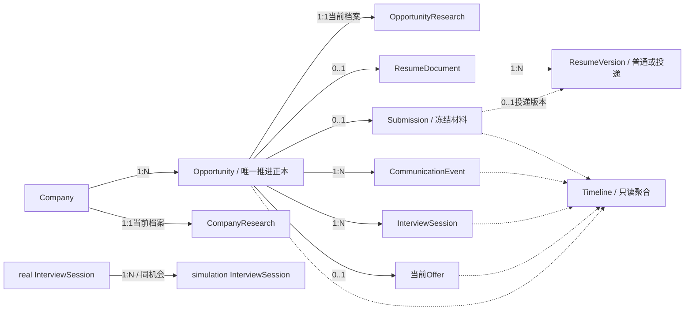

# Career Opportunity — Gap Analysis & Migration / Refactor Proposal

## 1. Executive Summary

**推荐增量重构，不重写应用。** 当前可复用的是纸面简历编辑、版本与PDF、投递冻结、SQLite事务/CAS/幂等、资料确认与来源追溯、ContextCompiler和Provider隔离。主要差距在业务所有权和动作：一次求职尝试尚无唯一正本，各机会共享工作稿，投递仍需先选正式版本，沟通/面试/Offer虽有typed对象但页面未按其业务语义工作。

目标不是把现有表改成文档同名表，而是让 **Opportunity拥有当前推进状态，ResumeDocument拥有当前表达，Submission拥有当时发送的材料，Research拥有当前情报，业务对象提供Timeline，Skill通过Compiler读资料并只提出Patch**。

本轮只分析。唯一新增产物为本文；不修改代码、schema、生产数据、现有审计、目标文档、STATUS或产品正本，不生成migration脚本、不启动真实AI、不修复测试。本文中的接口、字段、迁移和批次均为建议，不是已实施事实。已应用workbench-plan的依赖/验收方法；用户本轮“只分析、完成后停止”优先于技能的后续实施要求。

### 1.1 输入、权威与证据

本轮以用户确认的四份文件为Opportunity目标：

- **P**：[opportunity-product-model.md](../target/opportunity/opportunity-product-model.md)
- **D**：[opportunity-domain-model.md](../target/opportunity/opportunity-domain-model.md)
- **U**：[opportunity-ui-flow.md](../target/opportunity/opportunity-ui-flow.md)
- **I**：[context-ingestion.md](../target/opportunity/context-ingestion.md)

已重新读取AGENTS、authority、相关architecture、完整context-contract、roadmap、STATUS及[AS-IS-system-map.md](AS-IS-system-map.md)。四份目标文档覆盖本周期与旧产品目标冲突的部分；例如不再为本期拆独立JobPosting、不再坚持机会1:N投递、Raw当前修正版不再保存旧修订。Employment/Project不因此改变内部模型。

证据分层：**[代码] Verified by code；[数据库] Verified by schema/只读数据；[测试基线] 上一轮实际运行结果；[目标] 用户确认的TO-BE；[建议] 本文推荐处理；[推断] 影响判断；[Unknown] 尚不能确定。** 目标和建议都不能当实现证据。

源码HEAD仍为`368af740fd2b17e5718ce31675bf526df4591347`；本轮开始工作树已有`.codex/config.toml`删除和未跟踪的docs/audit、docs/target，未触碰它们的既有内容。源码无变化，未重复运行测试。上一轮同日实际结果为 **69通过、2失败；typecheck通过**，失败为profile保存同步草稿后测试仍提交旧revision；这是实现准备事项，不能把修改断言代替新交互验收。

### 1.2 本轮迁移相关盘点

2026-09-17 18:24（Asia/Shanghai），直接使用SQLite URI `mode=ro`、`PRAGMA query_only=ON`、单一读事务，未实例化会初始化/写入数据的Store。读取元数据及引用，不在本文复制私人正文。

| 已验证事实 | 对迁移的影响 |
| --- | --- |
| current 24行、records 27行、applications 1行、revisions 146行；schema v1 | 本次数据规模小，但仍需保护完整旧JSON与历史，不能按空库开发 |
| 2个job，1个实体opportunity；API兼容投影补出另一个 | 迁移从job全集与opportunity并集建立稳定ID映射，不能只迁现有opportunity行 |
| 2个job.status都为active；plan分别resume和interview；后者有案例Offer | 旧计划与业务记录不保证阶段一致，不能直接按最高记录阶段覆盖用户计划 |
| 按规范Opportunity ID归组，每个最多1条application；非demo application为0 | **目前未触发多次投递Migration Gate**；正式迁移前必须重新检查，不能保证未来仍如此 |
| Offer共1条、属于同一案例机会；无多Offer分组 | 目前未触发多Offer基数Gate；不代表Offer内容完整 |
| 1个有效公司引用，job.company文字与Company.name不一致；另1个job未关联Company | 有一项公司主体解释歧义，当前发生在案例；无引用者仍须按名称匹配/新建，不从OrgUnit反推公司 |
| editor-main 1份，无Opportunity所有者；source_refs目前仅profile | 不能根据当前选中的页面、最后编辑时间或事实来源认定草稿属于某机会 |
| editor_version 1份、旧version为0；同一个版本有2条ResumeUse，分别指向机会和方向 | 用途不是所有权；不能把现有版本全部搬给某一个Opportunity。方向用途虽无demo标记，仍引用demo版本 |
| 旧resume 1份、正文为空，有job_id | 保留兼容记录即可，不替用户生成新的空机会简历，也不当作导入完成 |
| 4条求职note各有1个typed研究/沟通/面试/Offer；未发现缺Raw引用、重复typed映射、未映射求职note | 当前迁移可按raw_note_id对齐；仍须为其他旧库及迁移期间新记录设计冲突检查 |
| 唯一interview有round/occurred_at，无real/simulation字段；research仅关联1个机会 | 不能把记录时间自动当已确认的真实面试日期；不能仅凭kind认定真实/模拟 |
| knowledge_source 3、candidate 3（confirmed 1/pending 2）、wiki_entry 1（job scope）；无note更正和旧proposal行 | pending必须保留待确认；confirmed不能重复创建事实；已有job Wiki也不能自动判成CompanyResearch |
| 唯一application没有Greeting字段；唯一PDF存在且hash匹配 | 旧Greeting为“未记录/未知”，不能补成“当时发送空字符串”；不重新渲染旧PDF |
| 默认备份目录仍为空；服务diagnostics仍0.1.0，源码0.2.0；真实Provider未配置 | 迁移前必须先取得可恢复备份并明确停写版本；这是执行前置条件，不是要求用户重选技术方案 |

本轮盘点时数据库SHA-256：`c6bf614deb82cdc2978ca98f56e878c85b6582d46f9b51a60b841a7b291ec739`，与上一轮末尾一致。以上计数不证明外部真实投递/面试发生，不把非demo标记等同真实业务事实。

### 1.3 代码证据入口

以下是本轮对照的实现入口；更细的现状证据和上一轮实际测试结果见AS-IS，本文不将其另写为产品正本。

| 对照内容 | 源码 |
| --- | --- |
| 通用存储、Job双写、application约束与快照 | [core.py](../../src/workbench/core.py)、[opportunity.py](../../src/workbench/opportunity.py)、[app.py](../../src/workbench/app.py) |
| 公司/组织/机会关联及ResumeUse | [domain.py](../../src/workbench/domain.py) |
| 计划、note、更正及typed活动 | [journey.py](../../src/workbench/journey.py)、[engagement.py](../../src/workbench/engagement.py) |
| 全局稿、版本、PDF与profile同步 | [editor.py](../../src/workbench/editor.py)、[profile.py](../../src/workbench/profile.py)、[artifacts.py](../../src/workbench/artifacts.py)、[legacy-app.js](../../frontend/src/editor/legacy-app.js) |
| Raw/Candidate/Wiki、编译与模型边界 | [knowledge.py](../../src/workbench/knowledge.py)、[context.py](../../src/workbench/context.py)、[providers.py](../../src/workbench/providers.py) |
| 页面数据、状态与业务入口 | [main.ts](../../frontend/src/main.ts)、[workspace.ts](../../frontend/src/workspace.ts) |
| 备份恢复及已知测试失败 | [backup.py](../../src/workbench/backup.py)、[test_profile_ownership.py](../../tests/test_profile_ownership.py) |

## 2. Object Mapping

| AS-IS（代码已核对） | TO-BE（目标出处） | 判断 | 推荐处理 |
| --- | --- | --- | --- |
| current.job + opportunity复制行 + journey_plan | Opportunity：一次具体求职尝试（P0/7，D2） | 一个职责跨三份可写对象 | **收敛正本**到现有Opportunity身份；JD/title/url和phase/result由其拥有；job和计划API降为适配，旧行/历史保留为兼容档案，不继续双向同步 |
| job.company字符串 + domain_company + opportunity_context.company_id | Company 1:N Opportunity（D1） | 公司身份目录值得保留，引用应变必需 | **保留并调整**domain_company；新建机会时原子复用/创建Company；同名多主体显示候选，不模糊自动合并 |
| job.title/jd/url | role_name/jd_text/action_url?（D2） | 字段业务语义基本可复用 | 可继续用现有内部字段名，通过DTO明确映射；不单独建JobPosting；原始JD作为来源，当前JD只由Opportunity拥有 |
| journey_plan.stage/next_action/due_date | 四个phase＋阶段日期（D2/16） | stage包含“研究/沟通/关闭”等不同概念 | phase替代阶段正本；next_action/due_date作为可选用户计划保留，不再决定phase；旧due_date不是phase_changed_on |
| job.status + applications.status | Opportunity.result；结束View（P7/8） | 存在不同状态语义 | 不能机械映射deleted/excluded/closed为withdrawn；新result严格枚举，旧值留存用于解释和待核对 |
| domain_org_unit | 可选旧组织引用，团队情报属于OpportunityResearch（D3） | 非必需实体，已有信息不应删除 | **保留兼容**现有组织树/引用，不扩层、不要求填、不自动把description作为情报 |
| opportunity_context的方向/周期/组织 | 非本期核心，可选关联 | 名称不应迫使扩展目标 | 合并公司引用所有权，其余保持可选附加引用/兼容读，不删除TargetRole/SearchCycle及已有用途 |
| editor_draft/editor-main | Opportunity 0..1 ResumeDocument（D4） | 文档结构可复用，归属机制错误 | **参数化document_id**和owner，第一次实际制作才建；旧全局稿保留迁移来源，不自动分发到所有机会 |
| editor_version、旧version | ResumeVersion（D5） | 已有显式保存、不可变内容及PDF | **保留**内容格式、ID、文件；新版本增加document_id/version_kind；旧版通过legacy collection可读，不猜所属文档 |
| ResumeUse | 历史用途、复制简历的来源线索 | 与ResumeDocument不是同一个概念 | **降级兼容用途**，保留方向/机会旧引用；新投递不要求先建ResumeUse；不改旧版本所有权 |
| artifact/PDF | 版本附件及投递证据 | 原子写、hash与下载可复用 | **保留**文件、hash、旧ID；调整共享PDF引用与删除保护，见7.4 |
| 无Greeting对象 | GreetingMessage当前草稿＋Submission快照（D6/7） | 真正缺能力 | **新增**机会下一个可编辑Greeting值，可嵌Opportunity或受控子对象，不必为名字单建表 |
| applications，按动作1:N，要求version/PDF | Submission 0..1，可不使用简历（D7/U6） | 冻结机制正确，基数/输入/事务不符 | **保留表与旧数据，调整约束**；新命令自动日期、特殊投递版本、Greeting冻结、phase联动；渠道等旧字段只读保留 |
| communication + raw_note | CommunicationEvent（D8/U7/8/16） | 业务主体可延续 | **保留ID/原文，扩展type/purpose**；text/phone/other，general/negotiation；不得新增PhoneCall/Negotiation系统 |
| interview + round/raw_note | InterviewSession real/simulation（D9–11） | 可作为记录起点，不是改名即完成 | **调整**类型、名称/日期、target_real_interview_id、准备、Transcript、当前FinalReview；simulation必须同机会关联real |
| offer records，多条且仅创建 | 0..1当前Offer（D12） | 有身份和Raw，可复用；缺当前更新边界 | **调整**为一个当前对象、条款可改、原件保留；新增收到/更新及最终决定动作；谈薪挂CommunicationEvent |
| research_snapshot＋job Wiki＋目录description | CompanyResearch / OpportunityResearch（D3） | 材料快照不是当前情报正本 | **新增当前档案能力、保留来源**；旧快照仍证据，已有确认条目只有明确归属后才转拥有者 |
| journey_note + correction | Raw与typed对象详情、旧记录适配 | 原件存储和正式业务活动被同一个UI替代 | **拆读取职责**：typed拥有活动身份/属性，Raw拥有材料；同一note只投影一次。任职note原样保留 |
| knowledge_source | RawSource + IngestionService（I1–6） | 来源、scope可复用；缺业务统一入口与修正政策 | **复用ID/引用/附件基础**，增加owner、内容类型、当前revision/hash；新Transcript修正只覆盖当前内容，不套通用历史写入 |
| knowledge_candidate + 旧proposal | PatchProposal（I7–10） | 确认/CAS逻辑可复用，目标类型不同 | **合并业务概念和交互，不盲合JSON**；旧Candidate映射为create-Wiki提案，旧resume proposal继续只读；新提案支持多目标受控字段 |
| wiki_entry / profile | Career Context（I11/18） | 有效个人事实与身份正本继续有价值 | **保留**个人Wiki/profile及历史、scope规则；机会情报不再复制一份进Wiki；不把Work内部对象迁进新系统 |
| ContextCompiler + run.packet/payload | prepare(task_type,target_object,user_request)＋ContextSnapshot（I11/12） | 受控读/审计/失效基础可复用，只有job/resume策略 | **扩展任务策略**，移除目录正文隐式读取；新Snapshot可复用run的身份/元数据，不强制单独建表 |
| 足迹/journey notes/status_history | Timeline派生视图（D15/U19） | 可复用排序/详情跳转，来源不够 | **新增查询投影，退役求职note聚合正本**；不建Timeline事件表、不把保存版本和接受Patch当业务事件 |

不能复用的“旧职责”退役，不代表删除旧数据。业务身份、材料、快照、历史和事实认知分别有一个当前拥有者；历史冻结副本不属于需要清除的重复正本。

## 3. Relationship Gap

| 关系 | AS-IS | TO-BE | 迁移/约束判断 |
| --- | --- | --- | --- |
| Company→Opportunity | 公司关联可空；另有公司文字 | 1:N，机会必需1个Company | 唯一名称匹配或明确选择；歧义不能自动决定 |
| Job↔Opportunity | 逻辑1:1，实体行可缺 | Job兼容身份，不再独立主模型 | 稳定旧ID映射；不增加JobPosting层 |
| Opportunity→ResumeDocument | 所有机会共用一个全局稿 | 0..1 | 唯一owner约束，懒创建；选择/复制来源不改变原件 |
| ResumeDocument→ResumeVersion | 全局隐式1:N，没有document_id | 1:N（可暂为0条） | 新版本必须有document_id；旧版不伪造归属 |
| Opportunity→Submission | 1:N | 0..1 | 所有写入口共同约束；多投递时Migration Gate，不删不合并 |
| Submission→投递ResumeVersion | 必需一个旧/新正式版 | 0..1；有简历则一份特殊冻结版 | 允许无简历；每次实际使用都建投递快照身份，无需用户先保存普通版 |
| 版本→PDF | 现行新版本1:1独占式检查 | 目标未规定PDF基数 | 推荐每版至多一个指定PDF，可共享同一不可变文件；历史保持原链接，无需复制PDF |
| Opportunity→当前Greeting | 不存在 | 逻辑0..1当前值 | 无内容可为空；Submission对应值独立冻结 |
| Opportunity→CommunicationEvent | 1:N，typed+note双视图 | 1:N | 基数已对；统一权威读写即可 |
| Opportunity→InterviewSession | 1:N，无type | 1:N，real/simulation | 原记录缺类型不能默认真实；新的simulation必须有父real |
| Real→Simulation | 不存在 | 1:N；simulation端必需1个 | 同Opportunity、防止simulation当父；删除/转型父对象受引用保护 |
| Opportunity→Offer | 1:N | 0..1 | 多个条款原件可归一个当前Offer，不等于多个Offer身份；旧多身份需人决策 |
| Company→CompanyResearch | 不存在当前档案 | 1:1逻辑当前档案 | 可返回空档案且首次写入才落库，不制造空内容 |
| Opportunity→OpportunityResearch | N:N研究快照、分散Wiki | 1:1逻辑当前档案 | 快照保留N:N来源引用，不直接合并成已确认情报 |
| Raw→PatchProposal | source_ids[]→candidate，旧proposal引用claims | 1:N；每Patch也可引用多份Raw | 保留多来源能力，跨scope发布必须明确授权目标用途 |
| Interview→Transcript/FinalReview | 一个raw_note，没有FinalReview | 当前Transcript及当前FinalReview各0..1 | Transcript上传前可空；Preparation属于real，不能挂全局 |
| Opportunity→Timeline | 没有全量业务聚合 | 查询投影，无新存储关系 | activity对象ID负责去重，源对象负责时间与摘要 |
| Offer accepted→Employment | 无自动创建 | 明确不自动创建 | **现状符合，保留**；不连入本期迁移 |

图为**建议落实的目标关系**，不是AS-IS。real/simulation是InterviewSession的两种值；Greeting可直接随Submission保存快照，不为图形完整建立空实体。

## 4. Backend Gap

### 4.1 Opportunity、Company与状态正本

[代码] `core.save_job/_save_job_in_transaction`写job并`sync_job`，`save_opportunity`反过来仍以job为基础；`journey.save_plan`另写stage。前端主要用jobs而非opportunities。

[建议] 复用`opportunity.py`公开身份，集中保存当前company_id、岗位/JD/action_url、phase/result及阶段日期。旧`job_id`只做alias；旧`/jobs`、`/journey/plans`入口在兼容期委派同一Domain Action，不能同时保存一套互相独立的字段。迁移后旧物理行只作历史/回滚用途；所有“当前job”读取从新正本投影，不再从旧行补写覆盖新值。

新机会最小命令仍是公司名/岗位/JD/可选URL。Company名称去首尾空格等确定性规范化后，唯一匹配则复用，无匹配则原子创建；不做模糊合并，若同名有多个主体让用户在实际创建场景选择。新建机会不要求OrgUnit、周期、方向、简历或AI配置。

四phase可内部编码为resume/submitted/interview/offer，result为active/accepted/rejected/withdrawn；编码是工程建议，用户标签遵循目标。result只存在Opportunity当前正本，Offer界面/Timeline均引用它，不再维护第二套“最终决定”。accepted要求phase=offer且有Offer；rejected/withdrawn可发生于任一阶段。`result != active`即已结束View，不产生closed phase。兼容软删除元数据不能偷偷转换成业务result。

`phase_changed_on`推荐由改变阶段的Domain Action在同一事务写入，并记录其来源对象ID/动作时间；不是独立编辑的冗余日期。新真实面试同时保存scheduled_on和confirmed_at，phase日期用确认当天；再次添加下一轮不会重置已处于interview的phase日期。Offer条款更新不重置第一次进入Offer的日期。用户明确修正日期时通过对象修正命令调整相关派生值，不把通用updated_at当阶段日期。

### 4.2 建议的业务动作边界

下表为未来Service接口语义，不要求HTTP路径逐字照搬。所有新持久化命令具备幂等key，修改具备expected_revision；404引用不存在、422规则不合法、409竞争/旧预览/重复身份冲突。旧命令回放返回原结果，不重新生成今天的日期。

| Domain Action | 输入与校验 | 原子结果/不应发生的副作用 |
| --- | --- | --- |
| CreateOpportunity | 公司选择/名称、岗位、JD、URL | Company复用/创建＋Opportunity，phase=resume/result=active；不建ResumeDocument |
| StartResume | opportunity_id、选定来源或明确空白、幂等key | 建立至多一份拥有独立revision的ResumeDocument；不能占用/移动别人的版本 |
| SaveResumeDraft / SaveVersion | document_id、revision、内容/排版 | 草稿保存不产生普通版本；主动保存才产生普通版；保留原编辑器结构校验 |
| RecordSubmitted | 当前/某版本/无简历三选一；Greeting当前revision；Opportunity revision | 自动日期＋特殊投递版（有简历时）＋Submission快照＋phase=submitted一次提交；失败不生成“已投递”事实 |
| RecordCommunication | opportunity_id、text/phone/other、purpose、文字或允许文件 | 正式CommunicationEvent＋关联Raw；可触发Skill生成Patch，Patch不自动应用，不改变phase |
| ConfirmRealInterview | 同机会、轮次名称、面试日期 | real Session＋confirmed_at；phase=interview；不要求事先有Submission |
| StartSimulation | 同机会已存在real Session ID | simulation Session＋目标引用；生成/复制Context Pack，不自动控制ChatGPT或录音 |
| CorrectTranscript / SaveFinalReview | session_id、当前revision、新正文 | 覆盖当前文本/终版，相关提案与分析失效；不写一套新Raw历史/AI原始复盘副本 |
| RecordOrUpdateOffer | opportunity_id、当前条件、原始材料、revision | 唯一当前Offer；首次收到时phase=offer；旧原始材料不覆盖；无Employment副作用 |
| EndOpportunity | expected_revision、accepted/rejected/withdrawn | 保留phase，改变result和result_changed_at；自身记录结果变更依据，不让Timeline自造结果 |
| AcceptPatchGroup | 一个目标、所选patch及用户编辑、目标/来源revision | 验证后立即更新正式对象，标记applied并返回结果；不要求再点一次Apply；不部分偷偷写成功 |

正常“记录已投递”按U6进入submitted；迟到补录/人工修正不应伪装成正常主动作并悄悄重置阶段。若后续实际需要在Offer后补投递，进入明确修正流程，不在本轮自行扩展阶段逆行规则。已有Submission不可通过重试、新key或旧applications入口变成第二次申请；新一次尝试建立新Opportunity。

### 4.3 模块保留、调整与兼容退役

| 模块 | 建议 |
| --- | --- |
| core / Store | 保留事务、CAS、epoch、当前/历史读取。Opportunity与投递编排逐步移到所属模块；不为形式一次拆所有Store方法。新增版本化迁移入口，启动不自动迁移 |
| opportunity / domain | 承担唯一机会与公司选择；opportunity_context公司字段退为兼容投影；组织/周期/方向现有维护保留 |
| editor / profile | 参数化所有草稿/选材/来源/恢复/版本操作，禁止只有首页参数化。profile同步不得遍历覆盖所有机会草稿；推荐草稿初始化带基础身份，后续由用户在目标文档显式刷新，历史冻结不变 |
| applications编排 | 可提炼小的submission模块，但继续使用applications存储；集中唯一性、无简历、版本/PDF/Greeting事务与阶段联动；旧status更新入口退出新业务语义 |
| engagement | 继续承接Communication/Interview/Offer，扩展当前状态和详情服务；按职责增长再分文件，不重建一套同名实体替换所有ID |
| journey | 求职typed活动的通用创建/更正转为Domain Action适配；旧note历史读取保留。episode及工作note接口不改 |
| research（新增能力） | current中受控kind或小模块管理CompanyResearch/OpportunityResearch，保留来源引用；不另起研究数据库或强制OrgUnit树 |
| ingestion / proposals（新增能力） | 统一资料入口＋修正策略，复用knowledge的scope/CAS/确认机制；目标字段白名单和domain调用决定写入权限，不提供通用任意JSON/SQL补丁 |
| knowledge | 继续拥有个人Wiki/profile来源；现有候选经适配在Patch界面呈现，已确认事实不重放。个人手动新建/编辑事实直接保存，不再强迫Raw→Candidate二次确认 |
| context / providers | 保留Compiler、请求边界和显式模型配置；任务策略/来源用途重建，见6；不复活旧文字简历AI来冒充结构化patch |
| timeline（查询能力） | 可作为机会详情的读Service，不需新事件表；返回type/object_id/date/summary/detail_target，摘要从当前权威对象生成 |
| artifacts / backup / demo | 保留hash、原子文件写、备份恢复；补齐多版本共用PDF引用保护。demo需随新映射维护归属，不能依据demo标签单独删掉被非demo用途引用的版本 |

### 4.4 Typed活动与note收敛顺序

1. 以typed对象ID为正式活动ID，raw_note_id作为材料引用。当前已有typed的note不再另造Communication/Interview/Offer；历史URL经别名定位同一个对象。
2. 只有note没有typed时，先返回带legacy标记的只读详情；缺少类型/时间等不能可靠映射的字段保持Unknown，在用户补齐后一次性建立正式映射，不自动认定所有interview note为real。
3. 详情读取由typed service组合当前Raw及当前领域属性；停用“typed.content”和“note更正正文”两套当前正文。旧研究快照保留冻结内容作为历史来源，不当Research当前正文。
4. 新页面全用typed/domain入口；旧求职note写入口转适配或明确拒绝已退役操作。任职note继续原行为，其更正/候选链不受本期Raw政策全局影响。
5. 迁移映射完成且旧调用清零后退役重复求职编辑UI和写入代码；原始行、revisions、冻结快照与可解析旧ID继续保留。不能为了退役页面删掉有来源引用的note。

## 5. Frontend Gap

| 当前页面/组件 | 目标结构 | 可复用 | 必须改变 |
| --- | --- | --- | --- |
| workspace.ts的机会左右分栏列表 | 机会管线→点整行进入Workspace（P9/U18） | 主shell、同源API、名称转义、hash深链、详情回跳 | 列为公司/岗位/phase/阶段日期，链接小图标；全部/四阶段/已结束View；按result过滤，去掉每行多操作与旧进行中/归档业务含义 |
| 机会顶部+plan/primary推导 | 稳定顶部（P10.1） | 标题、外部链接、固定布局 | 从Opportunity DTO读取phase及日期，非“有评估→用途→投递”前端猜进度；计划成为次级可选信息 |
| jd/analysis/research/resume/communication/interview/offer平级tabs | 当前阶段工作区＋岗位情报＋投递材料＋Timeline | 详情面板、折叠阅读、弹窗、冲突/失败保留输入 | phase选择主要行动；result已结束时显示终态与历史，不能继续显示正常推进主按钮 |
| 独立editor/legacy-app.js | 每机会Resume Workspace | **纸面DOM、CSS、格式、分区、快捷键、撤销、canvas PDF全部优先保留** | 所有请求明确document_id；首次选择/复制/导入；普通版本与投递版本同一历史列表不同标签；无全局稿静默回退 |
| resumeUses+applicationsHtml | 投递准备/投递材料 | 冻结正文/JD/PDF预览、下载和错误呈现 | 准备可编辑Greeting；登记只选使用哪份/不使用简历，不填渠道日期状态；投递材料只显示当时简历/Greeting/日期，所有普通版本在Resume Workspace |
| 通用addJourneyNote | Communication详情与Raw入口 | 文本框、上传/错误组件、来源查看 | text/phone两入口共用对象，negotiation复用同表单；创建后展示目标分组Patch，不再只有“记录一段话” |
| research tab + 公司目录description | 统一“岗位情报”（P10.3） | 阅读面板、来源链接、目录选择 | 视觉合并CompanyResearch/OpportunityResearch，编辑时后端owner明确；公司级修改影响同公司其他机会需清楚标识，不复制同值 |
| interview tab / #practice note过滤 | 当前真实轮次→准备/模拟/Transcript/FinalReview详情 | 列表、记录阅读、来源回跳 | 轮次name/date、real/simulation父子关系；最新待进行real依据日期和完成标记，不按created_at取最后一条；无真实轮次不出现可执行模拟动作 |
| offer原话tab | 当前Offer＋谈薪＋最终决定 | 条款正文/原材料阅读 | 当前Offer可编辑、0..1，结果命令写Opportunity；不以一条note自动认定接受 |
| 足迹/记录列表 | Opportunity Timeline（D15） | 排序、摘要、详情跳转 | 聚合源对象，typed与note去重；不计普通保存/AI重跑/Patch接受。全局任职足迹保留，求职部分可改用同一查询投影 |
| Wiki候选列表/record-ui | 按目标分组Patch | 差异、编辑、接受/拒绝、来源检查 | 直接接受即写入；个人事实仍落Wiki，研究/面试安排落领域对象；已确认数据不重复送待确认 |

旧平级tabs不是一次删除全部：先提供对应Workspace区域并验证旧记录可达，再在同批退役相应入口。保留旧hash的读取跳转，不允许旧hash继续访问共享可写editor-main。`#practice`中的任职reflection不随求职界面迁走；`#resume`独立入口可保留为文档索引和旧材料库，不能继续有“所有机会共用当前稿”的隐式写法。

导入需分清范围：[代码]当前没有JSON导入，PDF不支持恢复可编辑结构。[建议]首批支持复制已有结构化版本/旧稿，以及结构校验后的JSON导入；任意PDF可作为Raw/原附件保存，不能标“导入为可编辑简历成功”。其他Word/PDF解析属于后续格式接入，不更换纸面编辑器。

Timeline来源建议：Opportunity.created_on、唯一Submission、Communications（negotiation单独标签）、real/simulation Sessions、首次收到Offer、Opportunity.result变化。业务对象保留occurred/scheduled/confirmed/created等不同日期语义；未来面试安排显示“已确认/计划进行”，不能按创建记录称已完成。结果变更如需保留修正/重新开启轨迹，使用Opportunity自身的结果变更数据/修订，Timeline不保存副本。旧applications.status_history只供原投递状态历史回看，不能不经核对生成一次Opportunity结束事件。

## 6. Context / AI Gap

### 6.1 保留的边界与当前偏差

| 现状 | 目标 / Gap | 建议 |
| --- | --- | --- |
| ContextCompiler在事务内读取当前对象、校验revision/scope，生成packet和hash；Provider只接收packet | 这是可保留的编译边界，不必新造另一个Compiler | 扩充现有Compiler的任务策略和来源用途；Provider继续不能自行查询数据库 |
| 现有任务主要是job/resume；个人当前事实、目标约束、选中的active Wiki进入Context | 缺少Research、沟通、真实轮次、模拟、Offer等任务策略 | 由每个Domain Skill声明required/optional/forbidden context，而非为所有任务拼一个大Context |
| 关联Company/OrgUnit/Role/Cycle的name/description自动进入packet | 目录description不是经确认的CompanyResearch；与目标的正式事实来源规则有偏差 | Company的ID/name可作身份背景；description不再自动作为研究结论。当前Research经专用reader读取并标明owner/source；OrgUnit不成为必需项 |
| 不自动读旧对话、旧revision或Raw；真实Provider每次新建system/user消息 | 符合限制历史污染的方向；新任务需要有选择地读取当前Raw | Raw仅用于本次ingestion或明确指定证据；不将“支持Raw”变成默认扫描全部原文 |
| knowledge_candidate确认后创建Wiki；proposal主要围绕既有分析产物 | 不支持一个统一提案直接修改Research/Interview等正式对象 | 合并为PatchProposal的产品概念与确认入口，复用scope、CAS、来源检查，通过领域适配器提交；不把所有正式对象塞进Wiki |
| AnalysisRun可长期保存请求packet和result；knowledge_source不可变，note更正及通用_save保存revision历史 | 新目标要求当前Raw覆盖更正、无旧Raw revision；FinalReview只保留可编辑当前稿，不长期保存一份AI原版 | 新求职Raw/Review写入策略需单独实现；仅改UI隐藏历史不满足目标。现有历史保留只读，不借本轮目标清理旧用户数据 |
| Compiler的30条/100k限制实际主要约束选中Wiki，但packet元信息像总预算；存在重复content/selected_content | 扩充Research/Transcript后，任务输入预算更不可信 | 在最终packet统一计量，按任务声明裁剪/报错，required来源被截断必须显式提示，不能静默丢弃 |

当前`docs/02-context-contract.md`与已确认的目标[I]存在具体差异：目录背景自动读取、候选确认只落Wiki、资料与更正的历史保留方式，以及任务覆盖范围。**本轮不改合同正文**；正式实施到对应能力时，须同步修订所属权威合同，不能一面宣称实现目标，一面继续执行旧语义。

### 6.2 Skill与任务输入

[建议]先增加一个有限的任务注册表，每个Skill声明：`task_type`、目标对象类型、required/optional context、禁止来源、结构化输出、允许修改的对象/字段、`skill_version`和预算。Skill通过Compiler提供的领域reader获取数据，不持有通用Store/SQL权限。这是应用内部的领域任务边界，不需要建设插件平台、通用agent框架或工作流引擎。

| 任务 | 必需/相关输入 | 必须排除或限制 |
| --- | --- | --- |
| Resume优化 | 当前Opportunity/JD、Career Context、已确认相关Research、当前目标ResumeDocument | 当前稿是待修改表达，不自动成为个人事实；不能读取其他机会工作稿或全部历史版本 |
| Greeting生成 | 当前机会/JD、相关Career Context/Research、已有Greeting | 不把招呼语中的自我描述自动回写个人Wiki |
| Communication ingestion | 当前沟通Raw、所属机会、相关当前Research | 不默认附带全部个人经历；只产生有来源的字段提案 |
| Research整理 | 指定JD/Web材料/HR沟通/真实面试结论、现有CompanyResearch/OpportunityResearch | 不自动抓取网站；来源归属不明时不能跨机会提升成公司事实 |
| Interview准备 / Simulation Context Pack | 目标real轮次、JD、**实际投递简历**、Research、相关HR沟通、之前真实轮次的当前FinalReview | 不能用投递后工作稿替代实际投递内容；没有简历投递时明确缺失；不读旧Review版本或所有Transcript |
| Interview复盘 | 本轮当前Transcript、real/simulation身份、模拟所绑定real、相关准备背景 | 模拟AI面试官的虚构内容不能成为公司/JD事实；用户自述也只能成为待确认个人信息 |
| Offer分析 | 当前Offer条款/指定原材料、所属机会、相关薪资约束、谈薪Communication | 不增加Offer Comparison，不自动创建Employment |

[建议]Career Context以窄接口读取profile、个人active Wiki及必要目标/约束；Resume/Opportunity不直接查询Employment/Project内部结构。任职材料若尚未成为允许的当前个人事实，不因为“可能有用”而自动进入求职任务。Feedback继续完全排除。

Simulation的资料必须保留说话者和来源角色。仅有一个合法Raw ID不足以证明内容是真实事实；无法确认说话者的段落应提示待核对，不生成已确认事实。模拟用户自述与AI面试官假设必须分别处理。

### 6.3 Raw、Patch及留存策略

1. **Raw按业务入口归属。** Communication/Interview/Research/Offer详情接收资料，统一IngestionService负责解析、当前文本、来源和任务调度；不新增全局Inbox。旧note ID可继续作为来源别名，不能让同一段更正后的文本还有两套当前值。
2. **当前Raw覆盖更正。** 新求职Raw保留递增revision/hash以支持CAS和过期判断，但不保存旧正文revision。不能直接复用会自动追加历史的通用`_save`。旧数据已有的Raw/revisions按迁移保护原则保留只读；任职模块不随之全局改变。
3. **特定不可变材料优先。** [D]明确要求Offer原始材料本身不可修改；Submission/投递简历/Greeting/PDF也不可通过“更正Raw”修改。Offer可补充新材料、更新当前条件，但原附件仍是原件。这是特定对象规则，不将所有附件统一变为可覆盖文本。
4. **Candidate与Patch统一确认语义。** 旧pending candidate可映射为“创建Wiki事实”的Patch，保留原ID、source和决定状态。已confirmed/applied/rejected数据不重放、不再确认、不重复建Wiki。新提案按目标对象分组展示，接受后立即调用目标Domain Action；手动编辑正式对象直接保存。
5. **写权限由后端限制。** 提案包含target、允许字段、来源及expected revisions；接受时复核目标与来源，Raw更正或正式对象已变化则标记stale，要求重新核对。按同一目标分组原子接受并返回幂等结果，禁止通用任意JSON/SQL patch。
6. **不暗中保存旧Raw副本。** 新流程的run、proposal.before、idempotency响应、日志和Context留存策略都需检查；否则正文虽覆盖，旧Raw仍被另一张表永久保存。FinalReview的当前稿保存后，不再另存一份长期AI原始复盘。旧AnalysisRun不删除。
7. **分析追溯不等于保存全部历史正文。** [I]要求task/target、对象ID/revision、context_snapshot_id、时间和skill_version。[建议]持久化来源ID/revision/hash/用途及模型/任务元信息；请求正文按任务留存政策处理，新Raw和AI原始复盘不借snapshot重复保存。若原文已覆盖，能追溯来源与hash，但不能宣称可以重建当时完整输入；测试可在请求当下捕获packet验证来源。既有历史packet原样保留。

### 6.4 本期无需真实AI的部分

Company/Opportunity、独立ResumeDocument、Greeting手动编辑、Submission冻结、Research手动维护、Communication/Interview/Offer记录、Transcript更正、手动FinalReview及Timeline都可独立完成。Simulation MVP是**生成Context Pack→复制→用户新开ChatGPT语音对话→自行记录/转写→上传文本**，不需要内置语音录制、自动操控ChatGPT或调用真实模型。

Skill输出schema、权限、提案接受、CAS、来源隔离可先用虚构fixtures和mock Provider验证。真实模型目前未配置；不能据此宣称真实AI语义质量已验收。手动流程交付也不能被描述为所有AI目标已完成；真实调用留到后续明确授权且配置可用时单独验证。本轮没有模型调用。

## 7. Data Migration Proposal

以下全部是**未来实施方案，未写migration、未执行迁移**。迁移成功的首要标准是旧数据完整且可读取，其次才是新模型约束成立。

### 7.1 顺序与写入切换

1. **先建立可复现基线。** 核对实际运行进程与待迁移代码版本；当前运行自报0.1.0、源码0.2.0的差异必须在切换前消除。确认生产DB/附件目录，使用只读dry-run产出ID映射、依赖、冲突和计数，不以demo标签判断可删除性。
2. **先备份并验证恢复。** 复用现有backup能力，备份SQLite一致性快照、全部被引用附件、hash manifest、对应代码版本及迁移映射。必须在独立目录实际恢复并核对；“有备份脚本/定时任务”不等于已存在可恢复备份。
3. **冻结旧写入后再切换。** 正式迁移窗口停止旧服务写入，关闭/拒绝旧客户端写路径，记录最后epoch/文件hash；不能让运行中的旧代码继续按Job/editor-main语义写新数据。新schema版本使旧代码拒绝打开，不保留`user_version=1`冒充兼容。
4. **先建立canonical Opportunity及兼容ID。** 处理已确认的公司、阶段、结果冲突后建立唯一读写正本；旧Job/Opportunity/plan和旧ID继续可追溯。再引入按机会的工作稿和可空简历Submission约束。
5. **迁移关系与活动读取。** 已有typed对象优先，映射其Raw；保留旧快照和来源ID。逐步引入Research当前稿、Raw/Patch和real/simulation语义，不用缺失字段的默认值伪造历史。
6. **验证后开放新写入。** 检查全部引用、冻结内容及附件hash，验证新业务动作和旧数据读取。旧入口转只读/兼容路由；对应调用消失后再退役重复写代码，而不是先删旧表/材料。

### 7.2 对象映射和保留策略

| 数据 | 推荐映射 | 禁止的自动处理 / 需要核对之处 |
| --- | --- | --- |
| Job + 已有Opportunity + opportunity_context | 沿用canonical `opportunity:<job_id>`；保留Job ID别名与旧字段快照；JD、角色、链接由Opportunity持有 | 同名不代表同对象；存在值冲突时不能按updated_at取最后一条掩盖差异 |
| Company | 已有可靠company_id优先；无关联时按规范化精确名称查找，唯一匹配复用，无匹配创建 | 多个候选或文字与关联Company冲突为Gate，不能模糊匹配合并。本次案例机会存在后者 |
| JourneyPlan | next_action/due_date可保留辅助计划；旧stage保留为legacy字段和来源 | screening/research/resume/outreach可建议映射resume，但不能把due_date当阶段日期；closed不能直接推出rejected/withdrawn/accepted |
| phase / result / 日期 | 有明确领域事实和状态变化来源时映射；保存迁移依据。旧Submission日期保持原值 | plan、Application状态、Offer记录不一致时需核对；缺少进入阶段时间显示“历史日期待核对”，不以updated_at/当天补造 |
| editor-main | 完整保留为只读旧工作稿；用户第一次为某机会建立ResumeDocument时可显式复制，复制后独立 | 不推断它属于最近一次机会；不分配同一个可变对象给多个机会，不删除其revisions |
| 旧文字resume | 保留原ID/内容/来源供读取或显式复制 | 不冒充结构化ResumeDocument；空内容不生成一份已完成简历 |
| ResumeVersion + PDF | 保留原version ID、document、artifact ID、文件字节和hash；在旧材料库仍可达 | 不因ResumeUse指向某机会就移动版本所有权；不重生成旧PDF冒充原件 |
| ResumeUse | 保留角色/机会用途关系和来源；新流程不靠它充当工作稿owner | 当前同版本被机会与方向引用，其中一条用途无demo标记；不得删除demo版本而破坏该用途 |
| applications及快照 | 保留application ID、原日期、原冻结JSON、version/artifact引用、idempotency key和旧status_history；新增canonical关联 | 不从当前JD/Resume/Greeting重建旧快照；旧状态历史不自动成为Opportunity结果 |
| 旧投递没有Greeting | 标记“历史未记录/Unknown”，保留原快照 | 不补当前Greeting，不把缺失当作用户当时明确选择空白；新投递的明确空白与旧未知应可区分 |
| research_snapshot | 保留来源快照及已有机会关联；可供用户整理成当前Research | 不能直接把岗位研究提升为共享CompanyResearch；历史N:N来源关系可保留，不强制复制成多个当前事实 |
| Communication / Interview / Offer | 沿用typed ID，以raw_note_id映射材料，旧note URL跳到同一对象 | 不因两条文本相似去重；无typed的note先兼容读取；未知real/simulation、轮次日期或多Offer不能默认为已确认事实 |
| Raw / Wiki / candidates / revisions | 已有行、ID、来源和revision完整保留；现有Wiki继续作为当前个人事实；pending候选适配为Patch | 不重放已确认候选，不删旧Raw历史；新求职Raw的无历史政策只约束新写流程，不能静默清理旧历史 |

旧plan的`applied/interview/offer`可作为待核对阶段线索，不能凭名称补造Submission、真实轮次或Offer；`closed`且没有可靠结果时留在只读兼容区标记待核对，而不是给一个随机终态。本次案例plan为interview且已有Offer记录，不能仅按“阶段取最大值”自动升级。未知记录仍应可阅读，不强制用户先补齐才能查看旧材料。

### 7.3 Submission 1:N → 0..1

[数据库实查]本次只有1条application，归属1个案例Opportunity，**没有发现同一机会多次Submission**；因此多次投递Migration Gate本次未触发。这是当前快照结论，正式迁移前必须重跑按canonical Opportunity分组的盘点。

若届时发现1:N：停止相关关系的自动迁移，交用户区分“真实不同求职尝试”与“重复登记”。真实多次尝试可按用户确认拆为多个Opportunity，每条Submission保留原ID及全部快照，并确认活动归属；重复登记也必须保留原始记录和解释，不能自动选第一条/最后一条或删除。未解决前不得强行建立会丢行的唯一约束。

[建议]可继续使用`applications`表名，无需为改名重写。它当前的`version_id`/`artifact_id NOT NULL`无法表达“不使用简历”；未来需版本化schema升级，增加canonical opportunity唯一约束，并让版本/附件按是否使用简历一致可空。原body、ID及快照保持原值，新的领域DTO解释新旧格式。迁移过程中不形成两套同时可写的Submission仓库。

对历史有简历投递，可建立带legacy标记的投递版本包装，引用原冻结内容/原附件并记录其历史来源；不能更改旧普通版本的owner/type，不能把迁移时间冒充投递时保存时间。没有可靠ResumeDocument归属时，该历史材料可先通过兼容集合展示，待显式复制建立新工作稿；读取旧投递不依赖先猜定全局稿归属。

### 7.4 新投递版本与PDF的具体兼容点

目标要求每次有简历的投递都自动产生特殊投递版本，即使选择的是一份已保存普通版本。现有PDF基础能力可复用，但有三个实际约束需要一起处理：

- **当前稿路径：** 复用editor的flushSave、字体/单页检查、渲染和锁定机制，向RecordSubmitted提交固定revision及PDF；不要先调用“保存普通版本”再登记，导致一个动作平白多出普通版本或中途半成功。保存版本/冻结Submission/phase变化在后端同一业务事务完成；文件先写后事务失败时必须有安全的未引用文件处理策略。
- **选择旧版本路径：** 可直接引用其不可变PDF字节，让新特殊版本记录`source_version_id`。现有artifact.version_id及`version_pdf`唯一索引表示“生成该文件的版本”，当前后端校验和部分前端按此反查PDF；共享文件时，需让`version.artifact_id`成为读取关系，旧artifact.version_id保留生产来源语义，不篡改旧附件元数据。
- **删除保护：** 现有删除版本流程不能假设PDF只有一个使用者。检查全部version、application、ResumeUse及历史兼容引用后才可处理附件；已投递版本永久不可修改/删除。复用文件不能让删除普通源版本破坏投递材料。也可选择新建附件记录，但不得改变原文件；具体存储去重由工程实现，不构成用户Gate。

### 7.5 备份、回滚和验收要求

[建议]迁移manifest记录前后schema/code版本、epoch、对象计数、ID映射、冲突决定及附件hash。完整保存current、records、applications、revisions和被引用附件；不能仅导出新模型字段而丢失旧JSON。恢复演练必须证明旧Submission快照、版本内容和PDF字节均未变化，旧ID/来源链接仍能解析。

开放新写入前失败：回到已验证备份及匹配代码版本。开放新写入后失败：先停止写入并备份新旧状态，再做向前修复或有数据映射的回迁；**不得直接恢复旧快照而丢弃切换后用户新增数据**。回滚时也不能让旧代码误读新schema。

迁移验收至少包括：原数据完整性与附件hash；不使用简历的投递；特殊版本冻结；同一机会并发/重试只有一条Submission；Company共享但Research不误提升；旧链接可达；real/simulation关系校验；新Raw更正使旧提案失效且不追加旧正文历史；Employment/Project等非本期数据不变。当前profile相关两项失败需在后续实施前复现并解释，不能把本轮静态分析当作测试修复。

## 8. Recommended Implementation Batches

以下是建议的未来实施顺序；每批按一个可观察闭环验收，不要求先把全部新名词建表。所有批次均未开始。

| 批次 | 输入 | 修改范围 | 产出 | 预先确定的验收 | 前置依赖 |
| --- | --- | --- | --- | --- | --- |
| A. 建立可恢复迁移基线 | 当前代码、DB/附件、AS-IS与本报告 | 只针对本次迁移的dry-run/备份恢复工具和验证；核对运行版本与已知失败 | 可重复盘点、ID/引用清单、冲突清单、隔离恢复证据；生产数据不提前切换 | 备份可恢复、冻结JSON/PDF hash一致；能发现多Submission、多Offer和公司冲突；解释已知profile失败的触发条件 | 无；实际迁移另需完成相关Gate |
| B. 机会正本与管线 | A的已确认映射，P/D/U主模型 | opportunity/domain/core/API及机会列表/顶部；canonical Context入口适配 | Company关联、单一Opportunity、四phase/result、管线与基本Workspace；旧Job/plan兼容读取 | 创建机会默认resume/active且可无简历；同名公司按明确规则复用；结束View只读result；旧ID可达；CAS无重复正本；未知历史不造日期 | A；涉及冲突记录时依赖Gate |
| C. 每机会简历到一次投递 | B；现有editor、版本、Artifact、applications | editor请求参数/存储归属、Greeting、RecordSubmitted、版本/PDF引用和材料区 | 独立工作稿→普通版本→当前稿/旧版本/不使用简历三种投递；冻结材料与自动phase/date | 两机会编辑互不污染；普通自动保存不建版本；选旧版本仍建特殊投递版本；无简历可投；重试/并发不重复；投后改稿不改快照；删除保护；失败不半投递 | A、B；复用既有渲染器 |
| D. 业务资料、岗位情报与沟通 | B；knowledge和typed活动 | 当前Raw策略、Patch确认底座、Company/OpportunityResearch reader/writer、Communication详情、Timeline首批聚合 | 业务入口存材料、手动当前研究、text/phone/negotiation沟通；提案接口可用虚构输入验证 | 相同Raw不生成两个活动；更正不留新旧正文副本；手动正式编辑直接生效；Patch按目标接受/拒绝/CAS；公司研究可共享且机会研究隔离；旧来源仍可达 | A、B；本批不依赖真实AI |
| E. 真实轮次与模拟闭环 | C投递材料、D研究/沟通/Raw | Interview typed模型/领域动作、当前阶段UI、准备Context Pack、Transcript/FinalReview | 确认real即进interview；绑定real的simulation；复制Pack、导入转写、手动五项复盘与Timeline | name/date必需；跨机会模拟父级被拒绝；阶段日期取确认日而非面试日；多轮不重置首次阶段日期；Pack用实际投递简历；模拟AI言论不自动成为事实 | B、C、D |
| F. Offer与结束流程 | B结果命令、D沟通/Raw | 当前Offer读写、原件引用、谈薪入口、终态与Timeline剩余项 | 唯一当前Offer、条件更新、negotiation复用Communication、接受/拒绝/退出 | 任意阶段可rejected/withdrawn；仅Offer可accepted且有Offer；Offer原件不可改、条件可改；result驱动已结束；不自动建Employment | B、D；全流程验收衔接E |
| G. 领域AI与Context策略 | C–F正式对象及D提案底座 | 现有Compiler/Provider扩展，有限Skill注册和各领域输出适配 | Resume/Greeting/Research/沟通/面试/Offer任务声明与结构化Patch；可追溯元信息 | mock验证必需/禁止来源、总预算、输出白名单、stale拒绝、幂等和模拟来源隔离；Resume patch不破坏结构/格式；真实模型质量单独标状态 | C–F；真实调用另需配置和后续授权，手动流程不受阻 |
| H. 收敛兼容写入口 | 各闭环验收结果和旧入口调用盘点 | 同范围的Job/plan主状态、全局稿写入口、application独立状态、求职notes编辑UI与对应测试/文档 | 所有新写入经同一Domain；旧材料/URL只读可达；权威合同与模块README反映最终实现 | 无旧入口绕过约束；真实完整路径通过；旧材料、revisions、快照和PDF仍可读；不遗留两套当前事实；无无关目录清理 | B–G相应替代能力完成；可按模块随批收敛，不等最后大删 |

批次B–F不应因真实AI未配置而交付空壳；批次G也不能以“页面有按钮＋mock通过”宣称真实模型可用。每批只运行对应关键路径测试；持久化/并发/迁移必须有明确测试，纯布局调整做一次实际页面检查即可。最终完整路径是：创建机会→可选独立简历/Greeting→记录已投递→HR沟通/研究→真实轮次及模拟→复盘→Offer/谈薪→结果结束，并验证历史投递材料始终不变。

批次中提到的新增Service/DTO只是边界建议，实际文件数量由现有模块深度决定。继续使用FastAPI、sqlite3和现有前端框架即可；没有更换ORM、引入React或重建目录的前置需求。

## 9. Gates

仅列无法由代码可靠推导的业务归属/历史语义。以下是在未来迁移相关记录前需要决定的事项，不是请求本轮执行迁移。

| Gate | 当前证据 / 是否触发 | 需要用户决定什么 | 决定前的安全状态 |
| --- | --- | --- | --- |
| G1 公司归属冲突 | 当前案例Opportunity的公司文字与关联Company.name不同；已触发该记录的映射歧义 | 哪个Company是该次求职尝试的实际主体，或是否仅保留该案例为历史兼容数据 | 保留两个原值与关联，不自动合并/改名；不影响无冲突机会的新建 |
| G2 历史Interview与阶段语义 | 当前唯一案例Interview缺real/simulation与可靠业务日期；plan=interview但已有Offer记录 | 若要转成正式目标对象，确认该活动类型、若为模拟其目标real、轮次实际日期，以及该机会当前阶段/结果；否则保留只读案例 | 不造real或确认日期，不按“有Offer就升级”自动选阶段。其他真实记录若出现同类缺失，同规则处理 |
| G3 同机会多Submission | 当前未发现；未来迁移前重新盘点 | 如出现，逐条确认是否独立尝试、需拆分的Opportunity与活动归属，或重复登记的保留解释 | 不选首/末条、不删除合并、不强上唯一约束 |
| G4 同机会多Offer | 当前未发现；现有只有1个案例Offer | 如出现，确认是同一个Offer的历史条件变化，还是另一求职尝试；指定当前Offer及保留关系 | 全部原件和原记录保留，不自动按时间覆盖 |
| G5 其他无法判定的历史终态/归属 | 当前没有可据此确认真实业务终态的数据；正式dry-run遇到closed、冲突status或多义ID时条件触发 | 仅对受影响记录确认rejected/withdrawn/accepted及其所属机会；无法回忆可选择保持未知历史 | 只读兼容显示Unknown，不为满足新字段而补造历史结果 |

editor-main无法确定唯一owner不必阻塞：保留旧稿，首次使用时显式复制即可。旧Greeting缺失按Unknown保留；表名、PDF去重、ID别名、CAS和备份实现属于工程问题，本报告已给出推荐方向，不另设Gate。备份恢复通过和运行版本一致属于技术切换条件，不要求用户替工程验收。

## 10. Risks / Non-goals

| 风险 | 影响与控制 |
| --- | --- |
| 新旧正本同时写 | Job/Opportunity/plan/Application状态会继续互相覆盖；按领域动作切换写入口，并用旧ID只读适配，不长期双向同步 |
| 历史被“补齐”成假事实 | 自动归属全局稿、默认real、猜阶段日期、补Greeting会制造用户未确认的历史；未知保留，明确映射才迁移 |
| 冻结材料或PDF引用损坏 | 特殊版本与共享文件改变旧一对一假设；原快照/原字节不改，覆盖并发与删除引用测试 |
| Raw政策只在表面实现 | revisions、run或proposal暗存旧正文，或Offer原件被覆盖；按数据用途定义留存并检查实际写路径，旧历史不清理 |
| Context把推测变成事实 | 目录description、模拟AI发言、当前稿和研究来源跨scope传播；Skill显式声明输入用途及允许目标，正式写入仍需用户接受 |
| 旧客户端和混合运行版本 | 旧进程按旧schema写入可破坏新约束；迁移前核对版本并停旧写，schema升级拒绝旧程序 |
| 以案例覆盖证明真实能力 | 当前主要链路数据为demo且真实模型未配置；fixture验证契约，实际页面/真实模型分别记录证据，不能相互代替 |
| 回滚丢失切换后数据 | 简单恢复旧备份会丢新写入；开放写入前后采用不同回滚策略，保留两侧状态和映射 |

本周期不深度重构Employment、Project、People、Growth；只通过Career Context边界使用已允许事实，不改它们内部结构。也不建设Offer Comparison、独立Negotiation系统、全局Inbox、自动招聘平台、自动投递、云同步、内置语音平台或自动创建Employment；不引入第二套Timeline事实库，不为统一名词更换框架/ORM，不清空或重建用户资料。

本轮交付仅为本文件。没有修改业务代码、前端、schema、权威文档或既有AS-IS，没有写/执行migration，没有修复或重跑失败测试，没有真实AI调用。结束时数据库文件SHA-256仍与1.2节相同；Git已有的`.codex/config.toml`删除保持原状，新增内容仅本审计文档。下一阶段可据此细化并实施批次A，再按已确认映射推进；涉及Gate的旧记录须先确认或保留只读，不能据此报告直接全量切换。
