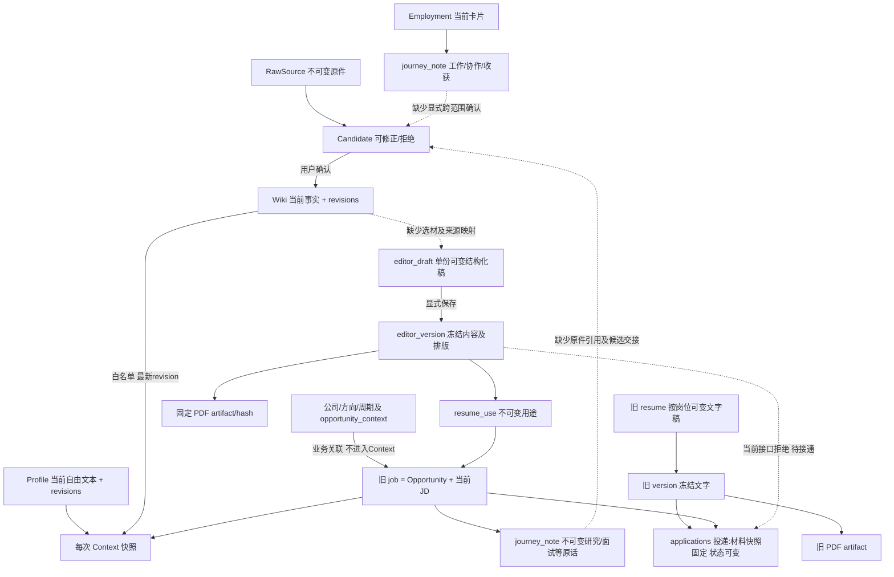

# 冷启动整改 · 2026-09-15

状态：本批 A1/B1 实施与隔离验收完成；C1/C2/C3审查与后续方案完成，未实施大改。输入证据：两份历史 [Astra](../archive/reviews/2026-09-15-novice/2026-09-15-novice-astra.md) / [Luna](../archive/reviews/2026-09-15-novice/2026-09-15-novice-luna.md) 报告；以当前代码与隔离浏览器复核裁决。已有未提交改动保留。

## Phase 1 · 裁决

- **Confirmed Bug**：共用 `.item-tools` 默认隐藏且禁用鼠标命中，仅 `.is-selected` / 工具内焦点启用；纸面 click 才设置选中。空白章节 + 无需先选中的正常路径失效。8771 隔离浏览器复现鼠标不新增、Enter新增；四类标题工具栏均 opacity=0、pointer-events=none。新增业务回调、焦点与保存本身已有实现。
- **Confirmed Flow Break**：`editor_version → resume_use` 成立；`core.record_application` 强制读取旧 `version` 并要求其 job_id。新版本不是仅缺按钮，而是接口拒绝。Wiki确认→分析成立，但 Wiki→结构化工作稿以及 journey_note→候选没有交接。
- **Domain Model Risk**：两套简历（全局结构化 editor_draft/editor_version，与按岗位旧 resume/version），只有一套 applications；原始记录没有 correction 链；基础 profile 是无字段约束自由文本，会和个人 Wiki 目标/约束重复进入 Context；方向本身不进入 Context，不是第二个已生效的个人目标来源。
- **Discoverability Only**：岗位评估、面试/研究/工作记录创建确实存在；全局面试、足迹是聚合阅读面，不据 Luna 未找到就加重复创建。
- **False / superseded finding**：Luna字段错位已自行撤回；必填报错证据不足；“没有评估/面试/足迹能力”的扩大解释被 Astra 与代码推翻。PDF未能观察下载不等于失败。投递断链仍成立。

## Phase 2 · 当前真实关系与生命周期

source of truth：个人基础信息当前属于 profile；分条职业事实属于 active wiki_entry；JD属于 job当前版本；计划属于 journey_plan；公司/方向属于 domain对象；工作期身份属于 journey_episode。快照是派生表达和历史依据，不是新增事实正本。`applications` 的三份 snapshot（岗位、简历、PDF）不可随源更新，status 是后续可改字段。`records`是通用存储容器，不等于所有kind都不可变；不可变由模块接口保证。

C1 最小后续方案：用户显式选 Wiki 的 id/revision/hash，将当时表达复制入工作稿并保存到条目的来源映射；可自由改写，非实时引用正文。版本冻结表达和来源映射。事实更新只提示工作稿检查，不修改旧版本/PDF。当前 meta 无来源契约，不能宣称已经具备此关系；本批不实施结构化选材。

C2 最小后续方案：保留原话；更正作为带原记录ID的新revision/correction，原话与当前解读分开。用户选段整理时登记带记录ID/hash/原scope的来源，再复用候选确认事务；任职/岗位经验提升到 personal 需显式选择和确认，不能绕过同scope规则。当前没有独立 Interview/Research 实体执行器，也没有完整 correction 模型，本批不加普通Edit。

C3 归属裁决：姓名/联系方式归 profile；长期能力与经历归个人 Wiki；出差/地点硬限制归个人 Wiki constraint；长期职业目标归 Wiki goal；岗位类型分类归 TargetRole；某次求职计划归 SearchCycle；具体招聘条件归 job JD，机会策略归 plan/机会 Wiki。当前 profile旧提示仍鼓励写经历目标，且 Context直接拼接 profile+Wiki，无语义冲突优先级；不能把“都是最新版”当成无重复。后续先显式审阅拆分旧 profile，保留迁移来源和revision，再收紧其职责；不按推断自动清洗用户文本或设置静默覆盖优先级。

## Phase 3 · 最小实施契约

1. 直接修共用章节新增入口，常显可点且在标题后的flex流内；其他条目工具栏保持选中行为、增加 hover/focus 可达性。沿用单click回调、mutate、新增焦点、历史与恢复。
2. 复用 POST `/api/applications` 和现有表。服务按记录kind仅接受 editor_version/version；新版本必须已有同job/version/PDF的 resume_use，旧版维持原job校验。持久化 version_kind、channel 和完整冻结快照；校验PDF关系及实际hash。渠道新UI必填，旧请求/旧记录缺失保持兼容。新请求的幂等键相同而材料/渠道/时间/初始状态变化返回409，重复提交只一条。旧记录没有原始请求指纹，兼容重放只校验身份/材料/时间/渠道；其当前status可能已更新，不能凭当前状态推断原始状态。
3. 机会简历页用已有用途登记实际投递，并在同页回看所有新旧投递；共用旧状态/事件服务。方向用途不能直接冒充某机会投递。
4. 不建第三套简历/Submission对象，不复制新版本到旧文字稿；不做多工作稿、Wiki自动填入、Timeline、聚合页创建按钮或全局UX翻修。
5. 无DDL/破坏迁移：现有JSON body增量字段，旧记录按缺省来源读取。旧正文/PDF/状态更新及历史数据继续可读；旧AI提案仍仅到旧文字稿，不宣称结构化AI完成。

## 实施范围与验收

实施范围：core.py、tests/test_applications.py、main.ts、workspace.ts、knowledge-ui.ts、editor/legacy.css（必要时legacy-app.js），以及所属README、架构与批次状态；同时只读核查C1–C3。

验收：D01/D03/R01/R02/C01–C08相关回归；先新增失败HTTP测试，再实现；运行pytest/typecheck/build。8771虚构空间真实UI：创建机会→编辑→四类鼠标新增/焦点→键盘→保存版本→关联→登记渠道/时间→离开重进→改稿→投递不漂移；历史恢复、下一步首页联动、旧事件读取、实际请求未混入候选/记录。

## 运行证据与最终审查

### 自动化

- 先跑 `PYTHONPATH=src .venv/bin/pytest tests/test_applications.py -q`：3 failed；新版本被旧接口以404拒绝，留下真实失败基线。
- 修复后 `PYTHONPATH=src .venv/bin/pytest tests -q`：**47 passed in 4.85s**。新增3组HTTP/存储测试涵盖关联后投递、完整冻结快照、工作稿修改/恢复/JD变更、真实磁盘回读、PDF损坏、错误scope、role不冒充job、跨机会显式复用、4并发重试和409、旧格式事件回读/重放、TestProvider实际payload排除记录及简历。
- `npm --prefix frontend run typecheck` 通过；最终 `npm --prefix frontend run build` 通过（259 modules，现有editor包>500k警告仍在）。只在CSS再次调整后重建，没有无理由重复全量后端测试。
- `git diff --check` 通过。

### 真实浏览器（全部虚构，未访问正式业务数据）

测试服务 `/tmp/career-os-remediation-0915`，`http://127.0.0.1:8771`，TestProvider。浏览器使用实际click/Enter与可见表单，不以DOM注入或API代替用户链路；API只用于后续冻结对象/实际文件验证。

1. 修复前鼠标点击项目无新增；Enter新增成功；四类工具栏计算样式均opacity0/pointer-events none。
2. 创建虚构澜桥/整改验收产品经理，保存下一步“核对固定版本后准备面试（虚构）”；从机会简历页进入编辑器。
3. 1280×720下四类鼠标每次增1，焦点分别进入skill、organization、title、school；四类Enter均增1并聚焦；项目要点鼠标新增成功。
4. 填写虚构姓名/技能/工作/项目/教育，保存草稿并reload，条目数和文本均保留；保存“澜桥投递固定版·虚构”并实际生成PDF。
5. 返回首页（既有返回位置问题未改），下一步仍在且可回原机会。关联固定版本后，从用途登记“虚构邮箱投递验收”、时间及状态；页面显示投递成功。未创建任何旧resume。
6. 离开再进投递，原姓名、技能、项目正文可见。继续修改当前稿姓名和技能，保存后再回投递，仍为原姓名和表达。
7. API读取完整投递JSON与改稿前基线**全量相等**；实际下载PDF字节sha256仍为 `955ca8e691378e00fd814c2f14fd5315eda84c7f6cd11db0fcd765b9e15af363`。当前稿已变更，历史引用并未漂移。
8. 历史恢复仍有放弃当前/先保存/取消三项；选择恢复后原姓名与技能恢复，显示“已恢复并保存”。后续新增内容也不改变旧投递。
9. 窄窗口回归发现原外缘定位命中不可靠，最终改为标题后正常flex流；790px四类鼠标计数连续7→8→9→10→11且焦点正确。640px章节唯一+直接显示；滚动到可见章节后技能3→4并聚焦。小屏固定A4纸面仍需滚动，不宣称全面响应式重做。
10. 实际停止/重启8771服务，再读完整投递及PDFhash仍相等；浏览器reload回机会显示原版本、渠道和时间。测试标签已关闭、视口覆盖已恢复；验收服务停止，虚构数据保留在隔离目录便于复查。

### 两轴审查与裁决

- 规格轴：报告不是需求清单。A1和B1已完成；不把用途当投递，不把旧简历当职业事实，不加Timeline或聚合页重复创建。C1–C3已给出当前关系、风险和最小后续方案，未擅自实施。
- 工程轴：对比本轮前文件快照，保留工作树其他改动；独立检查事务、kind、机会用途、PDFhash、幂等和旧记录。仅共用application服务扩展新版本支持；没有新Submission表、旧文字桥接副本或破坏migration。
- 独立审查提出旧记录重试未校验初始status：因旧记录从未保存初始请求且status可更新，直接比较当前status会误拒绝合法旧重试。主控裁决保留兼容并明确限制；新记录有指纹，已测试状态变更后原始请求重放。未宣称历史可恢复不存在的信息。
- 前端重试现沿用已有冻结请求机制；旧AI提案仍只写文字稿。Context代码未扩读，相关自动化回归通过；本批无真实AI调用质量/语音验收。

### 交付范围与剩余事项

本地代码与构建完成；**正式8765服务未由本批重启**，新后端逻辑需重启现有服务后生效。本批未读取或迁移正式资料、未对外发送投递、未提交/push。C1选材来源映射、C2更正/候选回流、C3显式资料收敛仍是后续方案；返回原机会、分析预览UX等维持低优先级待办。

### 正式入口生效补验（2026-09-15 用户追问后）

上轮只完成隔离验收，未将正式后端重启，这是交付遗漏。核对8765原进程PID82469，启动于2026-09-14 23:03:08，工作目录为本项目；正式HTML已指向新构建，但后端仍是旧进程。

已使用项目backup脚本备份到 `/Users/frog/Library/Application Support/CareerOS-backups/career-backup-3e8e29c8-001f-48d8-9580-7978271d109c`，优雅停止原进程并启动PID94183。保留原数据目录及real/未配置模型状态。正式主页面、编辑器及入口引用的JS/CSS实际HTTP字节与本地dist一致；无效渠道请求返回新版422校验，在落库前拒绝，未登记测试投递。current/revisions/records/applications四表摘要与重启前完全一致。已打开的浏览器页面需刷新才能加载新资源。
