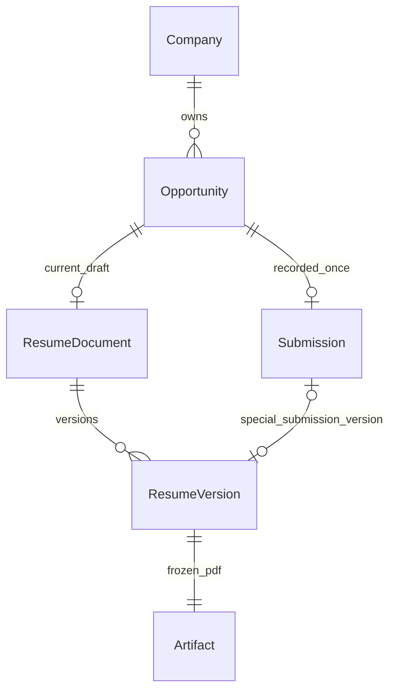

# Opportunity Batch C — 每机会简历、Greeting 与一次投递

状态：**隔离实现与核心验收通过；Production Cutover未执行**。实施/验收：2026-09-17—18。使用 `$workbench-implement` → `$workbench-review`；下文为预先固定的条件，通过情况仅以后续实施验收记录为准。

## 1. 范围、权威与实施基线

用户本轮要求 > [authority](../00-authority.md) > 四份 Opportunity 正本：[Product](../target/opportunity/opportunity-product-model.md)、[Domain](../target/opportunity/opportunity-domain-model.md)、[UI Flow](../target/opportunity/opportunity-ui-flow.md)、[Context & Ingestion](../target/opportunity/context-ingestion.md)。跨模块约束见 [Context](../02-context-contract.md)、[Architecture](../03-architecture.md)、[Journey](../04-journeys.md)、[Acceptance](../05-acceptance.md)、[Roadmap](../07-roadmap.md)。差异与迁移输入为 [Gap Analysis](../audit/OPPORTUNITY-GAP-ANALYSIS.md) 的 Resume / Submission / Greeting / PDF、§7.2–7.5、Batch C；该审计保持历史原文。

实施基于 `/Users/frog/Projects/Career-worktrees/batch-b` 中已验收的 B 工作树，而非仅 checkout HEAD。其 HEAD 为 `368af740fd2b17e5718ce31675bf526df4591347`，业务改动尚未提交；仅按 commit 新开 worktree 会丢失 B。后续开工须保存当时完整工作树清单/patch，核对 B 交付，再继续隔离开发或复制到新的隔离 worktree；不得回拷业务代码或 dist 到生产源码目录。

[Batch B §11](OPPORTUNITY-BATCH-B.md)是历史验收证据；规划时直接核对了其源码、manifest、inventory 和最终 migration verify，当时未重新查询生产进程（实施重新核验见§17）。B 当时生产为 `/Users/frog/Projects/Career` 的 0.2.0 / schema v1，数据为 `/Users/frog/Library/Application Support/Career Data`；**不是本轮重新测得的在线状态**。C 实施前重新确认服务、源码、数据、附件和端口。禁止 Production Cutover，禁止重启/替换生产，禁止改变生产正式写路径。

本批只接通手动 Resume → Greeting → RecordSubmitted。不进入 Communication、real/simulation Interview、Offer、Research、Raw/Patch、AI Skill、Timeline 完整聚合；不修改 Employment / Project、`.codex/config.toml`，不清理旧数据。

## 2. 用户可观察闭环与预定交付

1. 从管线进入某个 canonical Opportunity。创建机会、打开页面都不自动创建简历。
2. 点“编辑简历”，明确选择已有结构化版本、明确选择的 legacy 工作稿或空白；创建本机会唯一工作稿。另一机会重复操作得到另一份独立稿。
3. 在原纸面编辑器编辑、排版、选材、撤销/重做和预览；自动保存当前内容。点“保存版本”才新增普通版本，可恢复历史到当前稿。
4. 回到 Opportunity 编辑并保存 Greeting。无简历也可直接进入“记录已投递”。
5. 确认现实已投递，选择“当前稿 / 已保存版本 / 本次不使用简历”，预览本次 Greeting；不要求日期、渠道、备注。此动作只登记，不替用户向外发送。
6. 后端一次成功返回 Submission 和新 Opportunity：自动记录业务日，冻结当次材料，正常路径 phase 从 resume 进入 submitted。带简历时总有一份新的特殊投递版本；选择普通旧版也一样。
7. Opportunity 的投递材料区只显示当时 Resume / Greeting / 日期及原 PDF。Resume Workspace 管理当前稿、普通版本和标识为“公司 · 岗位 · 投递版本 · 日期”的特殊版本。
8. 后续改稿、修改 Profile/Wiki/JD、恢复旧版都不改已投递材料；已结束机会仍可回看。没有简历或旧 Greeting 未记录时如实显示，不用当前资料补齐。

验收对应 O04–O08、O19，O03 的投递日期部分、O20 的本批 Workspace 部分，以及 D01–D03、R01–R05。不将这些局部通过写成 O09–O18 或完整 J01 已完成。

## 3. AS-IS 与本批目标映射

| 当前事实及证据层级 | 本批处理 |
| --- | --- |
| **Verified by code**：`editor.py` 的 `_draft/_save_document`、版本保存/恢复全部固定 `editor-main`；GET 缺稿返回虚拟空白。`legacy-app.js` 的 job_id 仅用于材料范围/回链 | 显式 ResumeDocument owner；无文档 GET 返回未创建，不 fallback；所有动作绑定 document_id |
| **Verified by code**：每次草稿保存都写 `revisions`，但普通版本另存 `records.kind=editor_version` | 新 ResumeDocument 自动保存仅 current + CAS，不追加全文 autosave revision 或普通版本。旧 revisions 全保留；显式恢复的恢复点单独标识，不当普通版本 |
| **Verified by code**：`profile.py` 保存/整理调用 `sync_profile_to_draft`，会创建/更新全局稿 | Profile 只写个人正本；目标稿通过显式刷新/选材更新，legacy 也不被隐式写入 |
| **Verified by schema/code**：applications 的 version_id、artifact_id NOT NULL；job_id 无唯一性；JSON 有冻结材料和旧状态历史 | 原表版本化升级，新增 canonical 关联/唯一性，支持真正无简历；旧列值、body 与 ID 保全 |
| **Verified by code**：B 的 `record_application` 仅允许旧请求精确回放，新登记 409；application status 写入暂停 | 新 Domain Action 唯一创建路径；旧 API 不再承担新创建，保留旧回放，不恢复状态旁路 |
| **Verified by code**：`editor_version` 无 document owner/type；ResumeUse 是方向/机会用途引用，不能证明稿的所有权 | 新版本加 document_id、opportunity_id、version_kind；旧版用途和 owner 不回填、不迁移 |
| **Verified by code**：html2canvas + jsPDF 图片式 A4；生成版本时锁定稿、flushSave、字体/溢出检查；失败保留同请求重试 | 复用该渲染链；当前稿投递不先存普通版本；旧版投递复制原 PDF bytes |
| **Verified by code**：附件原子写在版本 DB 事务内，异常尝试 unlink；删除只检查 applications.version_id / ResumeUse | 增加最小staging/atomic rename/完整性检查、引用保护和 crash 验证；不扩展通用文件平台 |
| **Verified by code**：B Workspace 只有占位及旧投递；独立 editor / 全局版本库、旧登记表单仍有入口 | 接入定向简历/Greeting/投递；删除或改向已被替代的 C 写按钮，保留 legacy 阅读 |
| **Verified by historical test evidence**：B 最终兼容组 77 passed；profile 单独 1 passed / 2 failed | 不能把历史数字当 C 成功；后续按 §12 重建 scoped fixtures 和复测 |

B 私有证据目录：`/Users/frog/Library/Application Support/Career Migration Audits/batch-b-20260917T131011Z`。本轮读取 `latest-backup-inventory.json`：schema1，meta1/current24/records27/applications1/revisions146，共199行；1个 editor_draft、1个 editor_version、2个 ResumeUse、1个 PDF、49条引用；无多 Submission / 多 Offer / migration_gates，integrity=ok。`final-migration-verify.json` 显示旧行保全，新增迁移记录后200行，**2个 legacy defer、0个 canonical 迁入**。这只证明当时备份，不证明当前生产仍同样，也不能据此猜 legacy owner。

## 4. Domain 不变量与最小存储关系

图中为 C **新写入目标关系**：普通版没有 Submission；有简历 Submission 恰好一个特殊版和 PDF，无简历则两个引用都没有。新建版本均有自己登记的 PDF，不允许新带简历版本缺 PDF。旧无 owner 的版本/ResumeUse/多历史 application 在 legacy 集合保留，不强行纳入图中的新关系。

- 复用 `current`：新增 `kind=resume_document`，顶层 `id` 为独立 UUID，`opportunity_id` 为 canonical ID，`document` 保留现有 schemaVersion=1 结构，含 revision/savedAt、不可改的 copy provenance。不新建 ResumeDocument 表，不使用 Job ID 或 editor-main 充当文档 ID。
- 以 partial unique index 约束 `current` 中 resume_document 的 `opportunity_id`；服务端验证 owner 为可写 canonical Opportunity，禁止 owner reassignment。没有反向可写的 `Opportunity.resume_document_id` 第二正本，查询投影返回即可。
- CAS 按 document 独立递增；稿变更不修改 Opportunity phase/result，也不修改 Profile/Wiki。普通 PUT 不接受 owner、source_refs、版本类型或 Submission 字段。
- 新 `records.kind=editor_version` 增加 `document_id / opportunity_id / version_kind=ordinary|submission`、结构快照/hash、artifact_id、createdAt、来源与幂等指纹；沿用现有版本 ID/读取结构。新版本 INSERT-only；特殊版不可修改、删除或被普通保存 API 创建。
- 特殊版包含 submission_id；Submission 与其在同一事务建立、互相校验 owner。删除保护不能只看 UI 标识，需服务层与针对新特殊版的 DB 约束/触发保护。
- ResumeUse 保持原用途模型；C 不新增隐式 ResumeUse，也不让旧用途赋值成为当前稿 owner 或已投递证明。
- 一个 canonical Opportunity 最多一个 Submission，包括已可靠关联的旧 application。不能换请求键、job alias、ResumeUse 或旧 URL 绕过。
- 新 autosave 只改 current 当前稿和 revision；不调用通用 `_save` 自动积累全文 revisions。主动恢复保留现有明确恢复点能力，恢复点增加 document_id，仅服务恢复/追溯，不进入普通版本列表或 AI Context。旧 editor_recovery/revisions 不删。

## 5. StartResume、版本与编辑器复用 Interface

以下为本批拟采用的最小 HTTP 合同，后续实现时写入模块 README；不是现有接口。统一 owner resolver，路径均 URL encode。Opportunity ID 与嵌套内容 ID 的校验分开；现有编辑器内容 ID 校验不接受 `:`，不能把 canonical ID 塞入内容中的 `id` 字段。

| 动作/接口 | 输入与结果 | 约束 |
| --- | --- | --- |
| `GET /api/opportunities/{oid}/resume` | `{document:null}` 或 owner/document_id/revision/current document | 无副作用，不创建空稿；legacy 明确只读 |
| `POST /api/opportunities/{oid}/resume/start` | `expected_opportunity_revision, idempotency_key, source` → 唯一文档 | source 必选，事务内核对源与 owner；重复同键回放，不同键第二次创建409 |
| `GET/PUT /api/resume-documents/{did}` | PUT `document, expected_revision` | owner 服务端解析，不接受 caller job_id 改范围；CAS409保留输入 |
| `GET /api/resume-documents/{did}/materials`、`/sources` | 当前个人/本机会材料候选及来源状态 | 当前有效 Wiki/Profile；不全局拉其它机会、Raw、pending 候选或旧 revisions |
| `POST /api/resume-documents/{did}/select-facts` | `expected_revision, selections, include_profile, profile_revision, idempotency_key` | 复用现有选材，校验条目 revision/有效性/scope；显式 Profile 刷新也用此动作 |
| `GET/POST /api/resume-documents/{did}/versions` | POST `name, document, expected_revision, pdf_base64, idempotency_key` | 主动普通 SaveVersion；persisted draft 与结构完全一致，PDF校验；所有权/类型由后端生成 |
| `GET/DELETE /api/resume-documents/{did}/versions/{vid}` | 当前稿所属历史或明确兼容读取 | 删除仅普通且未受保护版本；特殊版/外部 owner 拒绝 |
| `POST /api/resume-documents/{did}/restore` | `version_id, expected_revision, idempotency_key` | 恢复本稿版本到当前，特殊版也可作为只读恢复来源；不改版本、不投递、不自动建普通版 |

`source` 为判别联合，不能省略后自动猜：

- `blank`：现有空白结构，不自动塞 Profile 或案例内容。
- `version`：显式 source_version_id + source_document_hash；后端读取已有结构化版本的不可变 document，核对完整性。来源可为 legacy 或另一机会版本，必须在“复制来源”选择器明确显示来源范围；不改变源 owner/ResumeUse。
- `legacy_draft`：仅明确选择 editor-main，带 source_revision/source_hash，事务内读一致快照。源变更409，不按当前最新值偷偷替换。
外部 structured JSON 导入移至 Resume Workspace 后续优化；本批拒绝该source，不提供导入按钮。

复制保留结构/排版及内容内部 ID（以 document 为命名空间），源链接另存不可变 provenance。来源的个人引用可保留来源痕迹；来自其它机会的 scope 引用只能标为 `copied_source` 的历史来源，不能作为目标机会已确认事实、有效选材授权或自动 Context。内容是用户明确复制的表达，不因此写回 Wiki。

尚无工作稿而选择已有版本投递时，不强迫先手动 StartResume：RecordSubmitted 的显式版本选择可在**同一业务事务内**从该结构创建有内容的本机会 ResumeDocument，并创建特殊投递版。这是用户明确选择来源的延迟创建，不是所有机会的自动空稿。已有当前稿时，选旧版投递不覆盖当前稿；若来源版本不属于当前文档，使用明确复制语义，而非恢复/挪 owner。

### 所有隐式全局稿路径的处置清单

| 现有入口/状态 | C 处理与验收 |
| --- | --- |
| `/editor.html`、首页快速入口、全局简历页 | 无 owner 时进入选择机会/legacy只读来源，不自动选第一条，也不创建全局可写稿 |
| `/editor.html?job_id=...`、旧 `/#jobs/...` 回链 | B resolver 只解析同一机会；canonical 显式 StartResume，legacy 只读；新 URL `/editor.html?document_id=...` 刷新仍绑定同稿 |
| `_draft/_save_document`、所有 GET/PUT/conflict reload | 同一 resolver/did；缺失 owner 404/409，不 fallback；返回带 owner/id |
| 全局 revision、savedSnapshot、autosaveChain、saveTimer、conflictState | 编辑器页面生命周期固定一个 did；切 owner 完整销毁/导航，清定时器和异步响应；回调捕获原 did，不能将 A 响应用于 B |
| undo/redo、savedRange、光标、恢复点 | 复用现有编辑逻辑但状态只在当前文档；撤销不能抹服务器 source_refs；跨页不共享栈 |
| pendingVersion/materialsRequest、选材请求指纹与重试 | 请求键绑定 did/动作/内容；响应丢失重复同一请求；409显式比较后重新确认，不自动覆写 |
| materials/sources/select-facts | 后端 owner 决定范围；不再用可随意修改的 query job_id 授权；复制来源与普通材料列表分开 |
| 历史列表/读取/删除/恢复/下载、全局 editorVersions | scoped 列表；legacy 为独立只读材料库；版本取 PDF 以 version.artifact_id，不靠 artifact.version_id 反推 owner |
| 预览、字体/单页检查、PDF 导出 | 绑定同一冻结结构与 revision；保留图片式 A4；导出/预览本身不建普通版，原“导出并归档”拆为明确 SaveVersion 或仅导出 |
| Profile 页面、联系方式跳转、组织旧Profile路径 | 取消 save/organize → 全局稿同步；回编辑器显示“来源已更新”，只经显式选材刷新；保留返回本稿链接 |
| feedback entity_id、WebMCP当前文档读取、退出未保存提示 | 绑定本稿身份；WebMCP不新增写入/模型能力；反馈仍不进 Context；未保存/冲突/待确认投递时保留离页提示 |
| 旧登记表单、ResumeUse关联后“登记投递”、旧全局版本保存按钮 | 改向 canonical Workspace 的统一动作；不保留后台自动两步投递/改phase代码；旧状态下拉移除 |

不重写 `legacy-app.js` 的纸面渲染/编辑算法，不替换 html2canvas/jsPDF，不借此引入新编辑器框架、全局状态库或通用文档系统。

## 6. Greeting 与 Profile 最小策略

Greeting 直接存 canonical Opportunity 当前 JSON 的 `greeting: string|null`，不建子表/实体。`POST /api/opportunities/{oid}/greeting` 接受 `{content, expected_revision, idempotency_key}`，仅此受控动作修改字段；保留原文，不 trim 掉用户排版，设置合理长度上限（20,000字符）。与元数据/结束动作共用 Opportunity CAS，普通 metadata action 白名单继续拒绝 Greeting/phase/result 混写。

Opportunity.greeting 是当前工作内容，投递后仍可通过同一受控动作修改；Domain不以已投递为由锁死。材料面板始终只读Submission snapshot，当前Greeting编辑放次要入口并明确区分；不暴露修改历史入口。新空机会缺字段等价“尚未准备”，不必初始化写入。

提交时读取同一 Opportunity revision：有当前内容则 `submitted_greeting_snapshot={state:'captured',content:原文}`，明确保存的空字符串也属于 captured；无内容时确认面板显示“本次未使用打招呼语”，新记录为 `{state:'not_used'}`。旧 application 缺该字段的读取投影为 `{state:'unknown'}`，只显示“历史未记录”，不回填原 body，也不从当前 Greeting 补内容。

Profile 是事实，ResumeDocument 是针对机会的表达。保存/整理 Profile 不修改任何 resume_document、editor-main、版本、恢复点或 Submission。当前 `_apply_profile` 与 select-facts 可复用：用户选择“从最新个人资料刷新”，预览后提交目标 did CAS + profile_revision；只更新该稿的受管身份字段/来源，保留其他表达和自定义链接。来源变化只提示，不自动刷新；Wiki 同理。

两个旧失败测试的已知根因来自 A/B 实测记录和当前代码：profile 保存已使 editor-main revision 增加，而测试仍提交0/旧值；第二项未先断言HTTP成功便取 document，继而 KeyError。C 不能仅修改 expected_revision 把它们变绿：先在冻结 B 源码、虚构 tmp 数据重新复现，再改成“Profile 不写任何稿；明确刷新检查双 CAS；旧客户端保存Profile仍保留扩展联系方式；历史全部不变”的断言。保留 Profile 自身 CAS、候选不进 Context、非法链接拒绝；目标稿被并发改时409，其他机会稿的变化不导致该稿假冲突。

## 7. RecordSubmitted 唯一领域事务

`POST /api/opportunities/{oid}/submitted`，必需 `expected_revision`（Opportunity）、`idempotency_key`、`resume` 判别联合；正常请求不接受 submitted_on、phase、result、channel、status、status_history 或 caller 指定的 artifact 路径。

- `resume={mode:'none'}`：不读/创建文档、版本、PDF，不偷偷使用现有工作稿。
- `resume={mode:'draft',document_id,expected_document_revision,document,pdf_base64}`：服务端 owner 与 CAS 校验，document 必须等于已保存当前结构；PDF 对应冻结渲染请求。
- `resume={mode:'version',source_version_id,source_document_hash,source_artifact_hash}`：后端读固定版本和校验过的原 PDF；调用者不能传替代 PDF。显式跨来源复制显示来源，原 owner 不变。

普通动作处理 `active + phase=resume + 尚无Submission`。对已有 Submission：同键同输入回放原结果；其他键409返回已存在 ID 的提示。对 submitted/interview/offer 或 ended 且缺记录，C 正常入口拒绝并提示需要明确历史补录/核对，**不得把后期 phase 回退为 submitted**。这是本批正常入口的范围，不定义未来禁止补录；后续独立 correction/import 需明确日期来源、理由、原始 snapshot 和更正审计，不能借普通动作接收回填日期。

事务顺序：

1. 规范化 canonical ID、严格判别输入；幂等指纹覆盖模式、Opportunity revision、稿 ID/revision/结构hash或源版本/hash。请求键按 action + canonical owner 命名空间，alias 使用相同 owner。PDF解码校验/昂贵渲染不长期占 SQLite 写锁。
2. 当前稿前端锁编辑 → flushSave → 等字体与A4检查 → 冻结结构/revision并渲染 → 保留不可变待提交请求。flushSave只保存草稿，不产生已投递事实或普通版本；失败可留已保存草稿但不能留 Submission/特殊版/phase变化。
3. 进入 `BEGIN IMMEDIATE`，**先查幂等已提交结果**，同请求优先回放（不能因成功后phase/revision变化而拒绝重试），同键异体409。随后核对 canonical 可写/活动、机会 CAS、无旧/新 Submission、材料 owner/CAS、源版本/PDF integrity 和当前 Greeting。
4. 按 §8 准备并校验最终 PDF；仅 version 首次复制分支可按显式来源创建文档。生成新的 submission_id、特殊 vid、aid；模式 none 完全跳过它们。
5. 同一个 SQLite 事务 INSERT 特殊版本/Artifact（若有）、INSERT applications、保存 Opportunity phase=submitted、phase_changed_on=业务日、phase_source=RecordSubmitted 与 submission_id，revision+1，并保存幂等结果；失效 epoch 沿用既有合同。不得在事务外改phase或另造 Job/Plan 状态。
6. COMMIT 后返回 `{submission, opportunity, submission_version?, resume_document?}`；完成暂存收尾。任何成功响应只依据已提交记录。提交成功但响应丢失，前端保留同键重试；不重新渲染生成另一个 PDF 请求。

日期由服务端单次 `now()`（持久 timestamp 带时区）及 B 的 `Asia/Shanghai business_day()` 得到 `submitted_on` 和 `phase_changed_on`；同一动作两者相等。幂等回放使用首次提交日期，跨午夜重试不重算；不从浏览器时区、普通版本创建日或旧 plan 推导。

## 8. PDF / Artifact 原子性与删除

采用**新特殊版本拥有新的 Artifact 记录和独立文件**，源为旧版本时做字节复制且 hash 相同，不重渲染。保留现有 `version_pdf` 唯一索引的生产来源含义；不在本批做内容寻址/文件去重。空间代价是一份投递 PDF 的副本，换取简单可验证的归属、删除与备份；不需要产品 Gate。

当前稿继续原图片式 A4 渲染，不称可搜索文字/ATS 已验收。后端维持PDF头尾/大小校验并核对结构、revision、bytes hash；这些检查不能独立证明浏览器渲染与任意上传PDF语义相同，必须以真实浏览器冻结渲染验收补证，不能声称密码学证明招聘方看到什么。

采用最小 crash-safe staging + atomic rename + integrity check，不预建通用Artifact WAL/文件事务平台：

- 在同一SQLite写锁内，将新PDF写到可识别的本批staging，flush/fsync后原子rename到专属命名的最终文件；校验bytes/hash后才提交业务事务，fsync目标目录。
- 成功提交之后的响应失败不得删除文件；DB回滚不产生Submission/特殊版/phase。正式文件可能在rename后DB提交前中断成为可识别孤儿；启动恢复核对数据库引用，将本批无引用文件安全移至隔离区，不删除旧文件/猜补业务事实。staging与专属文件名足以识别本批文件，数据库是已提交引用的唯一依据。
- 启动接受写入前和备份前检查已提交Artifact全部存在、hash正确；不正确明确失败。恢复只处理本批可证明无引用文件，未知旧孤儿报告而不自动清理。备份不带着未处理半状态宣称成功。
- 真正子进程中断覆盖stage后、rename后、DB commit前后；以恢复后的引用/文件hash和幂等结果验收。若实践证明必须持久operation journal才能满足不变量，实施记录须说明更简单方案具体不足，不能为了预期扩展先建日志平台。

删除普通版本沿用明确用户动作。事务内检查**全部**结构化/旧版本 artifact引用、applications 的 version/artifact与冻结引用、ResumeUse、特殊版本及历史兼容引用；受引用则409。源版本与新投递版采用独立bytes，所以无其它保护引用时删除源不损害投递；source_version_id 是可标记“来源已删除”的弱provenance，不影响复制材料完整性。已有 ResumeUse 的来源仍不得删除。

未被引用的普通版删除先提交DB删除，保留的专属文件通过同一无引用检查移至隔离区；DB删除提交前不得不可恢复地删PDF，崩溃后可依据引用判断恢复。若发现同一路径/aid被其它记录引用，绝不能 unlink。特殊版即使异常缺少反向 application，也按 version_kind 永久拒绝删除。C 不提供清空工作稿所有权、清理legacy或垃圾回收 UI。

## 9. applications 升级与 legacy 兼容

拟将数据库 schema 升为 **v3**；不能继续称 v2，因为 nullable 与唯一性合同已经改变。C 程序只接受新空库或显式迁移的 v3，读旧版本先拒绝且不初始化写入；不启动时自动升级。

继续使用 `applications` 表，原 id/job_id/idempotency_key/body 列保留；version_id / artifact_id 改可空，新增 nullable `canonical_opportunity_id REFERENCES current(id)`。对非null canonical关联建唯一索引；新写必须非null、指向 `kind=opportunity,format_version=2` 的正本。旧未决 legacy 行允许null，但不能借null路径创建新记录。

新body采用显式 `submission_format=3`，含 opportunity_id、submitted_on/recorded_at、submitted_greeting_snapshot、可选 resume_snapshot / version_id / artifact_id / artifact_hash、冻结 job/opportunity/company 展示快照、原操作指纹。不新增可写 Application.status 正本；旧 status/status_history 原文只读。检查新记录body与SQL列一致，以及 none 时 version/artifact/snapshot 全为空、with-resume时全部完整；不能凭一个 nullable列就宣称无简历链可用。

迁移在短事务内重建 applications 的必要列约束，逐行按旧列读取/复制，**body原字符串不重序列化**；保留旧索引/FK语义并增加新约束。旧日期、idempotency、snapshot、status_history、原version/artifact都不修改。新版本与新Submission冻结保护只加在对应新格式/类型，不能为了加标记重写旧记录。

关联策略：

- B 已确认 canonical 且旧job/显式关联一致，只有0/1条旧 application，可按稳定 ID 映射新增关联列；有关联旧投递就占用唯一槽位，新动作拒绝第二次。
- 多条 application 指向同一已可写 canonical、body与job关联冲突、缺旧附件等，停止相关迁移并报告；不能把其中一行偷偷留null绕过唯一性。若当前canonical已可写，不在C中自动降级/拆分它。
- B defer 的 legacy 保持未决关联和只读集合，旧ID仍可达；不以 ResumeUse、最近编辑、job.status、plan.closed、Interview/Offer 自动补 owner/phase/result。
- 旧 application 不要求补新的投递版实体；读取 DTO 标为“历史投递材料”，绑定原冻结结构/PDF。无可靠工作稿归属时保留legacy集合，不生成虚构ResumeDocument或改普通版类型。未来若增加包装必须另有明确用途，本批不做。
- editor-main、旧文字稿、editor_version、ResumeUse、editor_recovery、Raw/Wiki/Candidate/revisions 全部保留；只读来源与新稿分开。复制操作只产生新对象；迁移阶段不批量复制。

兼容入口：旧 `GET /api/editor`、旧版本 GET/Artifact下载保留只读，附 legacy 标记；旧全局 PUT、select-facts、restore、POST versions、DELETE旧版本拒绝并指向新 scoped 路径。旧无owner materials入口只读个人候选或要求选机会，不写稿。旧 `/api/applications` 只按原指纹回放已有旧请求，其余返回新入口提示；新C请求的重试走 RecordSubmitted。同名旧status endpoint持续409。

`domain/resume-uses` 可保留明确用途关联，但不触发Document或Submission；不能自动换版本owner。旧文字resume/proposal、Job状态、JourneyPlan.stage、typed Interview/Offer新建和demo整包门禁沿用B，不能因C实现投递顺便解禁。旧HTTP/Store直接业务入口都要审计，不能只藏按钮。

## 10. 页面与模块修改范围、实施顺序

当前稿 PDF 依赖真实纸面 DOM，不能在 Opportunity 页用另一套文本渲染器替代。Workspace 选择当前稿时进入带 did 的现有编辑器投递确认视图：锁稿、显示纸面预览与本机会 Greeting摘要、完成 §7 的渲染和一次 RecordSubmitted，成功回原机会。选择已有版本/无简历可直接在 Workspace 确认。若用户从编辑器发起，也使用同一确认流程和后台动作；导航不产生业务事实。版本来源选择器独立于普通 scoped 历史列表，明确复制语义。

所有请求失败保留表单/稿/固定待提交请求；冲突显示本次输入与服务器当前值，用户比较后才能换revision重试。Opportunity顶部和日期取后端结果，不能前端先乐观改成“已投递”。无简历不提供假下载按钮；旧无Greeting标Unknown；完整版本列表只在Resume Workspace/明确legacy材料库。

| 顺序 | 允许修改模块 | 内容及完成界线 |
| --- | --- | --- |
| C1 固定基线/测试触发 | 本文、STATUS；既有测试fixture与新增C测试 | 记录B工作树hash；隔离复现profile旧失败；先固定接口/关键失败注入点。生产只做重新核对，未授权部署 |
| C2 存储与迁移 | `core.py` 初始化/diagnostics；新 `resume_migration.py` 和 `scripts/migrate_resume.py`；`migration_baseline.py`，必要的B链验证适配 | schema3、应用表重建、索引/保护、dry-run/apply/verify；无语义猜测，无批量owner赋予 |
| C3 文档owner和文件边界 | `editor.py`；可新增窄职责 `resume_documents.py`、`resume_artifacts.py`；`artifacts.py` 的复用边界；`backup.py` | scoped draft/版本/选材/恢复，受控PDF登记/删除恢复；不改截图、旧文本renderer的产品行为 |
| C4 Greeting/提交事务 | `opportunity.py`、新 `submission.py`、`core.py`旧入口适配、`app.py`路由 | 单一RecordSubmitted、Greeting CAS、日期、幂等、唯一性、只读历史DTO；不给phase通用写接口 |
| C5 Profile与旧调用面 | `profile.py`、`domain.py`中ResumeUse边界，必要的Context接口防漏 | 去隐式sync、显式刷新；旧入口门禁；不扩展Context策略/AI，通常无需改编译器 |
| C6 UI纵向接通 | `frontend/src/editor/legacy-app.js`、必要的`legacy-entry.ts`/`editor.html`/局部样式；`opportunity-ui.ts`、`main.ts`、`workspace.ts`、`knowledge-ui.ts`，必要的`profile-ui.ts`回链 | scoped链接、首次来源、Greeting/提交确认/材料面板、标识与错误；保留纸面编辑与非本期页 |
| C7 整合与验收 | 对应tests；`src/workbench/README.md`、`frontend/README.md`、构建配置仅确需命令时、本文和STATUS | 更新当前接口/运行schema，处理被替代的C入口与描述；运行预定验证和独立review，记录真实证据后停止 |

不改 `employment.py` / `work.py` 及其业务schema；`journey.py/engagement.py/demo.py` 默认不改，只有发现C直接可绕过的简历/投递写路径时才做局部门禁并用对应测试证明，绝不解除B对后续批次的暂停。现有A/B记录、两份审计、四份target、AGENTS和Skills不因本计划改写；新接口实现后维护模块README，长期产品规则仍引用target。

## 11. Migration / rollback / forward recovery 预案

**仅在独立worktree与隔离目录执行以下动作。** schema3不等于批准生产升级。CLI沿用B的系统临时目录allowlist，解析realpath并拒绝生产目录、现有目标、代码目录、DB符号链接/硬链接、被链接的附件目录、报告覆盖。迁移不得直接作用于唯一备份。

1. 确认实际生产目录/SQLite/附件、服务版本与源码/dist；记录本次只读快照。使用既有 backup 创建当时的最新真实备份，不能只把B旧备份重新命名；备份写入新的独立目录，生产不做业务POST/改schema/重启。
2. restore 到不存在的新临时目录；先核对v1完整性、全ID/旧列/JSON原字节、引用和PDF hash，再用B已验证的显式v1→v2工具。逐项重新inventory，默认保留旧defer，不复用过期的hash-bound计划。
3. 对该v2副本运行C只读inventory/dry-run：文档/版本/ResumeUse/Artifact/application计数与ID；owner与canonical映射候选；同机会多投递；缺失/冲突引用；PDF bytes/hash；旧Greeting缺失；Raw/Wiki/Candidate/非本期行hash。报告可重复执行、不创建Store/不更新源库。
4. 为v2副本再建pre-C备份。C apply在BEGIN IMMEDIATE内校验源快照hash、schema、逐行映射；重建applications必要约束、建立新索引/保护、记录migration manifest、最后设user_version=3。失败DDL/数据/标记一并回滚；同manifest重跑返回原结果，不同输入拒绝。
5. C verify与只读startup检查：integrity_check、foreign_key_check、新约束；按“旧列投影 + 原body bytes”比较applications，不因新增关联列便允许正文变化；其他旧行逐ID/hash相同，附件集合/hash相同。迁移本身不产生空稿、普通/特殊版本或新PDF。B verifier的schema2/schema hash断言不能伪装为C verifier，链式报告分别保留v1→v2和v2→v3证据。
6. 启动隔离v3并核对实际路径/代码版本/诊断；旧0.2.0/v1程序、冻结B/v2程序分别尝试打开v3，必须在初始化前拒绝，DB/hash不变；C程序打开v1/v2同样只读拒绝。迁移不包含启动自动修复旧业务记录。
7. 最新生产备份若仍全是legacy，照实记录“实际副本只验证旧数据保全”。另在其**再次恢复的可丢弃分支副本**增加有明确前缀的虚构canonical机会并验证C三条投递路径；不把虚构新增称为用户数据迁入。独立合成fixture覆盖已有canonical+旧application、重复/冲突/源版本等不能从真实副本触发的条件。
8. 迁移后未开放写入的rollback：从pre-C v2备份restore到另一个新目录，配冻结B程序启动/读回，核对原ID/body/PDF；v1基线恢复亦保留验证。rollback从不覆盖v3副本或生产目录，也不把schema号直接改回2。
9. v3已经写入后：暂停该隔离副本写入并备份当前v3，restore到又一个新目录，用匹配C或修正后的v3程序forward recovery；新普通版/特殊版、无简历Submission、Greeting、阶段/CAS/幂等记录全部保全，再验证同键回放与暂存/完整性恢复。不得恢复pre-C快照丢弃这些新增事实。不承诺无损逆迁移，C不实现生产部署动作。

manifest至少含：C代码/工作树hash、输入备份与恢复路径、前后schema/快照hash、逻辑计数与关键ID、canonical关联决定及依据、defer/demo问题、原application字段和snapshot hashes、所有版本/ResumeUse/PDF引用、artifact hashes、Raw/Wiki/Candidate/非本期保护hash、失败注入/重试结果、rollback与forward证据、启动拒绝证据、生产前后核对结果。用户正文只在私有数据/证据目录，不贴入仓库计划或测试。

## 12. 编码前固定的自动测试

以下是后续必须执行的验收矩阵，本轮没有运行、没有通过声明。新增测试只覆盖持久化/并发/迁移边界；编辑器纯视觉交互用真实浏览器检查。所有数据均tmp/虚构，Provider为Test/Spy，不接真实AI。

| 编号 | 固定测试/断言 | 对应要求 |
| --- | --- | --- |
| T01 owner隔离 | 两机会懒创建各0..1；全部3种显式source（blank/version/legacy_draft）；structured_json拒绝；打开不创建；第二创建并发/同键回放；跨did/伪造owner拒绝；复制源owner/ResumeUse不变 | O04 |
| T02编辑与历史 | autosave/open/exit/预览/只导出不增普通版或全文autosave revisions；SaveVersion只增普通版；恢复只改当前稿/明确恢复点；普通PUT篡改source_refs拒绝 | O05、D01 |
| T03Profile/材料 | 复现B两个旧失败后更新scoped测试；Profile保存/organize不动任何稿；显式refresh双CAS；另一稿变化不冲突；来源变更只提示；跨机会材料/Raw/pending/反馈不进当前Context | O04/O07、Context合同 |
| T04当前稿提交 | 无预存普通版也提交；仅+1特殊版/+1Artifact/+1Submission，正确冻结结构/Greeting/日期；phase和revision同事务变化 | O05/O06 |
| T05旧版本提交 | 普通源版/legacy源版/其它机会显式源版均新建特殊身份，PDF byte/hash与源相同；无稿仅显式version模式延迟创建；已有稿不被覆盖；删无保护源版后原投递仍可读，已有ResumeUse源拒删 | O05/O07 |
| T06无简历 | 无工作稿和已有工作稿各提交none；都不新增/引用任何空doc/version/artifact；Greeting有值/显式空/未使用区分，phase/date正确 | O06 |
| T07并发/重放 | 同键并发仅一次；异键并发同机会只有一条；同键异体409；跨alias同槽位；响应丢失重试返回首次值；同键跨午夜不换日期 | O08 |
| T08CAS/阶段 | draft、Opportunity或Greeting被他窗改409且无业务半写；与EndOpportunity并发只有一个成功；后期/结束补录不回退phase；服务端业务日与浏览器日期无关 | O03/O08 |
| T09不变性/引用 | 提交后改当前Greeting/稿/Profile/Wiki/JD/恢复，旧snapshot/version/PDF恒等；特殊版UPDATE/DELETE拒绝；所有artifact读取以引用为准；人为共享aid/path与历史用途fixture证明删除保护全集 | O07 |
| T10故障/崩溃 | PDF无效/写入失败、stage后、rename后DB前、事务写一半、commit前、commit后响应前、收尾失败、删除中断逐点注入；包含子进程真实中止再启动。未提交不出现Submission/特殊版/phase；已提交不丢PDF；恢复后无未引用正式附件、重试不重复 | O08、R01/R02 |
| T11旧入口 | global editor全部写入拒绝；旧application同指纹回放，其余创建/status失败；旧Job/plan/typed/demo不能创建投递或改phase；缺owner/旧URL不回退任意稿；legacy全部可读 | O04/O08/O19 |
| T12迁移 | v2→v3正常/空库/全legacy/已关联旧投递/多投递/错关联/缺PDF；源hash变化、重复apply/异体、DDL故障完整回滚；旧body原字节和列值保持；null不能绕过canonical唯一性；不批量建稿 | O19 |
| T13恢复/版本门禁 | 真实backup/restore、pre-C v2 rollback与开写后v3 forward恢复；v1/v2旧程序拒绝v3、新程序拒旧库且源hash不变；禁止生产/链接/覆盖路径；pending文件阻止假备份成功 | R01/R03/R04 |
| T14非本期 | 既有Employment/Project/任职资料链与Context隔离回归；原Raw/Wiki/Candidate/history内容不变；只调用Test/Spy；不放开Interview/Offer写门禁 | O19/O20 |

测试承载：更新 `test_editor.py`、`test_editor_http.py`、`test_fact_resume.py`、`test_profile_ownership.py`、`test_applications.py`、`test_backup.py`、`test_migration_baseline.py`、必要的B兼容fixture；新增 `test_resume_documents.py`、`test_record_submitted.py`、`test_resume_migration.py` 覆盖上述新职责，不为每个测试结果新增文档。历史fixture与新创建fixture分开；不得用调用新API伪造“旧程序产生的旧数据”。

执行约定（将来的隔离工作树）：先在冻结B副本用 `.venv/bin/python -m pytest -q tests/test_profile_ownership.py` 复现旧两失败；开发定向跑上述C关键文件。整合后运行一次 `.venv/bin/python -m pytest -q`，因为schema/Store/profile/共用editor边界影响现有模块；失败须解释/处理，不能跳过以凑绿。再执行 `npm --prefix frontend run build`（含tsc）验证类型与实际静态产物，不无理由重复独立typecheck/build。只因修复或新失败重跑相关检查。

## 13. 编码前固定的浏览器验收

用户2026-09-17实施中确认的直接边界：一个Resume Workspace UI，多份机会所有工作稿。左侧唯一入口列出当前文档/最近编辑项且不自动选稿；Opportunity中“编辑简历”携带did进入同一纸面编辑器，并返回所属机会。U01/U02/U08同步检查目录选择、来源身份、返回与投递版本机会/日期标记。更深视觉设计登记Roadmap的Resume Workspace Productization；AI-Config仅在同处Feedback登记动机/场景和SecretStore备份排除，不实现。

使用显式临时数据目录、独立端口、新浏览器测试页，不沿用用户打开的页面操作生产；核对health实际目录/schema/版本后才能写。真实图像PDF保留原图片式性质。浏览器动作负责用户交互证据，HTTP/SQLite/hash负责持久化补证，不能互相冒充。

| 编号 | 实际操作与应观察结果 |
| --- | --- |
| U01 | 新建A/B两机会不建稿；从首次来源选择分别建稿，空白/legacy/已有版3种来源均实际走通；没有JSON导入入口 |
| U02 | A/B不同窗口编辑不同姓名/条目/排版，刷新、返回、重开仍各自正确；鼠标/键盘新增、排序、富文本、撤销重做、预览和来源链接保持原可用性 |
| U03 | A同时两窗修改触发409，原输入保留，明确比较后重试只影响A；切换机会/离开未保存提示；旧无owner链接不打开可写editor-main |
| U04 | 连续autosave及仅导出不增版本；点击保存普通版新增一项；历史恢复只更新当前稿；Profile更新不改A/B，显式刷新A后B和历史不变 |
| U05 | A只编辑当前稿、没有普通版，保存Greeting后记录已投递：进入同稿纸面确认、真实生成PDF、单次提交成功；管线已投递/当天，特殊版有明确标识，PDF下载/打开可见冻结内容 |
| U06 | 另一机会选择旧普通版本投递，即使当前稿已改仍冻结旧版；确认新特殊ID/原PDF hash，删除可删的普通来源不影响材料；有ResumeUse来源则明确拒删 |
| U07 | 无稿机会直接“本次不使用简历”投递；另一已有稿机会明确选择none；均不制造版本/PDF、不显示假下载，Greeting/日期和阶段正确 |
| U08 | 投递后修改当前Greeting/稿/Profile/JD再回材料面板，原PDF/Greeting/正文不变；版本列表只在Resume Workspace，不能删除特殊版；旧投递缺Greeting显示“历史未记录” |
| U09 | 模拟提交响应丢失/失败、双击、双窗口投递；界面不提前显示成功、不丢固定请求；重试后只有一条；与结束或Greeting改动冲突时能继续处理 |
| U10 | 隔离服务停止重启，重新从管线/旧Job链接/版本链接读取；legacy原ID/用途/PDF/Raw来源可达；v3副本备份恢复后同一路径可读 |
| U11 | 原Employment/Project导航、已有任务与编辑路径使用虚构资料冒烟通过；后续Interview/Offer仍明确未接管，无真实AI调用或自动资料写回 |

最新生产备份副本用于迁移保全与legacy浏览；其中若无可写canonical不能靠演示素材代替U01–U09。全交互用独立虚构目录；附加合成分支的证据与原副本分开标识。浏览器结果/PDF hash/日志和测试结果统一记录本文件的后续实施验收节与私有manifest，STATUS仅链接，不另建重复测试正本。

## 14. Gates 与待验证项

当前规划**没有新增已确认的用户产品 Gate**。B记录的G1/G2属于demo/legacy，公司/面试信息不确定仍defer，不升级为用户决策；旧全局稿归属不明有只读+显式复制路径，不阻塞新机会闭环。

后续实际盘点若真实数据出现以下情况才报告相关Gate：同canonical多条真实投递无法区分尝试；相互矛盾的真实owner关联无法安全保留可写关系；旧PDF/冻结内容缺失而无法恢复；真实数据归属/历史日期无法推导且阻塞正在迁移的对象。先保留原件/隔离问题对象；不自动删合/拆分/赋予当前日期。对已可写canonical无法满足唯一约束时不得靠null绕过，停止该迁移等待明确决策。

普通工程选择不设用户Gate：current JSON复用、schema3编号、文件副本与staging、Greeting字段、scoped API、复制来源校验。实现如发现真正与目标冲突，先给出具体条款和复现，再调整计划，不能以额外测试单独定义成功。

规划时待验证的C代码、测试、浏览器、迁移、恢复、生产版本与最新备份盘点，现已按§17给出实际证据；不再以此处规划状态解释当前交付。真实AI、外部投递送达证明、任意PDF导入、ATS文字解析、全D–G、异机灾备和无损v3→v2逆迁移不在本批验收。

## 15. 反向审查

| 攻击 | 计划中的阻断与必须失败的路径 |
| --- | --- |
| 两机会同时改会串稿 | did不可改owner；后端scope推导；前端页面固定did/异步响应绑定；T01/T03/U02/U03必须覆盖，不能只改首页URL |
| Profile偷改所有稿 | 移除save/organize的sync，只有显式目标稿刷新；legacy也只读；T03/U04 |
| autosave制造版本垃圾 | 新稿current-only CAS，普通版本只SaveVersion；导出和恢复不会暗建普通版；T02/U04 |
| 半个Submission/版本/孤儿PDF | 单SQLite业务事务+staging/atomic rename/引用完整性恢复；COMMIT后失联不得删PDF；T10的真实crash与恢复，不只mock异常 |
| 删除源版破坏投递 | 特殊版独立文件、原bytes hash一致；全部引用保护；弱来源追溯不当文件owner；T05/T09/U06 |
| 无简历靠假结构过关 | none不读取/创建doc、vid、aid，schema列nullable与body一致；T06/U07 |
| 旧applications再投第二次 | 原API仅旧回放、新APIcanonical唯一索引；null遗留不能新写；T07/T11/T12 |
| 双击/多客户端重复投递 | 幂等指纹+先回放+BEGIN IMMEDIATE+唯一约束；异键也不能第二次；T07/U09 |
| 后续改稿改变历史 | 新特殊版/Submission不可变、snapshot/bytes不从当前计算；Profile/Wiki不反向写；T09/U08 |
| editor-main仍被偷偷写 | HTTP全写禁用、Profile sync删除、首页/独立编辑器/导出/恢复/选材/旧Store业务入口扫描；T11和源码调用清单 |
| 提前进入Communication/Interview/Offer/AI | 不加领域对象/写入口/模型调用；保留B暂停；后期补录不擅自降phase；T14/U11 |
| Employment/Project受损 | 限制文件范围；仅共享Profile行为按新合同调整；任职相关行hash和已有回归/浏览器冒烟保持；T14/U11 |

再核对：没有为命名新建Submission表，没有把ResumeUse变owner，没有两个可写Opportunity正本；创建稿与普通保存不改phase；legacy application.status、plan.closed、job.deleted/excluded与已有Interview/Offer都不能生成result或猜历史phase。不建立文件事务平台或第二个业务事实库。

## 16. 明确停止点

用户已批准按C1–C7实施并执行workbench-review；先同步本次计划修订和测试/浏览器条件，之后才编码。完成隔离验收后停止，不进入D/E/F/G，不执行Production Cutover，不改生产v1或正式写路径，不接真实AI。关键验证失败必须如实记录，不能以B证据代替C成功。

AI-Config只登记为未来独立AI Infrastructure Batch，唯一需求记录在[Roadmap的Feedback登记](../07-roadmap.md)，本批不实现/不调用模型连接测试，也不向生产Feedback数据库写入。

Production Cutover是后续单独授权的部署动作。C完成也不能让生产失去尚未由后续批次接管的沟通、面试、Offer能力。本计划不授权该部署。

上一轮计划文档核验：以开工文件hash清单比较，原工作树211个、B工作树218个已纳入Git清单的文件中，仅本计划（新增）和STATUS发生变化；两处计划副本一致，本地链接、代码围栏、空白检查通过。此核验只证明文档改动范围，不证明C业务能力通过。

## 17. 实施与两轴验收记录（2026-09-17—18）

### 17.1 基线与实际范围

使用workbench-implement实施后，按workbench-review由主Agent基于实际diff另做规格轴/规范轴审查。交付在 `/Users/frog/Projects/Career-worktrees/batch-c`，分支 `codex/opportunity-c`，Git基点 `eafacb8`；先复制并hash固定B的未提交实际实现，不把仅checkout HEAD误称完整B基线。`baseline.json`与`c-relative-changes.json`区分继承B和新增C。未提交/合并到生产分支。

本批新增 `resume_documents.py`、`submission.py`、`resume_artifacts.py`、`resume_schema.py`、`resume_migration.py` 与 `scripts/migrate_resume.py`。修改Store版本门禁、Profile显式刷新、旧editor写封锁、备份恢复检查、inventory兼容v3和scoped前端；测试fixture显式区分旧v2与新v3。UI复用唯一纸面编辑器；左侧目录按最近编辑列稿，不自动选稿；机会入口与返回携带真实owner。新增目录GET只返回身份/编辑时间，不读取另一稿作为当前稿。

源目录只回写本C记录、STATUS与Roadmap。两份旧audit、四份target、A/B记录、Employment/Project实现、`.codex/config.toml`均未修改。模块README更新实际命令与接口；AI-Config及Resume Workspace Productization需求、动机和使用场景仅登记Roadmap的Feedback节，未写生产Feedback DB。

### 17.2 自动验证与旧两失败

- 最终 `.venv/bin/pytest -q`：**120 passed**（24.72s）。包括scoped HTTP、独立稿/显式Profile、普通/特殊版本、无简历、CAS/唯一性/幂等、删除引用、schema迁移和既有非本期回归。
- `npm --prefix frontend run build`：通过，含tsc；保留既有editor大chunk提示，不借本批重做打包。
- 实际冻结B复现 `tests/test_profile_ownership.py`：1通过、2失败。根因仍为旧Profile保存隐式同步全局稿导致旧测试使用revision0/旧revision遇到409，后续误读错误JSON。C按已确认产品目标移除隐式sync，并明确创建目标稿后测试显式refresh；没有为了绿灯恢复同步或降低CAS。当前三项均通过。
- 接入新schema后首轮全量为70通过/33失败/6错误，主要是全局editor URL、v1/v2创建及旧application fixture假设；随后只改对应fixture到明确scoped动作或真实旧DDL形状，未把失败跳过。定向修复后全量120通过。
- C新增故障/并发/迁移文件定向24通过后又加入启动与提交并发检查，最终包含在上述120项内；不能把重叠测试相加。

T01–T09：验证不同did不能串稿、同机会唯一稿、显式来源hash/CAS、autosave不造版本、版本复制不迁owner、当前Greeting可改且snapshot不变、none不造doc/version/PDF、同键并发/异键竞争、同键异体与跨日重放、End与提交竞争、普通版共享用途/PDF拒删、特殊版DB更新/删除拒绝。旧全局editor写、旧applications/status、Job/plan/typed/demo旁路仍受Domain封锁，已移除旧状态下拉监听器。

T10：真实子进程 `os._exit(73)` 覆盖stage后、rename后、特殊版写后、Submission写后、commit前、commit后；另覆盖删除事务中/commit后两个中断点。重启后未提交不出现投递/特殊版/阶段推进，已提交可重放且PDF存在/hash正确；未引用C文件进入隔离区。DB异常回滚、损坏PDF读取/启动fail closed及启动与提交并发也通过。没有通用Artifact WAL：同一SQLite写锁序列化文件操作，原子rename后的持久命名可识别孤儿，DB引用是提交事实，足以满足本批进程中断不变量。

T12–T14：v2旧DDL的空库/关联旧投递/多投递/错关联/缺PDF、source guard、DDL故障回滚、重复apply、旧程序拒绝、备份恢复及非本期回归通过。原始行/引用与旧schema由隔离fixture构造，不借新Store伪造旧版本行为。

### 17.3 实际浏览器验收

独立虚构目录 `browser-synthetic`，端口61232，TestProvider，运行版本0.4.0-batch-c/schema3；不是生产8765。浏览器动作与HTTP/hash补证分开记录。

| 预定条件 | 实際结果 |
| --- | --- |
| U01 / 用户追加统一工作台 | blank、明确legacy、existing version三来源均创建独立稿；无JSON导入入口。唯一左侧入口显示当前文档/最近编辑、不自动选稿；选择A打开同一editor.html，页头与返回链接均为A。首次复制导航修复后用F重验通过。 |
| U02–U04 | A/B不同姓名，多次保存、重开不串稿；B两窗口409保留两份输入，比较后明确保存。新增技能、上下排序、富文本快捷键、撤销/重做、PDF导出可用。F连续autosave/纯导出后版本列表仍为空；B显式普通版保存和恢复成功。Profile更新A/B均不变，显式选材只刷新A，来源链接可读。 |
| U05–U06 | A没有普通版，直接从当前纸面生成真实图片PDF并投递；B当前稿修改后选择旧普通版投递，特殊版有新ID/独立artifact。删除可删的普通来源后，特殊版仍下载成功；渲染检查PDF仍显示旧姓名，hash与旧字节一致。ResumeUse/共享引用拒删由自动HTTP测试验证。 |
| U07–U08 | C已有稿、D无稿都明确none成功，无空版本/PDF/假下载；D业务日真实跨到2026-09-18。A投递后当前Greeting和Profile选材稿变化，原Greeting/版本/PDF保持；版本列表显示🔒及机会/日期，无特殊版删除按钮。legacy缺Greeting显示“历史未记录”。 |
| U09 | 隔离测试服务注入commit后500，界面停留确认且不提前宣称成功；原请求重试只保留一次Submission。D另一窗改Greeting导致409，显示最新值，明确核对后继续成功。并发投递/双键竞争/跨日重放由自动测试补证；未将自动测试冒称浏览器双击视频证据。 |
| U10 | 隔离服务实际停止/重启后同一doc可读。forward恢复副本58961实际打开旧`#jobs/demo-b5-job`，历史投递、旧PDF链接、Raw原件/足迹来源可达；其schema3/旧行保全由manifest补证。验收后已停止恢复副本服务。 |
| U11 | 虚构任职/Project原导航与新建保存冒烟通过；实现文件未修改。Interview/Offer继续显示未接管，不开放旧生命周期写入，不调用真实AI。 |

终态持久化补证 `browser-final-verification.json`：6个虚构Opportunity、5个独立稿、4个Submission，A/B带PDF，C/D为none；F没有普通版本。浏览器PDF证据为 `browser-B-frozen.pdf/.png`，两个投递PDF分别校验hash。测试故障注入仅在临时服务启动脚本；正式代码无故障环境开关。最后重启61232为未注入故障的当前C/TestProvider服务。

### 17.4 最新生产备份、迁移与恢复

本轮先确认生产实际路径 `/Users/frog/Library/Application Support/Career Data`、SQLite `workspace.sqlite3`、附件 `artifacts/`、PID2994、8765、0.2.0/schema1。通过现有backup真实生成 `/Users/frog/Library/Application Support/Career Data-backups/batch-c-20260917T143553Z`。

恢复根目录：`/var/folders/cl/wtl8p1w508g43s7b4wqsr5gh0000gn/T/career-batch-c-rehearsal-z0yhqdvf`。所有restore目的地预先不存在，不覆盖生产或旧副本。

1. 完整备份→`restored`，verify_restore通过；原199行/所有关键ID/旧Submission快照/ResumeVersion/Raw/Wiki/Candidate和1份PDF逐行/hash保全。
2. 沿用B保守defer策略在副本v1→v2，无自动公司/phase推断；先验证B结果并生成pre-C v2备份。两个legacy机会仍defer。
3. C dry-run→v2→v3 apply→同输入重放→verify→实际v3启动。无C Migration Gate；1个旧Submission保持legacy，0个被猜测关联canonical，不批量建稿。最终计数meta1/current24/records29/applications1/revisions146（201行，较原199仅B/C各一manifest）；所有旧行投影/JSON原字节及附件不变。
4. 实际运行生产旧0.2与B旧0.3程序尝试打开v3，都拒绝且源hash不变。C拒绝v2也已验证。没有直接把schema整数改低。
5. **rollback**：pre-C v2备份恢复到新的`rollback-v2`，B运行时真实启动schema2；旧行/附件验证通过。仅适用于C开写前。
6. **forward recovery**：从生产恢复后的v3另建`synthetic-branch`，明确附加虚构业务，保留原副本保全证据。新建none投递、普通版、旧版投递和投递后Greeting修改；备份到`backups/forward-c-with-pdf`并恢复至`forward-v3-with-pdf`。**228行/3个artifact、66个引用检查通过**，SQLite integrity ok，普通/特殊ID与真实PDF bytes/hash保留，原提交同键重放恒等。不能用pre-C旧备份覆盖这些新写入。

全部私有manifest/日志在 `/Users/frog/Library/Application Support/Career Migration Audits/batch-c-20260917T143553Z/`，含原始inventory、两个迁移plan/apply/verify、rollback、旧程序拒绝、forward-pdf-verification、最终生产保护及测试/build日志；目录700、文件600。仓库记录只写结论和定位，不复制真实资料正文。

**生产保护最终核验**：PID仍2994，0.2.0/schema1，SQLite物理文件hash、全行/schema逻辑快照、附件hash、生产src及frontend/dist与开工基线全部相同。未发送生产业务写请求、未重启、未迁移或替换正式写路径。备份新增在生产数据目录之外。

### 17.5 两轴审查发现与处置

| 发现/触发 | 最小处置与验证 |
| --- | --- |
| Greeting保存后旧Workspace closure仍持有旧revision，首次建稿409 | 保存后刷新并重新渲染同机会；浏览器Greeting→建稿链及CAS重验。 |
| 选过来源的dialog关闭后仍被主页面与Profile的未保存检测计入，首次跳转被拦 | 两处只检测open dialog；F实际首次legacy复制直接进入正确稿，返回来源机会。未改变Profile保存规则。 |
| 旧稿/none提交与另一窗Greeting发生409后，确认框缺少继续入口 | 显示当前阶段/Greeting，显式核对后更新请求revision；D两窗实测通过，不自动重写用户决定。 |
| 工具栏flex覆盖hidden，已投递仍看到重复投递按钮 | 仅修正该按钮hidden样式；实际已投递A重开不显示，后端唯一性仍为最终约束。 |
| Store初始化executescript会结束外层事务，恢复文件不能依赖之前BEGIN | 在DDL后重新获得BEGIN IMMEDIATE再执行完整性/孤儿恢复；并发启动/投递与真实中断测试通过。无新增journal平台。 |
| 旧application.status监听器已无UI承载 | 删除死监听，后端旧status仍拒绝；最终build和旧入口测试通过。 |

规格轴：每机会工作稿、统一UI、版本/一次投递、Greeting两层语义、none、资料显式刷新、旧材料保全及生产隔离满足本批核心结果；没有扩入D–G。规范轴：current JSON深模块复用，applications唯一约束+事务/CAS/幂等、独立特殊PDF、崩溃恢复及v3门禁有实际证据。已发现阻塞问题均处理；不把继承B改动或TestProvider当作新增C能力/真实AI验证。

### 17.6 停止点与未验边界

**Batch C到此停止。具备在隔离环境规划/实施Batch D的前置；不表示D已经实现，也不授权Production Cutover。** 本次真实生产资料没有新增需用户裁决的Migration Gate；demo/legacy歧义保持defer，不自动迁所有权、合并公司或推历史阶段。

未验证/不宣称：真实AI与模型配置；外部招聘平台送达；任意外部JSON/PDF导入；可检索文字PDF/ATS质量；真实断电、磁盘硬件损坏、异机灾备；开写后的无损v3→v2逆迁移；所有设备/浏览器与长篇溢出版式；浏览器层系统性快速双击压力（并发唯一性已由自动测试覆盖）；完整D–G。Resume Experience更深布局和AI Infrastructure只在Roadmap/Feedback登记。临时恢复/合成目录与证据保留，不自动清理数据。
