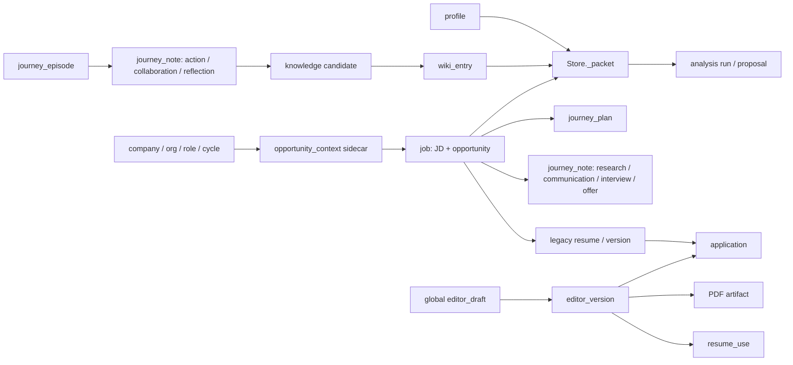
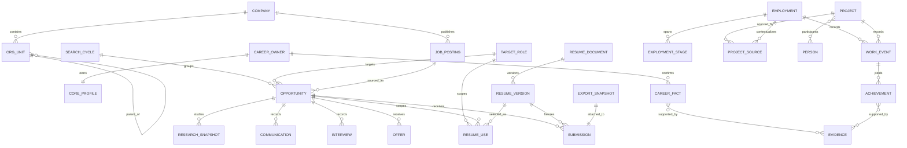

# Career OS 结构优化与产品化重构

## 本批用户结果

把现有可运行 MVP 从“页面拼接的功能集合”收敛为两个可持续使用的任务中心：

- 求职以 `Opportunity` 为主对象，完成研究、判断、简历、投递、沟通、面试和 Offer 的连续闭环。
- 工作以 `Employment` 为主对象，持续沉淀阶段、项目、协作、事件、成果、证据和成长。
- Career Assets 是二者共同读取的事实正本；AI 只能读取 Context Compiler 明确列出的当前版本资料。

保留现有资料、修订历史、结构化简历版本、PDF、投递快照和反馈。重构采用显式迁移和兼容读取，不建立第二套平行数据库。

## AS-IS：真实对象与数据流

SQLite 物理层当前只有 `meta/current/revisions/records/applications`；大部分关系由 JSON 字段和字符串 kind 维持。真实生产库为 schema v1，审查时有 6 个 current、129 个 revisions、9 个 records、0 个 applications；其中包含 3 个 `editor_version` 与 3 个 artifact，迁移不可丢失。

## 最严重问题

1. `job` 同时承担 JobPosting 与 Opportunity，`opportunity_context` 又作为旁挂关系，用户与代码面对两套机会身份。
2. 旧 `resume/version` 与结构化 `editor_draft/editor_version` 都可操作，简历没有唯一正本和唯一版本链。
3. 万能 JSON Store 被各模块通过 `_get/_save/_record` 和裸 SQL 穿透，数据库不能保证对象类型与关系完整性。
4. 研究、沟通、面试、Offer 和工作记录都塞进 `journey_note`；无法表达多轮事件、参与者、结论、证据与复用关系。
5. 实际 ContextPacket 缺少 `policy_version/unknowns/conflicts/omissions/budget_used`，来源内容形态也不统一。
6. 任职仍是工作卡加通用 notes，没有显式 Stage、Project、Person、Achievement 与 Evidence 关系。
7. 页面暴露对象 CRUD 与固定 tabs；主 CTA、当前问题和下一动作没有随机会状态收敛。
8. schema v1 没有版本迁移器；备份恢复不逐条验证数据库中的 artifact 引用。

## TO-BE：领域关系与基数

关键基数与约束：

- 同一 JobPosting 可以被不同求职周期形成多个 Opportunity；每个 Opportunity 在当前版本只指向一个 JobPosting、一个周期和至多一个目标方向。
- ResumeDocument 是可编辑文档，ResumeVersion 是不可变快照；同一版本可有多个用途，但一次 Submission 必须冻结一个版本和一个导出文件。
- Employment 可有多个阶段；Project 可来自一个或多个任职、个人实践或外部来源，因此 Project 与 Employment 通过 ProjectSource 关联。
- Person 与 Project 是多对多；CareerFact/Achievement 与 Evidence 是多对多。
- 研究快照有采集时间与来源，可被多个机会引用，后续刷新生成新快照而非覆盖历史。

## 对象分类

| 分类 | 对象 |
| --- | --- |
| Entity | CareerOwner、Company、OrgUnit、JobPosting、Opportunity、SearchCycle、TargetRole、ResumeDocument、ResumeVersion、Submission、Communication、Interview、Offer、Employment、EmploymentStage、Project、Person、WorkEvent、Achievement、CareerFact、Evidence、AnalysisSession、PatchProposal、Feedback |
| Value Object | 联系方式、日期区间、来源定位、状态变更、导出哈希、下一动作、薪酬条款片段 |
| Workflow | 原件→候选→确认、机会推进、简历选材→编辑→冻结→投递、面试准备→记录→复盘、资料修订、提案确认 |
| Derived / View | 今天、机会看板、准备度、差距判断、项目时间线、足迹、AI 摘要、过期提示 |

Derived 结果必须保存输入 revision/hash 和策略版本；任一依赖变化后显示 stale，不能静默当作当前结论。

## 后端调整、保留与迁移

### 保留

- CAS revision、不可变 revisions/records、幂等键、原话更正视图、显式 Wiki 选材、分析前 Context 预览。
- 结构化编辑器文档、正式版本、PDF hash、反馈隔离、本地同源与文件路径保护。

### 调整

- 提供公开 Repository/Service 接口，router 不再依赖 Store 私有方法。
- Context Compiler 输出稳定契约；Provider 只接收其 payload。
- `Opportunity` 成为页面和用例主身份，`JobPosting` 只保存岗位来源事实。
- 结构化 ResumeDocument 成为唯一可编辑简历；旧文本链只读兼容并可显式导入。
- 研究、沟通、面试、Offer、任职、项目和证据采用各自业务对象，不由通用 note 冒充。
- Submission 冻结 Opportunity、ResumeVersion、ExportSnapshot 及当时关系快照；状态变化留下历史。

### 迁移顺序

1. 在 schema v1 上先加公开边界和 Context v2，保持旧 API 兼容。
2. 建立可重复、事务化的 v1→v2 migration；升级前生成数据库与附件清单备份。
3. 从每个 `job` 生成 JobPosting + Opportunity，迁移 `opportunity_context/journey_plan` 关系并保留 legacy id 映射。
4. 从 `editor_draft/editor_version` 建立唯一 ResumeDocument 链；旧 `resume/version` 留作只读 LegacyResumeSource。
5. 迁移 application 为 Submission，补齐机会、版本、导出与关系快照；旧记录读取兼容。
6. 将 journey_episode 提升为 Employment；journey_note 按类型渐进迁移到专门对象，原文与修订历史不变。

任何一步失败都必须回滚事务并继续允许旧代码读取原库；不得用空库重建冒充迁移成功。

## 页面 → 对象 → 主 CTA → 领域动作

| 页面 | 主对象 | 唯一主 CTA | 领域动作 |
| --- | --- | --- | --- |
| 今天 | 当前 Opportunity / Employment | 继续最紧迫的一步 | executeNextAction |
| 求职机会 | Opportunity | 完成当前下一步 | setNextAction / recordEvent |
| 机会·评估 | AnalysisSession | 选择材料并分析 | compileContext / runAnalysis |
| 机会·简历 | ResumeUse | 准备本次投递版本 | selectVersion / freezeExport |
| 机会·投递 | Submission | 登记已发生投递 | recordSubmission |
| 机会·沟通/面试/Offer | 对应业务对象 | 记录本轮结果 | recordCommunication / finishInterview / recordOffer |
| 简历工作台 | ResumeDocument | 继续编辑当前文档 | saveDraft / saveVersion |
| 任职 | Employment | 记录当前工作进展 | recordWorkEvent |
| 项目 | Project | 补充可复用证据 | linkEvidence |
| Career Assets | Source/Candidate/Fact | 处理下一条待确认资料 | confirmCandidate |
| 反馈 | Feedback | 提交当前问题 | captureFeedback |

次要编辑、历史、删除、导出进入局部菜单；空状态直接解释当前缺什么并给出创建该对象的动作。

## 分批与验收

### B1 边界与受控 Context

- 引入公开存储接口与 Context Compiler；落实 ContextPacket v2，同时兼容现有前端字段。
- 验收：一次机会评估的预览与执行使用完全相同的 source revision/hash 清单；无关任职与反馈不进入 payload；资料变更后旧结果 stale。

### B2 Opportunity + Resume + Submission 主链

- 建立显式迁移与兼容 adapter；统一机会身份和结构化简历版本；冻结完整投递快照。
- 验收：创建机会→选择事实→保存正式简历/PDF→关联机会→登记投递→修改当前资料→历史投递仍可重现；重启后 hash 一致。

### B3 Employment + Project + Evidence 主链

- 提升现有工作卡，建立项目、参与者、事件、成果和证据关系；保持原始 note 可追溯。
- 验收：任职事件→项目成果→证据→候选 CareerFact→人工确认；求职 Context 仅在明确选材后读取确认事实。

### B4 状态驱动前端

- 今天、Opportunity、Resume、Employment 和 Career Assets 围绕主对象与下一动作收敛；保留必要历史入口。
- 验收：冷启动用户不理解内部 kind 也能完成两条纵向闭环；页面不出现 Job/Opportunity、两套 Resume 等内部双重概念。

### B5 可操作全链路案例

- 在当前本地工作区装载一套带统一“案例”标识的虚构资料，覆盖机会、研究、分析选材、正式简历/PDF、投递、沟通、面试、Offer、任职、项目、参与者、事件、成果、证据和 Wiki 回流。
- 案例不覆盖唯一的用户基础资料，也不改写现有真实对象；所有新增对象记录 dataset id，重复装载不重复创建。
- 设置页提供明确的案例装载与删除动作；删除只清理该 dataset id 所属对象和附件，用户自行触发，不能误删真实数据。
- 验收：装载后两个任务中心均有可操作记录，重启仍存在；再次装载数量不变；删除仅在隔离测试目录验证，本轮不自动删除生产案例。

## Gate

当前没有阻塞 B1 的产品 Gate。B2 前必须完成真实库备份并核对 3 个编辑器版本及 3 个附件；这属于迁移前置动作，不需要重新询问用户。真实 AI 质量仍受 API key 配置限制，但不阻塞数据结构、Context 预览和 TestProvider 契约整改。

## 交付结果（2026-09-15）

- B1：Context Compiler 已统一预览与执行载荷，输出 schema v2 的来源 revision/hash、policy、unknowns/conflicts/omissions 与预算；依赖关系变化使旧结果失效。
- B2：Opportunity 成为公开任务身份，结构化编辑器成为唯一可写简历入口，Submission 冻结机会、岗位、业务关系、正式版本与 PDF。
- B3：Employment、EmploymentStage、Project、ProjectSource、Person、Participant、WorkEvent、Achievement、Evidence 与 EvidenceLink 已显式建模；旧 episode/note 保留兼容读取。
- B4：今天、机会、简历、任职、项目与 Wiki 页面围绕当前对象和下一动作组织；全局简历页不再暴露早期文字稿写入。
- B5：生产工作区已装载 `career-os-b5-demo-v1`。统一 `[案例]` 记录覆盖两条纵向链路、四类机会活动、Wiki 原件/候选/确认、分析结果、正式版本、PDF、投递与反馈；重复装载不重复创建，删除按清单和 dataset id 双重核验。
- 数据安全：生产更新前备份位于 `/Users/frog/Library/Application Support/CareerOS-backups/career-backup-3eb6ca20-f70e-498a-92c8-21f8f5647191`；未执行破坏性 schema 迁移。
- 尚未验证：本机未配置真实 AI 所需的 API key/model，因此只验证 Context、请求边界和合成结果链路，不把它表述为真实模型质量验收。
